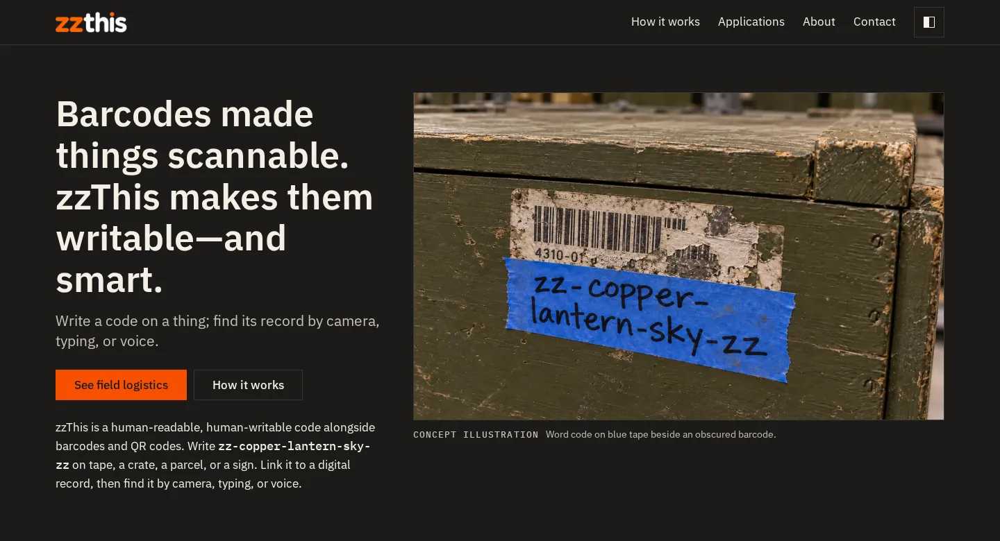
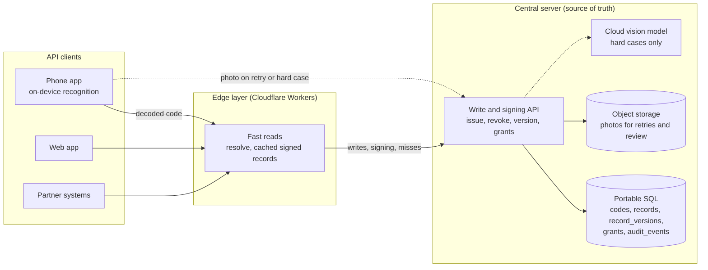

<p align="center">
  <a href="https://zzthis.com/">
    <picture>
      <source media="(prefers-color-scheme: light)" srcset="docs/readme/banner-light.webp">
      
    </picture>
  </a>
</p>

# zzThis

**Write a code on a thing; find its record by camera, typing, or voice.**

[Live site](https://zzthis.com/) · [Demo](https://zzthis.com/demo/) · [Project board](https://github.com/orgs/Zero-State-LLC/projects/25) · [Specs](specs/README.md) · [Spec source](docs/SPEC.md)

[](https://github.com/Zero-State-LLC/zzthis/actions/workflows/ci.yml)
[](https://github.com/Zero-State-LLC/zzthis/actions/workflows/pages.yml)
[](package.json)
[](https://astro.build/)
[](#status-and-disclaimer)
[](LICENSE)

Topics: `human-readable-codes` `handwritten-codes` `logistics` `astro` `github-pages` `static-site` `prototype`

zzThis is a human-readable, human-writable code that works alongside barcodes and QR codes. A person writes a code such as `zz-copper-lantern-sky-zz` on tape, a crate, a parcel, or a sign, links it to a digital record, and finds that record later.

This repository holds the marketing site and a scripted click-through demo, published on GitHub Pages at the root of the custom domain [zzthis.com](https://zzthis.com/). It goes live there once the DNS records and the Pages custom domain are set ([#6](https://github.com/Zero-State-LLC/zzthis/issues/6)). After that, GitHub redirects the old project-site URL `zero-state-llc.github.io/zzthis/` to it. As separate npm workspaces it also holds the shared code library, the web client, and the `/v1` API server that the specs describe.

## Contents

- [Status and disclaimer](#status-and-disclaimer)
- [Quick start](#quick-start)
- [Design tokens](#design-tokens)
- [Repository atlas](#repository-atlas)
- [Architecture](#architecture)
- [Roadmap](#roadmap)
- [Contributing](#contributing)
- [License](#license)

## Status and disclaimer

zzThis is a **prototype**.

- The marketing site and the demo are live, and both are static: they call no API.
- The code library ([`packages/zz-core`](packages/zz-core/)), the `/v1` API server ([`workers/api`](workers/api/)), and the web client ([`apps/web`](apps/web/)) are implemented in this repository and pass their tests ([spec 005](specs/005-v1-api/spec.md)). The API and web client are deployed only to isolated staging; production deployment remains gated by the operator requirements in [`AGENTS.md`](AGENTS.md).
- The demo uses scripted demo data only. It runs no recognition, makes no network requests, uses no camera or microphone, and stores nothing.
- Images labeled "Concept illustration" are AI renderings, not photos of a working system.
- Camera and voice recognition ([spec 004](specs/004-capture/spec.md)) are not built, and the on-device reader is off in v1. Typed lookup is available in the web client. No recognition accuracy or performance result is claimed.

## Quick start

Requirements: Node 24 (CI uses Node 24; `package.json` allows 22.12 or later) and npm.

```sh
npm ci              # install exact versions from package-lock.json
npm run dev         # start the dev server at http://localhost:4321/
npm run lint        # ESLint and Prettier check
npm run typecheck   # astro check and tsc --noEmit
npm run test        # Vitest; root coverage gates src/lib and demoMachine.ts; zz-core, web, and API workspaces gate their configured src/**/*.ts scopes
npm run build       # build to dist/ and run scripts/check-dist.mjs
npm run preview     # serve dist/ locally
```

The end-to-end workflow starts its own fresh API Worker. Do not start `npm run dev:api` before running it; that command is for manual API development.

```sh
npx playwright install chromium
npm run e2e -w apps/web
```

### Base path

The site is served from the root of `https://zzthis.com`. `astro.config.mjs` sets `site: 'https://zzthis.com'` and `base: process.env.ASTRO_BASE ?? '/'`, so the default build emits root paths such as `/_astro/...`. The Cloudflare staging workflows set `ASTRO_BASE=/` explicitly, and `ASTRO_BASE` can still point a build at a subpath. Every internal link and asset URL goes through `src/lib/url.ts`, so do not write root-absolute paths such as `/images/...` or `/demo` by hand. `scripts/check-dist.mjs` fails the build on a leftover `/zzthis/` path or a link to the old `zero-state-llc.github.io` host at the root base, on root paths that miss a configured subpath base, and on other spec checks against `dist/`. The Pages custom domain is set in the repository's Settings > Pages, not by a `CNAME` file: `pages.yml` deploys with GitHub Actions, and GitHub ignores a `CNAME` file for Actions-built sites.

## Design tokens

Canonical values are extracted from [`src/styles/tokens.css`](src/styles/tokens.css) into [`design/tokens.json`](design/tokens.json). Colors use CSS `light-dark()`. The shared Swift, Kotlin, and CSS files are generated from that JSON. See [`design/README.md`](design/README.md).

### Color

| Token | Light | Dark |
|---|---|---|
| `--color-paper` | `oklch(95.3% 0.016 86)` | `oklch(17.5% 0.006 75)` |
| `--color-panel` | `oklch(97.6% 0.009 86)` | `oklch(21.5% 0.007 75)` |
| `--color-ink` | `oklch(22.2% 0.004 85)` | `oklch(94% 0.014 86)` |
| `--color-ink-2` | `oklch(39.6% 0.013 82)` | `oklch(78% 0.018 85)` |
| `--color-rule` | `oklch(82.9% 0.027 85)` | `oklch(32% 0.009 80)` |
| `--color-accent` | `oklch(65.9% 0.215 38)` | `oklch(65.9% 0.215 38)` |
| `--color-on-accent` | `oklch(22.2% 0.004 85)` | `oklch(22.2% 0.004 85)` |
| `--shadow-color` | `rgb(28 27 25 / 0.12)` | `rgb(0 0 0 / 0.35)` |

Older names such as `--surface` and `--text` point at these tokens. The full set, including focus, wash, and grid, is in `design/tokens.json`.

### Type

`--font-display` is IBM Plex Sans Condensed. `--font-body` is IBM Plex Sans. `--font-mono` is IBM Plex Mono, with the Korean, Japanese, and Hebrew faces after it.

| Token | Value |
|---|---|
| `--text-2xs` | 0.75rem |
| `--text-xs` | 0.8125rem |
| `--text-sm` | 0.9375rem |
| `--text-base` | 1.0625rem |
| `--text-md` | 1.25rem |
| `--text-lg` | 1.5625rem |

`--text-xl`, `--text-display-s`, and `--text-code` are `clamp()` expressions in the stylesheet.

### Spacing, radius, shadow, motion

| Token | Value |
|---|---|
| `--space-3xs` to `--space-2xl` | 4, 6, 10, 16, 26, 42, 68, 110 px |
| `--gutter` | 16px; 26px from 40rem; 42px from 60rem |
| `--measure` | 62ch |
| `--radius-none`, `--radius-chip` | 0, 3px. Pills use 999px. |
| Mount shadow | 8px below, 4% inset, 10px blur, `--shadow-color` |
| Motion | 120ms, 220ms, 420ms. Easings are in `design/tokens.json`. |

## Repository atlas

| Path | What it holds |
|---|---|
| [`src/pages/`](src/pages/) | One file per route (home, how it works, applications, demo, about, contact) plus `404.astro` |
| [`src/components/`](src/components/) | Shared Astro components such as cards, header, footer, and the theme toggle |
| [`src/content/`](src/content/) | All copy and image metadata as TypeScript; edit copy here, not in pages |
| [`src/lib/`](src/lib/) | Scripted demo resolver, image and URL helpers. The code grammar is re-exported from [`packages/zz-core`](packages/zz-core/). |
| [`src/demo/`](src/demo/) | Demo state machine and its browser island |
| [`src/layouts/`](src/layouts/) | The base page layout |
| [`src/styles/`](src/styles/) | Site styles. Tokens are extracted into [`design/`](design/README.md). |
| [`packages/zz-core/`](packages/zz-core/) | The code grammar, wordlist, check word, issuer, and classifier, shared by the site, the web client, and the API |
| [`apps/web/`](apps/web/) | The web client ([spec 005](specs/005-v1-api/spec.md) US6), a thin Astro client of `/v1` |
| [`workers/api/`](workers/api/) | The `/v1` API server ([spec 005](specs/005-v1-api/spec.md)): Cloudflare Worker, Hono, D1, R2, and Durable Objects |
| [`design/`](design/README.md) | Shared tokens, generated Swift and Kotlin, logo files, UX patterns. zzThat pins a copy. |
| [`tests/`](tests/) | Vitest suites |
| [`public/images/`](public/images/) | Optimized WebP images |
| [`scripts/`](scripts/) | `check-dist.mjs` build checks, `check-agents-md.sh`, `security-scan.sh` |
| [`docs/SPEC.md`](docs/SPEC.md) | Content, layout, behavior, architecture proposal, and the decision log |
| [`docs/BUILD-BRIEF.md`](docs/BUILD-BRIEF.md) | Build constraints and the definition of done |
| [`docs/ASSETS.md`](docs/ASSETS.md) | Image paths and the panels they map to |
| [`docs/screenshots/`](docs/screenshots/), [`docs/wireframes/`](docs/wireframes/) | Review screenshots and wireframes |
| [`specs/`](specs/) | Spec Kit specs 001 to 005, with an [index](specs/README.md). Spec 005 is the `/v1` contract. |
| [`.specify/`](.specify/) | Spec Kit [constitution](.specify/memory/constitution.md) |
| [`intent/`](intent/) | Intent files that come before specs |
| [`AGENTS.md`](AGENTS.md) | Contract for coding agents working in this repo |
| [`.github/workflows/ci.yml`](.github/workflows/ci.yml) | Required `build` check: lint and build |
| [`.github/workflows/site-ci.yml`](.github/workflows/site-ci.yml) | Typecheck and tests on pull requests |
| [`.github/workflows/pages.yml`](.github/workflows/pages.yml) | Deploys to GitHub Pages after a push to `main` or a manual dispatch; pull requests never deploy |
| [`.github/workflows/free-security-scan.yml`](.github/workflows/free-security-scan.yml) | Security scan |
| [`.github/workflows/e2e.yml`](.github/workflows/e2e.yml) | Playwright end-to-end run, on demand or on a `run-e2e` label; not a required check |
| [`.github/workflows/project-collaboration.yml`](.github/workflows/project-collaboration.yml) | Adds issues and PRs to the project board |

## Architecture

The marketing site and the demo are static and call no API. The server and the code library for the topology below are now implemented in this repository ([spec 005](specs/005-v1-api/spec.md)). The API and web client are deployed only in isolated staging; production deployment remains gated. The design is copied from [`docs/SPEC.md` Section 10.1](docs/SPEC.md#101-topology): one central server owns codes, records, grants, and the audit log; every app is an API client; revocation, single use, expiry, and rate limits are enforced on the server. The HTTP contract for that server is [`specs/005-v1-api`](specs/005-v1-api/spec.md). The server chooses the words, including for free public codes.



## Roadmap

Track work on the live [zzThis + zzThat board](https://github.com/orgs/Zero-State-LLC/projects/25). How the workflow uses it is in [`docs/project-board.md`](docs/project-board.md).

### Phase 0: Spec, site, and demo

- [x] Write the spec ([#2](https://github.com/Zero-State-LLC/zzthis/issues/2))
- [x] Marketing site ([#3](https://github.com/Zero-State-LLC/zzthis/issues/3)) and click-through demo ([#4](https://github.com/Zero-State-LLC/zzthis/issues/4)), shipped in [PR #9](https://github.com/Zero-State-LLC/zzthis/pull/9)
- [x] Deploy on GitHub Pages (project-site path `/zzthis/` until the zzthis.com cutover)
- [x] Architecture proposal (SPEC Section 10) and Michael's content answers

### Phase 1: Site decisions and polish

- [ ] Answer the open questions for Michael ([#10](https://github.com/Zero-State-LLC/zzthis/issues/10); new grammar and image questions [#36](https://github.com/Zero-State-LLC/zzthis/issues/36) to [#42](https://github.com/Zero-State-LLC/zzthis/issues/42))
- [x] Demo: remove "did you mean" suggestions of live codes ([#12](https://github.com/Zero-State-LLC/zzthis/issues/12), [PR #19](https://github.com/Zero-State-LLC/zzthis/pull/19))
- [x] Code rules for case, spacing, the bare mark, and `@` handles ([#33](https://github.com/Zero-State-LLC/zzthis/issues/33), [#34](https://github.com/Zero-State-LLC/zzthis/issues/34); SPEC Section 2.2a)
- [ ] Demo follows the v1 code rules (spec 001 T029)
- [ ] Image asset curation ([#7](https://github.com/Zero-State-LLC/zzthis/issues/7))
- [ ] Domain and DNS: serve the site from the root of zzthis.com ([#6](https://github.com/Zero-State-LLC/zzthis/issues/6)). Danny said yes on 2026-10-08. Done when the DNS records, the Pages custom domain, and HTTPS are verified.
- [x] Spec Kit constitution and specs 001 to 004 ([PR #17](https://github.com/Zero-State-LLC/zzthis/pull/17), [`specs/`](specs/README.md))
- [ ] Automate the remaining manual acceptance checks: contrast, reduced motion, Lighthouse, no cross-origin requests

### Phase 2: Submission

- [ ] xTechSearch: confirm eligibility and registrations, decide by Oct 12 ([#11](https://github.com/Zero-State-LLC/zzthis/issues/11))
- [ ] xTechSearch submission prep ([#8](https://github.com/Zero-State-LLC/zzthis/issues/8))

### Phase 3: Product prototype (implemented in this repo; isolated staging deployed, production gated)

- [x] Wordlist pipeline and check-word library ([#14](https://github.com/Zero-State-LLC/zzthis/issues/14), [`packages/zz-core`](packages/zz-core/))
- [x] Minimal exact-match resolver ([#13](https://github.com/Zero-State-LLC/zzthis/issues/13), [`workers/api`](workers/api/))
- [x] Typed lookup in the web client (spec 005 US6)
- [ ] Camera and voice recognition (spec 004); on-device camera reader is off in v1
- [x] `/v1` API ([spec 005](specs/005-v1-api/spec.md)): contract shell ([#60](https://github.com/Zero-State-LLC/zzthis/issues/60)), data model ([#61](https://github.com/Zero-State-LLC/zzthis/issues/61)), sign-in ([#62](https://github.com/Zero-State-LLC/zzthis/issues/62)), mint and re-roll ([#63](https://github.com/Zero-State-LLC/zzthis/issues/63)), resolve and owner records ([#64](https://github.com/Zero-State-LLC/zzthis/issues/64)), retry photo ([#65](https://github.com/Zero-State-LLC/zzthis/issues/65)), rate limits ([#66](https://github.com/Zero-State-LLC/zzthis/issues/66))
- [x] Later web client in this repo, thin client of `/v1` ([#67](https://github.com/Zero-State-LLC/zzthis/issues/67), [`apps/web`](apps/web/), spec 005 US6)
- [ ] zzThat phone apps, specified in that repo, consume this API and [`design/`](design/README.md)

v1 ends with the prototype above. Candidates for v2, such as any-language codes and a trained reader ([#35](https://github.com/Zero-State-LLC/zzthis/issues/35)), are listed in [SPEC Section 12](docs/SPEC.md).

## Contributing

The steps, branch protection, and review rule are in [`CONTRIBUTING.md`](CONTRIBUTING.md).

1. Read [`AGENTS.md`](AGENTS.md) and the active file in [`intent/`](intent/).
2. For non-trivial work, start from the relevant spec in [`specs/`](specs/README.md). Branch from `main` and open a pull request. `main` is protected: direct pushes are blocked, the `build` check must pass, and one approving review is required. [`CODEOWNERS`](.github/CODEOWNERS) requests reviewers.
3. Before you push, run `npm run lint`, `npm run typecheck`, `npm run test`, and `npm run build` on Node 24.
4. Edit copy in `src/content/`, not in pages. Keep product claims inside what [`docs/SPEC.md`](docs/SPEC.md) supports.
5. Use the issue templates for bugs, features, and questions.

## License

Proprietary, all rights reserved. See [`LICENSE`](LICENSE). No use, copying, modification, or distribution is permitted without prior written permission.
