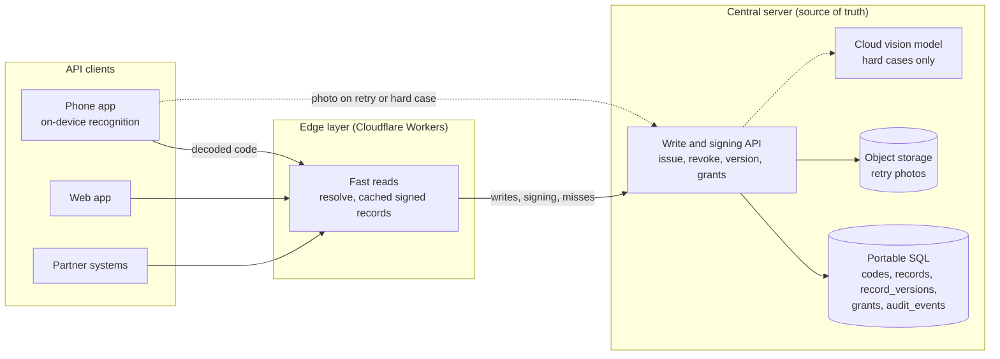

# zzThis Spec

> **Spec Kit map (2026-10-02).** This file stays as the source for copy, tags, and decisions. Spec Kit artifacts now hold the requirements. See [`specs/README.md`](../specs/README.md).
>
> | Section | Now lives in |
> |---|---|
> | 2 Product | [`specs/002-resolver-core`](../specs/002-resolver-core/spec.md), [`003-wordlist-checkword`](../specs/003-wordlist-checkword/spec.md), [`004-capture`](../specs/004-capture/spec.md) |
> | 3 to 5 Site, demo, visual system | [`specs/001-marketing-site/spec.md`](../specs/001-marketing-site/spec.md). Verbatim copy stays here. |
> | 6 Stack and repo | [`specs/001-marketing-site/plan.md`](../specs/001-marketing-site/plan.md) |
> | 7 Workflows | Superseded by the Workflows section in each `specs/*/spec.md`. The "OPEN Q13" and "draft PR" text below is stale. |
> | 8 Acceptance | [`specs/001-marketing-site/checklists/requirements.md`](../specs/001-marketing-site/checklists/requirements.md) |
> | 2.2a v1 text grammar | Accepted 2026-10-03 from Michael's Q48 and Q49 answers. Implemented by the spec 003 library (US3). |
> | 9 Questions | Still the decision log. Q21 to Q39 were added on 2026-10-02; Q49 to Q56 on 2026-10-03. |
> | 12 Roadmap | v1 scope, exit criteria, and v2 candidates. |
> | 10 Architecture | [`specs/002-resolver-core/plan.md`](../specs/002-resolver-core/plan.md), [`specs/004-capture/plan.md`](../specs/004-capture/plan.md) |
>
> Research targets, the funding-pitch founder bio, and the company-stage line were removed from this repo on 2026-10-02 (Q24 RESOLVED).

Status: v1 spec, deepened 2026-10-03 (Section 2.2a grammar, Section 12 roadmap). Owner of this document: Opus 5.5 (spec). Implementer: cloud coding agent or Grok Bot executor. Reviewer: operator (Danny), through a pull request to `main`.

## How to read this spec

- Square-bracket tags cite the source of each product claim or piece of copy: [BRIEF], [WIRE], [OVERVIEW], [PRODUCT], [OPERATOR]. [PRODUCT] cites Michael's private product write-up dated 2026-09-09, which is not in this repo. A dated tag such as [OPERATOR 2026-10-02] marks an operator decision made on that date. [ASSETS] cites the committed image asset manifest on branch `assets`.
- **INFERRED** marks a design or engineering choice made in this spec. The implementer may follow it without further approval.
- **OPEN** marks a decision that Michael must make. Each OPEN item has a default so the build is not blocked.
- When sources conflict, the [BRIEF] governs the site. For product behavior, [PRODUCT] governs.
- Copy shown in a `copy:` block ships verbatim. Copy marked INFERRED is connective text and may be edited during review.

## Contents

1. Summary and audience
2. Product spec (2.2a: v1 text grammar)
3. Marketing site
4. Click-through demo (`/demo`)
5. Visual system and components
6. Stack, repo layout, and engineering rules
7. Workflows
8. Acceptance criteria
9. Out of scope and OPEN questions
10. Architecture (proposal, not built)
11. Provenance
12. Roadmap: v1 scope and v2 candidates

## 1. Summary and audience

zzThis is a human-readable, human-writable code that works alongside barcodes and QR codes [BRIEF]. A person writes a code such as `zz-copper-lantern-sky-zz` on tape, a crate, a parcel, or a sign. The person links the code to a digital record and finds it later by camera, typing, or voice [BRIEF]. A second layer uses AI to turn a marked or photographed item into the next task and record [BRIEF].

This spec covers three deliverables and one proposal:

1. The product definition that the site describes (Section 2).
2. The first marketing site (Section 3).
3. A scripted click-through demo at `/demo` (Section 4).
4. A proposed architecture for the real product: central API, edge layer, and on-device capture (Section 10). It is a proposal, not built.

**Audience for the site:** xTechSearch visitors, possible investors, and collaborators [BRIEF].

**Audience for the brief:** Michael Chung (founder and project lead) and Daniel Meyer (full-stack development) [BRIEF].

**Honesty rules that apply everywhere:**

- zzThis has no validated codebook and no controlled comparisons yet [PRODUCT]. Recognition, resolver security, and human-factors performance are untested [PRODUCT].
- No performance figure appears on the site or in this repo until it is measured (Q7, Q24).
- The site makes no claim of pilots, customers, endorsement, or government adoption. The footer shows the words "Patent pending" at Michael's direction [MICHAEL 2026-10-02]; the site makes no other patent claim (Q9 RESOLVED).
- The xTech panel images are concept renderings [ASSETS]. The handwritten photos are real photos of Michael's handwritten codes [ASSETS].

## 2. Product spec

### 2.1 Status: concept versus tested

| Capability | Status | Source |
|---|---|---|
| Architecture, syntax, capacity calculations, postal and privacy workflows | Current work (design) | [PRODUCT] |
| Proof of concept built with Lovable, linked from zzthing.com | Exists; dictionary, generation, and checksum code not yet verified | [PRODUCT] |
| Word codebook | Not validated; no controlled comparisons | [PRODUCT] |
| Handwriting and print recognition of zz codes | Untested | [PRODUCT] |
| Secure resolver | Untested; prototype planned | [PRODUCT] |
| Central API, edge layer, and on-device capture (Section 10) | Proposal, not built | [OPERATOR 2026-10-02] |
| AI photo-to-action, inventory assistant, touch-first handling | Concept, shown as image concepts | [BRIEF] |
| Panels a–o and demo images | Concept renderings | [ASSETS] |
| Handwritten photos of codes on paper | Real photos | [ASSETS] |

### 2.2 Code grammar

**Framing markers.** The standard form opens with `zz-` and closes with `-zz` [BRIEF] [PRODUCT].

**Words.** The site shows lowercase code words: "MARK a lowercase zz code" [BRIEF]. Codes are built from a controlled word codebook designed for handwriting, reading, speech, recall, correction, optical recognition, and error detection [PRODUCT].

**Case rule.** Every zz code in site copy (text, headings, captions, titles) is lowercase and site copy never writes a standalone capital "ZZ". Photos and renders supplied by Michael may show a capital ZZ mark or uppercase letters inside a code; alt text describes them in words ("capital-letter zz mark") or quotes the code as shown [MICHAEL 2026-10-02] (Q42 RESOLVED).

**Mark types.** A zz mark can be words, numbers, or simple hand-drawn symbols such as a smiley or tally marks, and a person can read it even when it is written inside a sentence [MICHAEL 2026-10-02]. A code can connect to authorized macros as well as a record and next action [MICHAEL 2026-10-02]. The site names this as a concept only and does not describe how macros run or are authorized (INFERRED).

**Examples from sources:**

| Code | Context | Source | Under the v1 grammar (Section 2.2a) |
|---|---|---|---|
| `zz-copper-lantern-sky-zz` | Hero example; crate tape | [BRIEF] [ASSETS] | Valid, plain |
| `zz-apple-sky-lantern` | Postage code written in the label area | [PRODUCT] | Fails `no-closing-marker` |
| `zz-blue-bike-astoria-zz` | Physical thing | [PRODUCT] | Valid, plain |
| `zz-vitalik.eth-zz` | Web3 resource | [PRODUCT] | Fails `invalid-character` (Q52 default, issue #38) |
| `zz@-AgentSmith-neo-zz` | Verified agent | [PRODUCT] | Fails `invalid-handle` (Q51 default, issue #37) |
| `zz-@agentsmith-zz` | AI agent handle (Home, Top ways 04) | [MICHAEL 2026-10-02] | Valid, handle |
| `zz-b2-smith-1-zz`, `zz-b2-4-zz` | Duffel and crate tape (panel a) | [ASSETS] | Valid, plain (field code) |
| `(zz) camp bravo four two (zz)` | Circled marker variant on a pallet (panel c) | [BRIEF] [ASSETS] | Valid, plain; canonical `zz-camp-bravo-four-two-zz` |
| `zz-river-maple-sky-zz` | Parcel (panel g) | [ASSETS] | Valid, plain |
| `zz-kathy-lost-cat-zz` | Lost-cat flyer (panel h) | [ASSETS] | Valid, plain |

**Circled-zz variant.** Panel c shows a "circled zz marker variant" on a wrapped mixed-goods pallet [BRIEF], written as `(zz) camp bravo four two (zz)` [ASSETS].

**Namespace marker.** The `@` marker appears in the verified-agent example `zz@-AgentSmith-neo-zz` [PRODUCT]. Michael's Q49 answer sets the v1 rule: `@` comes first, right after the opening marker, and marks a handle (Section 2.2a G4) [MICHAEL 2026-10-02 #34]. Verification is a resolver concern, not something the printed characters prove (INFERRED); verifying who runs a handle is a v2 candidate (Section 12).

**Word counts and capacity:**

- With a 5,000-word dictionary, two ordered words give 25 million raw combinations, and three give 125 billion. These counts come before reserving capacity for checks, exclusions, and policy [PRODUCT].
- [PRODUCT] also proposes a candidate 10,000-word dictionary. Two ordered words from it give 100 million raw combinations, and three give one trillion (arithmetic INFERRED).
- Two or three data words plus a checksum word produce three or four visible words. The checksum does not increase identifier capacity [PRODUCT].

**Checksum word.** A checksum word or other redundancy supports error detection [PRODUCT]. The demo does not implement or imply a real checksum algorithm (INFERRED).

**Formats to model:** two-word, three-word, checksum, prefix, enterprise, one-time, and reusable-account formats [PRODUCT].

**Status of the syntax.** The syntax shown on the site is illustrative. The interaction format is to be selected by measured performance and system cost [PRODUCT]. The text grammar that parsers accept is fixed for v1 in Section 2.2a; the issued formats (which word counts the server issues) stay OPEN (Q27).

### 2.2a v1 text grammar (accepted 2026-10-03)

This section is the accepted v1 grammar for codes written as text. It replaces the "product options, not yet accepted grammar" placeholder in spec 003 FR-006. Sources: Michael's replies on issue #33 (Q48) and issue #34 (Q49) [MICHAEL 2026-10-02 #33] [MICHAEL 2026-10-02 #34], used as given. Where Michael's replies leave a gap, the rule carries a default with its question ID (Q50 to Q56, issues #36 to #42) or is marked INFERRED. Spec 003 owns the library that implements it; specs 002 and 004 and the demo (001 T029) call that one library.

v1 is ASCII only. Any-language codes are a v2 candidate (issue #35).

**G1. Code types**

| Type | Shape | Example | Source |
|---|---|---|---|
| Word code | Dictionary words from the closed wordlist (spec 003) | `zz-copper-lantern-sky-zz` | [MICHAEL 2026-10-02 #34] |
| Field code | Words or names mixed with numbers | `zz-b2-smith-1-zz` | [MICHAEL 2026-10-02 #34] |
| Handle | A name for a person, organization, or AI agent. The first part starts with `@` | `zz-@agentsmith-zz` | [MICHAEL 2026-10-02 #34] |
| Bare mark | `zz` or a circled `(zz)` with no content | `zz` | [MICHAEL 2026-10-02 #33] |

- The parser reports one of three kinds: `plain` (word code or field code), `handle`, or `bare`. Telling a word code from a field code needs the wordlist: a plain code whose parts are all wordlist words is a word code. Every other plain code is a field code, including codes such as `zz-hello-zz` whose words are not on the list. Michael's definition ("words or names mixed with numbers") is extended to cover these (INFERRED).
- Macro codes such as `zz-fn-pay-agentsmith-zz` and `zz-run-reorder-water-zz` are plain codes to the grammar. Running a macro is an app concern that needs an authorized, confirmed user, and it is not part of v1 [MICHAEL 2026-10-02 #34].
- Drawn symbols (a smiley, a star) are a separate image-recognition mode, not part of this text grammar [MICHAEL 2026-10-02 #34]. They are a v2 candidate.

**G2. Normalization, in order**

1. Fail with `empty` if the input is empty or only whitespace. Then fail with `too-long` if the raw input is longer than 256 characters (INFERRED guard for FR-010 malformed input in spec 002).
2. Trim leading and trailing whitespace. Treat line breaks and tabs as spaces, so a code written across two lines is one code [MICHAEL 2026-10-02 #33].
3. Treat the dash characters U+2010 to U+2015 and U+2212 as a hyphen, because phone keyboards replace typed hyphens (INFERRED).
4. Lowercase ASCII letters. Case never changes which code it is: `Zz-HELLO-zz`, `zz-Hello-zz`, and `zz-hello-zz` are the same code, and so is the same code written all in capitals [MICHAEL 2026-10-02 #33].
5. Rewrite an `@` that touches the opening marker (`zz@-name-zz` or `zz@name-zz`) as `zz-@name-zz` (Q51 default, issue #37).
6. Find the markers (G3), then split the content on separators. Hyphens, spaces, or a mix count as separators, and a run of them counts as one separator [MICHAEL 2026-10-02 #33].
7. Check each part (G4) and the part count (G5).
8. Return the canonical form: `zz-` plus the parts joined by single hyphens plus `-zz`. The canonical form of a bare mark is `zz` [MICHAEL 2026-10-02 #33].

**G3. Markers**

- A code with content needs a marker at the start and at the end. A circled `(zz)` counts as a marker [MICHAEL 2026-10-02 #33]. A missing closing marker fails with `no-closing-marker`. This replaces the demo parser's rule that accepted a missing closing marker (Section 4.4).
- Markers are whole tokens. An opening `zz` must be followed by a separator, and a closing `zz` must follow one: `zzcopper-lantern-zz` and `zzz-x-zz` fail with `no-marker`, and the `zz` at the end of `buzz` is part of the word (INFERRED). A circled marker needs no separator. `(` and `)` appear only inside the exact token `(zz)`.
- The two ends may mix forms, for example `(zz) camp bravo zz`, because handwriting varies (INFERRED).
- The circled form is display metadata only. `(zz) camp bravo four two (zz)` and `zz-camp-bravo-four-two-zz` are the same code (INFERRED from "one canonical form" [MICHAEL 2026-10-02 #33]).
- A bare mark is `zz` or `(zz)` alone, or two markers with nothing but separators between them (`zz-zz`, `(zz) (zz)`), or `zz` followed only by separators [MICHAEL 2026-10-02 #33]; the last three forms are INFERRED. Capital letters are accepted from handwriting: `zz` written in capitals parses as the bare mark `zz`.
- A part may not be `zz`. `zz-zz-zz` fails with `marker-in-body` (INFERRED).

**G4. Parts**

| Part | Allowed characters after lowercasing | Rule | Source |
|---|---|---|---|
| Plain part | `a` to `z`, `0` to `9` | One or more characters | [MICHAEL 2026-10-02 #34] |
| Handle part | `@`, then `a` to `z`, `0` to `9`, `.`, `_` | `@` only as the first character of the first part. 1 to 32 characters after `@` (INFERRED cap). At least one letter or digit; no leading, trailing, or doubled `.` (INFERRED) | [MICHAEL 2026-10-02 #34] |

- A handle is the only part of its code: `zz-@agentsmith-neo-zz` fails with `invalid-handle` (Q51 default, issue #37).
- `@` anywhere except the start of the first part fails with `misplaced-at`, for example `zz-ai@-agentsmith-zz`.
- `.` and `_` outside a handle fail with `invalid-character`, so `zz-vitalik.eth-zz` fails and `zz-@vitalik.eth-zz` passes (Q52 default, issue #38).
- The reserved symbols `#`, `$`, `/`, and `:` fail with `reserved-symbol`, never as ordinary characters, so they can get meanings later without breaking codes [MICHAEL 2026-10-02 #34].
- Letters outside ASCII (for example Korean or Cyrillic) fail with `unsupported-script` in v1 (INFERRED; issue #35 tracks any-language codes). Other characters fail with `invalid-character`.

**G5. Part count**

A code with content has 1 to 5 parts, counting a handle as one part (Q50 default, issue #36). More or fewer fail with `part-count`. Codes issued from the wordlist keep the counts in Section 2.2: two or three data words plus a check word [PRODUCT].

**G6. Failure reasons**

The parser returns exactly one reason. When several apply, it returns the first in this order (INFERRED, so tests are stable): `empty`, `too-long`, `no-marker`, `no-closing-marker`, `marker-in-body`, `unsupported-script`, `reserved-symbol`, `misplaced-at`, `invalid-handle`, `invalid-character`, `part-count`.

**G7. Storage and display**

- Store and display the canonical form, lowercase and hyphen-separated, including handles [MICHAEL 2026-10-02 #33] [MICHAEL 2026-10-02 #34].
- Site copy, images, and documents show lowercase `zz` or the circled `(zz)`, never a capital-letter zz mark on its own or in a code. On its own, a capital Z mark painted on equipment resembles adversary vehicle markings, and these materials go to the Army [MICHAEL 2026-10-02 #33]. Uppercase letters inside code words (as in `zz-1234ABCD-zz` on a sign) are not covered by this rule. Alt text may quote text inside an image as it appears (Section 3.8); prose that names a code uses the canonical form (INFERRED). Test inputs that need capitals are described in words. Images that still show a capital-letter zz are tracked in Q53 (issue #39) and 001 T030.

**G8. Codes inside running text** (Q55 default, issue #41)

- Typed lookup: the whole input must be one code or one bare mark. The parser does not search inside a sentence.
- Camera and text scanning (spec 004): find every marker pair. A lone `zz` with no content is offered as a bare mark only after the person confirms it.

**G9. Test vectors.** The grammar library and the demo (after 001 T029) must return these results.

| Input | Result | Canonical form or reason |
|---|---|---|
| `zz-copper-lantern-sky-zz` | plain | `zz-copper-lantern-sky-zz` |
| `zz copper lantern sky zz`, all in capitals | plain | `zz-copper-lantern-sky-zz` |
| `zz-copper` + tab + `lantern-zz` | plain | `zz-copper-lantern-zz` |
| `zz−copper−lantern−zz` (U+2212 minus signs) | plain | `zz-copper-lantern-zz` |
| `(zz) camp bravo zz` (mixed markers, INFERRED) | plain | `zz-camp-bravo-zz` |
| `(zz)camp bravo(zz)` | plain | `zz-camp-bravo-zz` |
| `zz-buzz-zz` | plain | `zz-buzz-zz` |
| `Zz-Copper--lantern  sky-zZ` | plain | `zz-copper-lantern-sky-zz` |
| `zz-copper` + line break + `lantern-sky-zz` | plain | `zz-copper-lantern-sky-zz` |
| `zz–copper–lantern–zz` (en dashes) | plain | `zz-copper-lantern-zz` |
| `(zz) camp bravo four two (zz)` | plain | `zz-camp-bravo-four-two-zz` |
| `zz-hello-zz` | plain | `zz-hello-zz` |
| `zz-b2-smith-1-zz` | plain | `zz-b2-smith-1-zz` |
| `zz-1234ABCD-zz` | plain | `zz-1234abcd-zz` |
| `zz Guest WiFi connect zz` | plain | `zz-guest-wifi-connect-zz` |
| `zz-fn-pay-agentsmith-zz` | plain | `zz-fn-pay-agentsmith-zz` |
| `zz-@agentsmith-zz` | handle | `zz-@agentsmith-zz` |
| `zz-@AgentSmith.eth-zz` | handle | `zz-@agentsmith.eth-zz` |
| `zz-@acme_support-zz` | handle | `zz-@acme_support-zz` |
| `zz@-agentsmith-zz` | handle | `zz-@agentsmith-zz` |
| `zz@agentsmith-zz` | handle | `zz-@agentsmith-zz` |
| `zz-@` + 32 letters + `-zz` | handle | same, lowercase |
| `zz` | bare | `zz` |
| `(zz)` | bare | `zz` |
| `zz` in capitals | bare | `zz` |
| `zz-zz` | bare | `zz` |
| `(zz) (zz)` (INFERRED) | bare | `zz` |
| `zz-` (INFERRED) | bare | `zz` |
| (empty or spaces only) | fail | `empty` |
| 300 spaces | fail | `empty` |
| `copper` | fail | `no-marker` |
| `zzcopper-lantern-zz` | fail | `no-marker` |
| `zzz-x-zz` | fail | `no-marker` |
| `( zz ) camp ( zz )` | fail | `no-marker` |
| `zz-copper-lantern-sky` | fail | `no-closing-marker` |
| `zz-@agentsmith` | fail | `no-closing-marker` |
| `zz-zz-zz` | fail | `marker-in-body` |
| `zz-구리-등불-zz` | fail | `unsupported-script` |
| `zz-#tag-zz` | fail | `reserved-symbol` |
| `zz-pay-$5-zz` | fail | `reserved-symbol` |
| `zz-a/b-zz` | fail | `reserved-symbol` |
| `zz-x:y-zz` | fail | `reserved-symbol` |
| `zz-ai@-agentsmith-zz` | fail | `misplaced-at` |
| `zz@-AgentSmith-neo-zz` | fail | `invalid-handle` |
| `zz-@-zz` | fail | `invalid-handle` |
| `zz-@.agent-zz` | fail | `invalid-handle` |
| `zz-@agent.-zz` | fail | `invalid-handle` |
| `zz-@agent..smith-zz` | fail | `invalid-handle` |
| `zz-@` + 33 letters + `-zz` | fail | `invalid-handle` |
| `zz-acme_support-zz` | fail | `invalid-character` |
| `zz-vitalik.eth-zz` | fail | `invalid-character` |
| `zz-one-two-three-four-five-six-zz` | fail | `part-count` |
| 257 characters | fail | `too-long` |

### 2.3 Resolver

- **Public identifier versus authorization.** The visible words are a public identifier, not a password or private key. Payment and authorization stay in signed backend records [PRODUCT].
- **Controls.** The resolver maps the public code to mutable records and enforces single use, expiration, revocation, signed updates, permissions, rate limits, and auditability [PRODUCT].
- **Uncertain readings.** The system resolves only above a validated threshold; otherwise it requests confirmation, another view, or manual handling [PRODUCT].
- **Abuse cases.** Copied marks, replay, enumeration, unauthorized updates, and malformed input [PRODUCT].

### 2.4 Record linking

- A code links to existing identifiers: NSN, document number, hand receipt, and photo (panel e) [BRIEF].
- In field logistics, the code connects to existing identifiers [BRIEF].
- **No-device marks.** "For a field code made with no device, link and reconcile later" [BRIEF]. A person writes the code first, and a record is attached when a device is available.

### 2.5 Capture by camera, typing, or voice

- **Input paths.** Read by camera or manual entry. Report the words by voice where useful [BRIEF]. Voice and manual entry are alternate input paths [BRIEF].
- **Recognition approach.** Distinctive markers and placement cues are combined with existing printed-text and handwriting models, lexicon-constrained decoding, ranked candidates, and checksum validation [PRODUCT].
- **Decision bands.** Calibrated confidence decides whether the system resolves, asks for confirmation, requests another view, or abstains [PRODUCT]. These are accept, clarify, retry, or abstain decisions, calibrated separately for voice, image, and typed input [PRODUCT].
- **Read-back.** Panel f shows a radio cue and read-back of three code words [BRIEF]: "Tag: copper, lantern, sky. Break." [ASSETS]. Read-back confirmation errors must be evaluated, not assumed away [PRODUCT].

### 2.6 AI-assisted photo-to-record flow

Workflow: PHOTOGRAPH one or more items → CONFIRM the proposed identification → choose a handling or inventory action by touch or voice → REVIEW the prepared record or form. "This is the second layer of the story, not a separate product category." [BRIEF]

- **Photo to action.** A Soldier photographs loose or damaged items. zzThis AI helps identify each one, suggests how to handle, pack, ship, return, repair, or dispose of it, and prepares the relevant form for review [BRIEF].
- **Inventory assistant.** A Soldier photographs a supply shelf at different times. zzThis helps count what remains, identifies what is running low, and suggests a reorder [BRIEF].
- **AI and touch first.** A Soldier drags a recognized item to an action on the screen or speaks a request instead of typing through forms [BRIEF].
- **Human review.** A person confirms the proposed identification and reviews the prepared record or form [BRIEF].

### 2.7 Privacy

Codes are public identifiers, and authorization stays separate [PRODUCT]. Research targets are not part of this repo (Q24).

## 3. Marketing site

### 3.1 Information architecture

**Navigation, in order:** How it works | Applications | About | Contact [BRIEF]. The zzThis logo links to `/` (INFERRED). A theme toggle sits at the end of the nav bar (INFERRED). On viewports narrower than 900 px, the nav collapses into a disclosure button labeled "Menu" (INFERRED).

| Route | H1 | Purpose | Source |
|---|---|---|---|
| `/` | Hero line | Long scrolling page, mobile first | [BRIEF] |
| `/how-it-works` | How it works | Mark, read, link, report; then photograph, confirm, act, record | [BRIEF] |
| `/applications` | Applications | Field logistics, postal and parcel, community use, digital aliases | [BRIEF] |
| `/about` | About zzThis | Michael, advisors, prototypes, business context | [BRIEF] |
| `/contact` | Contact | 1@1000x10.com and a collaboration invitation | [BRIEF] |
| `/demo` | See zzThis in action. | Prototype links, planned zzThat app, scripted click-through with mock data | Operator request; H1 [MICHAEL 2026-10-02] |
| `/technology` | (not built) | Michael's draft wording is stored in `src/content/technology.ts`; the page is built and enters navigation only when it has that explanation plus a supporting example [MICHAEL 2026-10-02] | [BRIEF] [MICHAEL 2026-10-02] |

- `/how-it-works` is a real page that reuses the Home workflow components. Home also exposes `#how-it-works` (INFERRED; the [BRIEF] allows "Anchored Home sections; stable detail route later").
- The demo is not in the main nav. Links to it appear on `/how-it-works`, in the Home core workflow section, and in the footer [MICHAEL 2026-10-02] (Q5 RESOLVED). When the free zzThat app launches, add a prominent "Try zzThat" navigation action that links to zzthat.com [MICHAEL 2026-10-02].
- **Technology page:** `src/content/technology.ts` holds Michael's public draft wording, marked `unpublished`. No route is generated and no page links to it until the page has that explanation plus a supporting example. Do not publish an empty stub [MICHAEL 2026-10-02] (Q14 RESOLVED).
- Every page has exactly one H1, then H2 and H3 by content hierarchy, not by menu [BRIEF].
- Every page has a footer with "Contact: 1@1000x10.com" [BRIEF], the nav links, and a link to `/demo` (INFERRED).

### 3.1a Layout and proportions (wireframes)

[WIRE] is the companion layout source for this spec. It shows Home as three phone scroll segments and two desktop segments of one continuous page [WIRE]. Grey boxes in [WIRE] mark image positions, and type, color, and final imagery follow later [WIRE]. Where [WIRE] and the [BRIEF] differ on copy, the [BRIEF] governs. Where they differ on order or layout, [WIRE] governs, because it is the later and more specific source (INFERRED).

**Home order on phones (3 segments)** [WIRE]

| Segment | Sections, in order | Panels |
|---|---|---|
| 1. First screen and workflow | Header (logo, Menu); H1 hero and subline; hero image; actions; featured statement; comparison strip; How it works (Mark, Read, Link, Report, one card at a time) | b; c close-up, d, e, f |
| 2. Field work and AI | Field logistics (controlled swipe row); From photo to action (j, k, l sequence, then m and n cards) | a, b (alternate), c; j, k, l, m, n |
| 3. Applications and contact | More applications (Postal and parcel, Everyday and community, Digital aliases); About teaser; Contact action; footer | g and o; h; i |

**Home order on desktop (2 segments)** [WIRE]

| Segment | Sections, in order | Panels |
|---|---|---|
| 1. First screen and workflow | Logo and nav; hero text beside hero image; featured statement; comparison (4 cards) [MICHAEL 2026-10-02]; core workflow (4 steps); field logistics (3 across); photo to action (j, k, l, 3 across) | b; c close-up, d, e, f; a, b (alternate), c; j, k, l |
| 2. More applications | m and n (2 across); Applications grid 2×2 (Field logistics, Postal and parcel, Community, Digital aliases); About and Contact (2 across); footer | m, n; j thumbnail, g and o, h, i |

On phones, the Applications grid omits the Field logistics card, because the field band sits directly above it [WIRE].

**Grid per breakpoint (INFERRED)**

| Viewport | Container | Columns | Series of 3 | Core workflow | Applications |
|---|---|---|---|---|---|
| 320–599 px | Fluid, 16 px side margins | 1 | Stacked; field a, b, c use a controlled swipe row [BRIEF] [WIRE] | 1 per row [WIRE] | 1 per row |
| 600–899 px | Fluid, 26 px margins | 2 | 2 across, then wrap | 2×2 | 2×2 |
| 900–1199 px | Max 1120 px, 12-column grid | 12 | 3 across [BRIEF] | 2×2 | 2×2 |
| ≥ 1200 px (check at 1440) | Max 1280 px, 12-column grid | 12 | 3 across | 4 across [WIRE] | 2×2 |

The controlled swipe row uses CSS scroll snap and a visible peek of the next card. It has Previous and Next buttons and no auto-advance. The row is a focusable region labeled "Field logistics examples" (INFERRED).

**Golden ratio, 1:1.618** [WIRE]. Michael asked Daniel to use this ratio for the layout [WIRE]. The [BRIEF] allows it only "without constraining responsive layout" [BRIEF].

| Use | Rule (INFERRED) |
|---|---|
| Hero split at ≥ 900 px | `grid-template-columns: minmax(0,1fr) minmax(0,1.618fr)` (text : image) |
| About intro and contact row | Text 1.618 : contact card 1 |
| Founder row | Initials card 1 : bio 1.618 |
| Card image area | Aspect ratio 1.618 : 1, `object-fit: cover`, `object-position` from the focal point |
| Spacing scale | φ steps: 4, 6, 10, 16, 26, 42, 68, 110 px (Section 5) |
| Override | The ratio yields when content would overflow. Columns use `minmax(0, …)`, and long copy wraps [BRIEF] |

**j–l sequence.** Panels j, k, and l form one visible three-step sequence [WIRE]. Render them as an ordered list with step labels "01 Photograph", "02 Guide", and "03 Review", set uppercase by CSS [WIRE]. The mobile wireframe uses "Guidance" and "Prepared form". This spec uses the desktop labels at every width, because [WIRE] says sections and wording stay consistent with mobile (INFERRED). A thin construction line joins the three steps. It runs horizontally at ≥ 900 px and vertically on phones. Panels m and n follow as two more cards titled "Inventory assistant" and "Touch first" [WIRE]. All five cards have equal footprints within their row.

**Concept-gallery label rule.** One short concept-gallery label covers the j–n group, and captions explain each step [WIRE]. The [BRIEF] allows concept status once for the demonstration gallery and once on the prototype links [BRIEF].

- Concept labels [MICHAEL 2026-10-02] (Q17 RESOLVED): a standalone AI-render panel carries the tag "Concept illustration" (the Home hero image b, each Home application card, and single-panel sections on `/applications`). A grouped gallery carries one visible label above its panels: on Home, above the core workflow steps, the Field logistics row, and the From photo to action group. `/how-it-works` and `/applications` keep one page label under the H1, which covers their galleries. Captions name the actual workflow.
- Label copy: standalone tag "Concept illustration" [MICHAEL 2026-10-02]. Group label (INFERRED): "Concept illustrations. These panels show intended use, not a deployed system." Page label (INFERRED): "Concept renderings. The panel images on this page show intended use, not a deployed system." All three live in `src/content/labels.ts`; replace the INFERRED wording if Daniel supplies exact text.
- The second label appears on the About prototype links. Copy (INFERRED): "Both sites are concept-stage explorations."
- `/demo` uses its own "Demo · mock data" label instead (Section 4).

**About layout** [WIRE]

| Order | Phone | ≥ 900 px |
|---|---|---|
| 1 | H1 and intro | H1 and intro (1.618) beside the contact card (1) |
| 2 | Current explorations, stacked | zzthing.com and zzthat.com, 2 across |
| 3 | Founder card: headshot or initials | Headshot or initials (1) beside the bio (1.618) |
| 4 | Hacker Dojo: eyebrow, H2, subtitle, logo, two paragraphs | Same block; logo about 96 px square [MICHAEL 2026-10-02] |
| 5 | Advisors, one stacked card each [WIRE]. Headshot where one was supplied, otherwise initials | 3 across: Patrick Muggler, Arshi Chadha, Ridham Bhagat; then Daniel Meyer, Adam Fry [MICHAEL 2026-10-02] |
| 6 | Codes written by hand, four real photos, 2×2 | 2×2 [MICHAEL 2026-10-02] (Q42 RESOLVED) |
| 7 | Location, then Next action | Location and Next action, 2 across [WIRE] |

The 2026-10-02 brief and wireframes add Adam Fry and drop the Future space card. Michael's later 2026-10-02 answers remove Jim White from the advisors [MICHAEL 2026-10-02]. Headshots ship for Michael Chung, Patrick Muggler, Arshi Chadha, and Ridham Bhagat. Daniel Meyer and Adam Fry stay on initials. The implementer does not scrape LinkedIn [MICHAEL 2026-10-02] (Q6, Q46 RESOLVED).

**Overrides to H.1–H.3**

1. H.1: Add the subline directly under the H1: "Write a code on a thing; find its record by camera, typing, or voice." [WIRE]
2. H.1 phone order becomes: H1, subline, image b, actions, then the [BRIEF] paragraph [WIRE]. This replaces "image above text on phones". The image still comes before the descriptive paragraph.
3. H.1 desktop: The text column holds the H1, subline, actions, and paragraph. The image column holds b. The 1:1.618 ratio is unchanged.
4. H.1: The focal point of image b sits on the tape code, so the mark stays visible in every crop [WIRE]. Caption: "Word code on blue tape beside an obscured barcode." [BRIEF]
5. H.1: Keep both buttons. The desktop wireframe shows only the primary action, but the [BRIEF] specifies both [BRIEF].
6. H.1: The H1 reads "writable - and smart." with a spaced hyphen, as typed in Michael's alternate hero copy [MICHAEL 2026-10-02] (Q47; Jev decision 2026-10-02). This replaces the Q1 em dash. No em dash is allowed anywhere in site copy.
7. H.3: Render the comparison as four cards, in this order: Barcode, QR code, Alphanumeric code, and zzThis [MICHAEL 2026-10-02]. This replaces the three cards in [WIRE] and the [BRIEF] cells. Each card has four labeled rows (Create the mark, Read the mark, What it connects, Easy to say and remember) that use the H.3 cells verbatim. The note under the cards is both H.3 sentences verbatim (Q41 RESOLVED). Keep the section number "02" and the current card design: dark cards, small uppercase monospace row labels set by CSS, divider lines, and the corner detail. Only the zzThis card has the accent edge, and it stays last. Layout: four equal columns at ≥ 900 px, a 2×2 grid at 600–899 px, and stacked single cards below 600 px, with no horizontal scrolling. At ≥ 900 px each row aligns across all four cards, so a longer cell pushes the same row down on every card [MICHAEL 2026-10-02].
8. The Section 3.2 order conflict is resolved by [WIRE]: comparison → How it works → Field logistics → From photo to action. Q2 is closed.

### 3.2 Home (`/`)

Reading order follows Do / Re / Mi / Fa as rhythm only. No beat labels are printed [BRIEF]. Golden-ratio proportions may inform spacing and image scale [BRIEF].

**Source conflict (closed):** the [BRIEF] destinations row lists "core workflow; field example", while the reading-order table puts Re (field item) before Mi (workflow). [WIRE] settles the order (Section 3.1a override 8, Q2 closed).

#### H.1 Hero (Do)

Image: `public/images/panels/b-crate-word-code.webp`, eager loaded, `fetchpriority="high"`. At 900 px and wider, the image and text sit side by side at about 1.618:1 (image:text). On phones, the image appears above the text so that the image comes before the description [BRIEF; layout INFERRED].

```copy
H1: Barcodes made things scannable. zzThis makes them writable - and smart.
P:  zzThis is a human-readable, human-writable code for the physical world. Write zz-copper-lantern-sky-zz on tape, a crate, a parcel, or a sign. Link it to a digital record, then find it by camera, typing, or voice.
Primary button:   See field logistics   → /#field-logistics
Secondary button: How it works          → /how-it-works
```

[BRIEF] The paragraph is the 2026-10-02 text [MICHAEL 2026-10-02] (Q47 RESOLVED). The H1 uses the alternate draft's spaced hyphen ("writable - and smart.") as typed [MICHAEL 2026-10-02] (Q47; Jev decision 2026-10-02), replacing the Q1 em dash. Image b carries the "Concept illustration" tag in its caption [MICHAEL 2026-10-02]. Render the code in IBM Plex Mono (INFERRED).

#### H.2 Featured statement (Do)

No image.

```copy
H2: The shortest, smartest distance between a physical thing, its digital record, and the work that comes next.
P:  A zz code gives people a way to create the mark themselves, wherever the work happens. AI can help identify what a camera sees, count what remains, suggest how an item should be handled, and prepare the next task. The same visible code connects the item, its history, and the people responsible for it.
```

[MICHAEL 2026-10-02] (Q47 RESOLVED). The H2 is unchanged.

#### H.2a Top ways zzThis is used (Do)

Sub-block of section 01, after the featured paragraph. No new eyebrow. Sections 02 to 08 stay numbered as they are. Layout: 1 column below 600 px, 2 columns from 600 to 899 px, 3 columns at 900 px and wider. Rows in a line share a height. zzthat.com is plain text [MICHAEL 2026-10-02].

```copy
H3: Top ways zzThis is used
01 Logistics
   zz-copper-lantern-sky-zz
   zz-fastfreight-c4821-123-zz
   Easier handling: mark crates, bags, and parts, then read, link, and hand them off with a phone camera or a few spoken words. For shipping, including across borders, the zz-code can be the shipment's shared identity and hub, where customs, carriers, and payment services find the same information, and its ID on the shared ledger used by every service that handles the goods.
02 Postal
   zz-post-rock-river-sky-zz
   A handwritten zz-code can serve as proof of postage and a trackable reference: write it in the stamp corner of a letter or parcel, and it links to postage, routing, and tracking.
03 Everyday use: zzThat
   zz-kathy-lost-cat-zz
   zz-moving-box-kitchen-3-zz
   Free for everyone. Write a code on a lost-pet flyer, a moving box, a garage-sale item, or a note, and anyone can scan it, like a QR code you can write by hand. Endless imaginative uses. The zzThat app is coming to Android, iOS, and the web at zzthat.com.
04 AI agents
   zz-acme-support-agent-zz
   zz-@agentsmith-zz
   AI agents need identities people can easily know and recognize by name, and enterprises need to name and brand their agents, on the everyday web as well as on blockchains. A zz-code gives an agent a short name people can write, say, and verify, linked to who runs it and what it is allowed to do.
05 Blockchain addresses
   zz-btc-harbor-violet-nine-zz
   zz-harbor-violet-nine-zz
   Wallet, account, smart-contract, and agent addresses on networks such as Bitcoin and Ethereum are long strings of random characters. A zz-code is a readable alias for any of them: easier to write, say, and check on screen before you send.
06 Macros
   zz-fn-pay-agentsmith-zz
   zz-run-reorder-water-zz
   A zz-code can also call a function: a short, human-writable command that asks a system to do something, such as reorder supplies, pay an agent, or open a work order. A macro runs only for an authenticated, authorized user who confirms it; the code itself carries no authority.
```

[MICHAEL 2026-10-02]

#### H.3 Comparison strip (Do)

H2: "How zzThis compares" (INFERRED). Cells are verbatim [MICHAEL 2026-10-02] and replace the [BRIEF] cells:

| | Barcode | QR code | Alphanumeric code | zzThis |
|---|---|---|---|---|
| Create the mark | Print | Print or display | Print or handwrite | Write, draw, print, or display: words, numbers, or symbols |
| Read the mark | Scanner | Camera | Person, scanner, or typing | Person, camera, voice, typing, or within text |
| What it connects | Item to data | Surface to digital content | Shipment or item to its tracking status | Thing to its record, next action, and authorized macros |
| Easy to say and remember | No | No | Hard (8 to 22 random characters) | Yes (2 to 4 words, or short words and numbers) |

Note under the cards (small, muted, full width), both sentences verbatim [MICHAEL 2026-10-02] (Q41 RESOLVED): "Alphanumeric example: an 8-character handwritten postage code (Deutsche Post) or a 14–22-character parcel tracking number. zz-codes can be words, numbers, or simple hand-drawn symbols such as a smiley or tally marks, and can be read even when written inside a sentence."

Render this table as four cards, per override 7 in Section 3.1a. Also include a visually hidden `<table>` with the same cells so that screen readers can navigate by row and column (INFERRED).

#### H.4 How it works (Mi), `id="how-it-works"`

```copy
H2: How it works
P:  Core identity: MARK a lowercase zz code → READ it by camera or manual entry → LINK it to a record → REPORT the words by voice where useful.
Step 1 H3 Mark:   Write the code on tape, a crate, or a pallet.        [image alt-c]
Step 2 H3 Read:   Camera or manual entry.                              [image d]
Step 3 H3 Link:   Connect to an existing record and photo.             [image e]
Step 4 H3 Report: Say the code words if a voice handoff is useful.     [image f]
P:  Example code: zz-copper-lantern-sky-zz   (lowercase, as text)
P:  For a field code made with no device, link and reconcile later.
Link: Try the scripted demo → /demo
```

Sources: the first paragraph and the closing line are [BRIEF]. The example-code line shows the visible lowercase zz code as text, not as the zz-code logo image [MICHAEL 2026-10-02] (Q11 RESOLVED); the "Example code" label is INFERRED. The step text is [WIRE]. The link text is INFERRED. In each card, the image sits above the step text.

#### H.5 Field logistics (Re), `id="field-logistics"`

```copy
H2: Field logistics
P:  Hand-mark mixed items at the point of work; link the mark to a record.
Cards: a, b (alternate), c, with captions from the Section 3.8 image plan.
```

[WIRE]. This band and H.6 together form the visually largest part of Home, with eight full-size image cards [BRIEF]. Section H.7 uses smaller thumbnails.

#### H.6 From photo to action (Fa), `id="photo-to-action"`

```copy
H2: From photo to action
P:  A second layer after the handwritten code: see an item, identify it, choose its next task.
[Concept group label, Section 3.1a]
Sequence: j (01 Photograph), k (02 Guide), l (03 Review); then cards m (Inventory assistant) and n (Touch first)
P:  AI-assisted work: PHOTOGRAPH one or more items → CONFIRM the proposed identification → choose a handling or inventory action by touch or voice → REVIEW the prepared record or form.
```

The first paragraph and the card labels are [WIRE]. The workflow paragraph is [BRIEF]. Keep this section distinct and after the marking example, never under the digital-alias card [BRIEF].

#### H.7 More applications, `id="applications"`

```copy
H2: More applications
P:  The same writable code works in other settings.
H3 Field logistics (≥ 600 px only): Hand-mark bags, crates, pallets, and mixed goods; read or relay a code; connect it to existing identifiers. Then photograph loose items, prepare a turn-in, compare inventory, and use touch-first actions.   [thumbnail j]
H3 Postal and parcel: Write a reference directly on a parcel; photograph loose items and receive packing guidance before choosing a parcel code.   [g, o]
H3 Everyday and community: A handwritten code on a lost-cat flyer or other public surface can lead to a useful page.   [h]
H3 Digital aliases: A short human-readable code can stand in for a long machine address used by software agents.   [i]
Link: All applications → /applications
```

The story text for each category is [BRIEF]. The intro paragraph and link text are INFERRED. On phones, each card shows one image. The parcel card shows g and o side by side at 50% width each [WIRE].

#### H.8 About teaser

```copy
H2: About and people
P:  Meet Michael and the advisors; see prototype explorations.
Link: About zzThis → /about
```

[WIRE]

#### H.9 Contact action, `id="contact"`

```copy
H2: Contact
P:  Discuss field feedback, a pilot, or collaboration.
Link: 1@1000x10.com → mailto:1@1000x10.com
```

[WIRE] [BRIEF]

#### Footer (all pages)

Footer: How it works | Applications | Demo | About | Contact, then "1@1000x10.com" [BRIEF] and the words "Patent pending" [MICHAEL 2026-10-02] (Q9 RESOLVED).

### 3.3 How it works (`/how-it-works`)

| Order | Section | Content | Source |
|---|---|---|---|
| 1 | H1 "How it works" | Intro: "Two connected workflows: one code for identity, and AI for the work that follows." (INFERRED) | — |
| 2 | H2 "Core identity" | Same as H.4, using the shared component | [BRIEF] [WIRE] |
| 3 | H2 "Three ways to read a code" | H3 Camera; H3 Typing; H3 Voice, each one line: "Read by camera or manual entry. Report the words by voice where useful. Voice and manual entry are alternate input paths." Panels d and f | [BRIEF] |
| 4 | H2 "When a reading is uncertain" | "The design resolves only above a confidence threshold. Otherwise it asks for confirmation, another view, or manual handling." | [PRODUCT] |
| 5 | H2 "AI-assisted work" | Same as H.6, using the shared component | [BRIEF] [WIRE] |
| 6 | H2 "The code is public; the record is protected" | "The visible words are a public identifier, not a password or private key. Payment and authorization remain in signed backend records." | [PRODUCT] |
| 7 | Demo link | "Try the scripted demo" → /demo | INFERRED |

### 3.4 Applications (`/applications`)

H1 "Applications". The intro, verbatim: "AI belongs across field logistics and parcel workflows. Digital aliases are a separate application." [BRIEF]

| H2 | Story copy (verbatim) | Panels | Source |
|---|---|---|---|
| Field logistics | BRIEF category story (see H.7) | a, b alternate, c, d, e, f, j, k, l, m, n | [BRIEF] |
| Postal and parcel | BRIEF category story | g, o | [BRIEF] |
| Everyday and community | BRIEF category story | h | [BRIEF] |
| Digital aliases | BRIEF category story, plus "Deeper blockchain/AI architecture can grow into a later page." | i | [BRIEF] |

Each H2 section carries an `id` (`#field`, `#parcel`, `#community`, `#aliases`) so a later page can link to it (INFERRED). The field section is the largest on this page [BRIEF]. Story copy, `pageExtra`, and the existing series stay as they are. New galleries render after that series [MICHAEL 2026-10-02].

A gallery may include an H3, intro paragraphs, then the cards, then closing paragraphs. When the gallery has an H3, card titles are H4. Otherwise card titles are H3. A group whose images are concept renders shows one group concept label. A group whose images are all real photos shows the caption-style line "Real photos." A standalone concept card carries the "Concept illustration" tag. Frames use the image ratio with `object-fit: contain` (not cropped). A small image is not shown wider than about 1.5 times its natural width.

**Postal and parcel.** Standalone image `app-super-identifier` (frame 268 / 200). Caption, from MICHAEL note: "Carrier labels that can carry one zz-Code ID." Closing paragraph, verbatim:

> By appending a single 'super identifier' to legacy systems, we create a unified data node system to give current analog logistics the new digital-smart AI solutions and network. In the above, in theory, a FedEx overnight shipper can only put the zz-Code ID on the package and its deliverer in the fulfillment chain in anonymous, until the final touch with the receiver.

H3 "Coupang concept use cases". Intro, verbatim: "One human-readable public reference. Sensitive data is revealed only to authorized systems and people." A lead card first shows Michael's 2x2 composite of all four steps (docx image3; title "All four steps", caption "Purchase, fulfillment, last mile, and pickup." INFERRED; Jev decision 2026-10-02 to show the composite and the four steps). Then an ordered group of four (frame 4 / 5). Titles and captions, captions from MICHAEL note:

| Step | Title | Caption |
|---|---|---|
| Step 1 | Anonymous customer orders online | Purchase: Customer selects reduced-exposure delivery. |
| Step 2 | Merchant ships only with the zz-Code | Fulfillment: The parcel displays only a shipment reference. |
| Step 3 | Delivery man only knows pickup address | Last mile: The assigned courier receives task-limited address access. |
| Step 4 | Anonymous customer gives matching secret code or signature | Pickup: A private credential authorizes release at a secure pickup point. |

Closing paragraphs, verbatim:

> This is an example of end-to-end anonymous delivery to a drop store and anonymous pickup. The receiver would pick up by identification using private-key to the package’s public key.
>
> This reduces potential for customer data breach by keeping customer information including payment account from the merchants’ applications.

**Everyday and community.** Signs group (frame 6 / 5): For sale, Help wanted, Event cancelled. Captions, from MICHAEL note: "A zz-code attached to a lamp (object) for sale." "A help wanted sign with the zz-code." "An “Event Cancelled” sign with the zz-code."

Connect, Shop / Pay, and Donate (frame 9 / 10). Captions, from MICHAEL note: "A sign code opens guest Wi-Fi details." "A booth code opens the vendor page." "A sign code opens a donation page."

Standalone trail marker (frame 812 / 431). Caption, from MICHAEL note: "A trail marker tags in the park that visitors can scan and update with their posts, etc."

Share, Community, and Handwritten works infographics (frame 4 / 5). Captions, from MICHAEL note: "Wedding photos and other everyday sharing with a zz-code." "Lost dog and block party signs with a zz-code." "Lemonade stand and lost cat signs with a zz-code."

H3 "Businesses" (INFERRED). Intro, from MICHAEL note: "Businesses can convert their product names with the scannable zz-Codes." Real photos, tape before and after (frame 4 / 3). Captions, from MICHAEL note: "Before: product tape with a phone number." "After: the same tape with a scannable zz-Code."

Truck signage, no extra H3. Intro, from MICHAEL note: "A commercial moving truck signage has a zz mark added to it, and people can scan it for the information." Real photos, before and after (frame 342 / 281). Captions, from MICHAEL note: "Before: printed company signage on a cargo truck." "After: a zz mark added so people can scan it for the information."

**Digital aliases.** Standalone ENS wallet image `app-wallet-ens` (frame 733 / 436). Caption, from MICHAEL note: "An Ethereum ENS address being scanned by a wallet with a zzThis function."

### 3.5 About (`/about`)

The layout follows Section 3.1a.

| Block | Copy | Source |
|---|---|---|
| H1 | About zzThis | [WIRE] |
| Intro | "A code a person can write anywhere, linked to a digital record and the next work." | [MICHAEL 2026-10-02] wireframes |
| Contact card | "1@1000x10.com. Invite collaboration and test partners." | [WIRE] |
| H2 Current explorations | zzthing.com: "Broader showcase and label mockups." zzthat.com: "Scanner/creator prototype; planned free web, Android, and iOS app." [MICHAEL 2026-10-02] Concept label 2 (Section 3.1a) | [WIRE] [BRIEF] |
| H2 Founder | Michael Chung, "Founder, system architecting, and project lead." [MICHAEL 2026-10-02] Bio, used as written (Q43 RESOLVED): "I “invent” business models. If you ever used cards for DMV or Gmail tabs, thank me. ; ). In 1992-93, pitched to NYC and initiated a pilot with NYC for possibly the world first electronic payment (by cards) at municipals for motor vehicle fines and fees. In 1995, the NYC DMV began acceptance; and in 1996, the first EZ-Pass for tolls began in NY state. In 2003, my patent application was published for sorting tagged emails to their dedicated tabs (Priority. Address, Bills, etc.), predating Gmail 2013 tabs. Professional experience includes 25 years in real estate and federal GSA RFPs (was awarded two for office spaces, one was a 10-years fixed over $9 million lease-contract), and other small businesses – eateries, supermarkets, merchant credit cards, finance, direct marketing, etc. Recent 13 years in SV in tech startups space, 10+ years in and about the blockchain space, and the recent 3+ years of the AI. A driver of Michael’s business models is purposefully enabling the unity of the deterministic blockchain with the probabilistic AI to solve the current great problematic gaps and the emerging next-phase civilizational opportunities." Headshot: `images/people/michael-chung.webp`. LinkedIn: https://www.linkedin.com/in/unitynow | [MICHAEL 2026-10-02] (Q43 RESOLVED); placement [OPERATOR 2026-10-02] (Q24) |
| H2 Hacker Dojo | Subtitle: "Innovation community and advisory network." Logo `images/logos/hacker-dojo.webp`, about 96 px square, alt "Hacker Dojo logo". Paragraphs, verbatim: "zzThis is based at Hacker Dojo, the hackers' coworking and maker space in the heart of Silicon Valley, minutes from the headquarters of Google, NVIDIA, ServiceNow, and many more. Every day it gives us direct participation in, access to, and mentoring from one of the world's premier communities for tech innovation, creativity, and cutting-edge work. That means peerless knowledge, know-how, information, and resources." "Its several hundred members cover the full range of skills, from software, hardware, and robotics to physical AI, IoT, security, and design. Many have decades of experience, and many work at the leading edge of their fields. Members build their own projects and run their own meetups and frequent hackathons, including an AI security series led by our advisor Arshi Chadha. Security is an area of growing importance to the Army and the defense community." | [MICHAEL 2026-10-02] (Q44, Q45 RESOLVED) |
| H2 Advisors | Cards: Patrick Muggler, "Connected logistics and IoT"; Arshi Chadha, "AI security"; Ridham Bhagat, "Cybersecurity, cryptography and research methods"; Daniel Meyer, "Full-stack development"; Adam Fry, "AI agents, infrastructure and deployment". Bios for Patrick, Arshi, and Daniel are verbatim from the brief; Ridham and Adam bios are verbatim from Michael's later 2026-10-02 answers (`src/content/people.ts`). Headshots for Patrick, Arshi, and Ridham (Q46 RESOLVED). Daniel Meyer and Adam Fry keep initials. | [MICHAEL 2026-10-02] |
| H2 Codes written by hand | Four real photos in a 2×2 (Section 3.8): hw-agent-notes, hw-usps-tally, hw-mark-on-object, and hw-dog-collar-tag, including the two capital-ZZ photos (Q42 RESOLVED). zz-hackerdojo-zz, zz-helloworld-zz, and zz-roto-zz are removed. Label: "Real photos of handwritten codes." | [MICHAEL 2026-10-02]; label INFERRED |
| Location | "Mountain View / Santa Clara area; Hacker Dojo work base." Unchanged. | [WIRE] [BRIEF] |
| Next action | "Discuss a pilot, test cohort or collaboration." → mailto | [WIRE] |

**Advisor card (INFERRED).** Each card shows a square photo (`object-fit: cover`, alt is the person's name) when a headshot was supplied, and otherwise initials in IBM Plex Mono at 42 px inside a 1:1 tile. Then the name as H3, the role line, the bio where supplied, and a LinkedIn link where a URL was supplied [MICHAEL 2026-10-02] (Q46 RESOLVED): Michael Chung, Patrick Muggler, Arshi Chadha, and Ridham Bhagat have headshots. Daniel Meyer and Adam Fry have no URL and no headshot yet (Q10, Q12).

### 3.6 Contact (`/contact`)

| Block | Copy | Source |
|---|---|---|
| H1 | Contact | [BRIEF] |
| P | "Discuss a pilot, field feedback, or collaboration." | [BRIEF] |
| Email | 1@1000x10.com as a `mailto:` link | [BRIEF] |
| Location | "Michael works from the Hacker Dojo area in Mountain View/Santa Clara." | [BRIEF] |

The page has no form, because the site has no backend (INFERRED).

### 3.7 Content model (INFERRED)

All copy lives in `src/content/*.ts` as typed objects [BRIEF]:

```ts
type PanelStatus = "concept" | "real-photo" | "demo-mock" | "logo";
interface ImageMeta {
  id: string;            // "a" … "o", "demo-01", "hw-agent-notes", "app-*"
  src: string;           // "/images/panels/b-crate-word-code.webp"
  width: number; height: number;
  title: string; shortCopy: string; alt: string; caption: string;
  focal: { x: number; y: number };   // 0–1, maps to object-position
  destination: Array<"home" | "how" | "applications" | "about" | "demo">;
  status: PanelStatus;
  sourceTag: "BRIEF" | "WIRE" | "ASSETS" | "MICHAEL";
}
```

`uses.ts` holds the Home "Top ways" block. `applications.ts` adds optional `pageGalleries` (heading, intro, label, columns, frame, items, closing) on an application. `people.ts` adds optional `photo` (`src`, `width`, `height`) on a person and on the founder. Application images added on 2026-10-02 live in `appImages.ts` and are merged into `images`.

The other content files are `hero.ts`, `comparison.ts`, `workflows.ts`, `applications.ts`, `people.ts`, `contact.ts` (including `hackerDojo`), `technology.ts` (unpublished draft), `labels.ts`, `uses.ts`, and `demo.ts`.

### 3.8 Image plan

All panel images have status `concept` [ASSETS]. Captions follow the [BRIEF] scene direction or the [WIRE] step text.

| Panel | Path (`public/images/…`) | Alt text (INFERRED) | Caption | Placement |
|---|---|---|---|---|
| a | panels/a-duffels-crate.webp | Olive duffels and a crate with blue tape marked zz-b2-smith-1-zz and zz-b2-4-zz. | No-device marking on duffels and a crate. [BRIEF] | Field band, /applications |
| b | panels/b-crate-word-code.webp | Olive crate with blue tape reading zz-copper-lantern-sky-zz beside an obscured barcode. | Word code on blue tape beside an obscured barcode. [BRIEF] | Hero; demo B |
| b alt | panels/alt-b-weathered-crate.webp | Weathered crate label with a handwritten blue-tape code over a barcode. | Obscured label. [WIRE] | Field band (avoids repeating the hero image) |
| c | panels/c-pallet-circled.webp | Wrapped pallet hand-printed with (zz) camp bravo four two (zz). | Wrapped mixed-goods pallet with circled zz marker. [BRIEF] | Field band |
| c alt | panels/alt-c-circled-tape.webp | Close-up of blue tape reading (zz) camp bravo four two (zz). | Write on tape or an item. [WIRE] | Step 1 Mark |
| d | panels/d-camera-read.webp | Phone camera framing a handwritten crate code with offline and checksum indicators. | Camera or manual entry. [WIRE] | Step 2 Read |
| e | panels/e-linked-record.webp | Tablet record card linking a code to NSN, document number, hand receipt, and photo. | Code linked to NSN, document number, hand receipt, and photo. [BRIEF] | Step 3 Link |
| f | panels/f-radio-readback.webp | Two radios with the handoff "Tag: copper, lantern, sky. Break." and a read-back. | Radio cue and read-back: three code words. [BRIEF] | Step 4 Report |
| g | panels/g-parcel.webp | Parcel with zz-river-maple-sky-zz handwritten beside the address. | Handwritten code on a parcel beside the address. [BRIEF] | Parcel card |
| h | panels/h-lost-cat.webp | Lost-cat flyer with zz-kathy-lost-cat-zz being scanned by a phone. | Lost-cat flyer with handwritten code. [BRIEF] | Community card |
| i | panels/i-agent-alias.webp | Laptop showing a short zz alias mapped to a long agent address. | Short agent alias standing in for a long machine address. [BRIEF] | Aliases card |
| j | panels/j-photo-to-action.webp | Soldier photographing loose and broken items on a vehicle tailgate. | Loose or broken items; spoken note. [WIRE] | 01 Photograph |
| k | panels/k-ai-guidance.webp | Rugged phone boxing each item with a proposed next step. | Confirmed item and handling choices. [WIRE] | 02 Guide |
| l | panels/l-turn-in-form.webp | Tablet turn-in request form with item fields and attached photos. | Prepared form and photos. [WIRE] | 03 Review |
| m | panels/m-shelf-inventory.webp | Day 1 and Day 4 shelf photos; water at about two days left with a reorder prompt. | Same shelf across days; lower stock and proposed reorder. [WIRE] | Inventory card |
| n | panels/n-touch-first.webp | Phone screen with a recognized item being dragged onto large action buttons. | Drag an identified item to an action; offer voice input. [WIRE] | Touch-first card |
| o | panels/o-pack-and-ship.webp | Phone packing guidance for a guitar and an appliance with a zz parcel code. | Guitar and appliance packing guidance; handwritten zz parcel code. [BRIEF] | Parcel card |
| l alt, m alt | removed from `public/` | Not used: Michael confirmed the primary l and m files (Field Tablet Turn-In Request Review, Split-screen water stock drops by Day 4) [MICHAEL 2026-10-02]. The alternates remain on branch `assets`. | — | Q4 RESOLVED |
| demo 01–05 | demo/*.webp | Per step, Section 4.3 | Per step | /demo |
| app-super-identifier | applications/super-identifier-labels.webp | Stacked UPS, DHL, and FedEx Express shipping labels. The FedEx Large Pak label shows From: PAC-987-654-3210-XYZ and To: PAC-123-456-7890-QTR. | Carrier labels that can carry one zz-Code ID. from MICHAEL note. concept. [MICHAEL 2026-10-02] | /applications, parcel, standalone. Source: zz - More Applications part.docx image2 |
| app-delivery-overview | applications/delivery-overview.webp | Four panels: a woman orders on her phone, a warehouse worker handles a box labeled zz-apple-sky-5678-zz, a courier carries the box from a van, and a customer collects it at a pickup counter. | Purchase, fulfillment, last mile, and pickup. INFERRED | Parcel, Coupang lead card |
| app-delivery-1 | applications/delivery-1-purchase.webp | A woman on a sofa orders on her phone. A panel beside her shows a cart, a shoe, and a delivery option switched on. | Purchase: Customer selects reduced-exposure delivery. from MICHAEL note. concept. [MICHAEL 2026-10-02] | /applications, parcel step 1. Source: zz - More Applications part.docx image4 |
| app-delivery-2 | applications/delivery-2-fulfillment.webp | A warehouse worker in gloves handles a box on a conveyor. The box label reads zz-apple-sky-5678-zz. | Fulfillment: The parcel displays only a shipment reference. from MICHAEL note. concept. [MICHAEL 2026-10-02] | /applications, parcel step 2. Source: zz - More Applications part.docx image5 |
| app-delivery-3 | applications/delivery-3-last-mile.webp | A courier beside a delivery van checks his phone while holding a box labeled zz-apple-sky-5678-zz. | Last mile: The assigned courier receives task-limited address access. from MICHAEL note. concept. [MICHAEL 2026-10-02] | /applications, parcel step 3. Source: zz - More Applications part.docx image6 |
| app-delivery-4 | applications/delivery-4-pickup.webp | A customer holds up her phone at a pickup counter while a staff member hands over a box labeled zz-apple-sky-5678-zz. | Pickup: A private credential authorizes release at a secure pickup point. from MICHAEL note. concept. [MICHAEL 2026-10-02] | /applications, parcel step 4. Source: zz - More Applications part.docx image7 |
| app-wallet-ens | applications/wallet-ens-alias.webp | An acrylic desk sign reading zz-vitalik.eth-zz, Wallet / Contact Code, with a QR code. A phone shows the zzthis app with zz-vitalik.eth-zz marked Verified and options to connect a wallet, add the address, save the contact, verify on-chain, and pay or tip. | An Ethereum ENS address being scanned by a wallet with a zzThis function. from MICHAEL note. concept. [MICHAEL 2026-10-02] | /applications, aliases, standalone. Source: zz - More Applications part.docx image8 |
| app-for-sale | applications/for-sale-lamp.webp | A table lamp with a handwritten paper tag reading zz-1234ABCD-zz, under a For Sale banner. | A zz-code attached to a lamp (object) for sale. from MICHAEL note. concept. [MICHAEL 2026-10-02] | /applications, community signs. Source: zz - More Applications part.docx image9 |
| app-help-wanted | applications/help-wanted-sign.webp | A handwritten HELP WANTED sign on a glass door with zz-1234ABCD-zz written below. | A help wanted sign with the zz-code. from MICHAEL note. concept. [MICHAEL 2026-10-02] | /applications, community signs. Source: zz - More Applications part.docx image10 |
| app-event-cancelled | applications/event-cancelled-sign.webp | A handwritten EVENT CANCELLED sign reading zz-123XYZ-zz on a door. A phone beside it shows the zzthis app: Code recognized, Event Update, Event Cancelled. | An “Event Cancelled” sign with the zz-code. from MICHAEL note. concept. [MICHAEL 2026-10-02] | /applications, community signs. Source: zz - More Applications part.docx image12 |
| app-connect | applications/connect-guest-wifi.webp | A table sign reading zz Guest WiFi connect zz with a Wi-Fi icon. A phone shows the zzthis app opening the guest Wi-Fi details. | A sign code opens guest Wi-Fi details. from MICHAEL note. concept. [MICHAEL 2026-10-02] | /applications, community connect. Source: zz - More Applications part.docx image13 |
| app-shop-pay | applications/shop-pay-booth.webp | A table sign reading zz Maria flea market booth 12 zz. A phone shows the zzthis app opening the vendor page with items, a pay link, and contact. | A booth code opens the vendor page. from MICHAEL note. concept. [MICHAEL 2026-10-02] | /applications, community shop. Source: zz - More Applications part.docx image14 |
| app-donate | applications/donate-booth.webp | A table sign reading zz Hacker Dojo donate 11 zz. A phone shows the zzthis app opening a donation page. | A sign code opens a donation page. from MICHAEL note. concept. [MICHAEL 2026-10-02] | /applications, community donate. Source: zz - More Applications part.docx image15 |
| app-trail-marker | applications/trail-marker.webp | A wooden trail sign reading zz-TrailInfo-zz, Trail Info Code, with a hiker nearby. A phone shows the zzthis app with trail updates, a check-in, a safety alert, and a map. | A trail marker tags in the park that visitors can scan and update with their posts, etc. from MICHAEL note. concept. [MICHAEL 2026-10-02] | /applications, community trail. Source: zz - More Applications part.docx image16 |
| app-share | applications/share-infographic.webp | Infographic titled Share: readable short codes for everyday sharing. Example codes: zz Alex photos wedding zz, zz Maya resume zz, zz Sam playlist zz. | Wedding photos and other everyday sharing with a zz-code. from MICHAEL note. concept. [MICHAEL 2026-10-02] | /applications, community infographic. Source: zz - More Applications part.docx image17 |
| app-community | applications/community-infographic.webp | Infographic titled Community: make flyers actionable without forcing a QR code. A lost dog flyer and a block party sign, with codes zz Lost dog maple street zz, zz Block party RSVP zz, and zz Free couch pickup zz. | Lost dog and block party signs with a zz-code. from MICHAEL note. concept. [MICHAEL 2026-10-02] | /applications, community infographic. Source: zz - More Applications part.docx image18 |
| app-handwritten-works | applications/handwritten-works-infographic.webp | Infographic titled Handwritten works: no printer, no QR generator, just write the code. Signs for a lemonade stand, a garage sale, and a lost cat, with codes zz Lemonade stand pay zz, zz Garage sale map zz, and zz Lost cat help zz. | Lemonade stand and lost cat signs with a zz-code. from MICHAEL note. concept. [MICHAEL 2026-10-02] | /applications, community infographic. Source: zz - More Applications part.docx image19 |
| app-tape-before | applications/business-tape-before.webp | Before: yellow company tape on a red post reading 510-786-2004, Western States Tool & Supply, 1950 Alpine Way, Hayward, CA 94545. | Before: product tape with a phone number. from MICHAEL note. real-photo. [MICHAEL 2026-10-02] | /applications, community businesses, before. Source: zz - More Applications part.docx image20 |
| app-tape-after | applications/business-tape-after.webp | After, with the banner After with UZZ / zzthis: the same yellow tape now reads zz@-WESTERN-STATES-zz, Tool & Supply, 1950 Alpine Way, Hayward, CA 94545. | After: the same tape with a scannable zz-Code. from MICHAEL note. real-photo. [MICHAEL 2026-10-02] | /applications, community businesses, after. Source: zz - More Applications part.docx image21 |
| app-truck-before | applications/truck-sign-before.webp | Before: a box truck with Filco Logistics LLC signage, Professional Moving & Staging Transport, and a partly blurred phone number. | Before: printed company signage on a cargo truck. from MICHAEL note. real-photo. [MICHAEL 2026-10-02] | /applications, community truck, before. Source: zz - More Applications part.docx image22 |
| app-truck-after | applications/truck-sign-after.webp | After: the same truck signage with a capital-letter zz mark added before the phone number 650-460. | After: a zz mark added so people can scan it for the information. from MICHAEL note. real-photo. [MICHAEL 2026-10-02] | /applications, community truck, after. Source: zz - More Applications part.docx image23 |
| real photo | handwritten/hw-agent-notes.webp | Handwritten paper notes reading zz-patient name-zz, zz-ai@ agentsmith-zz, and zz dojo mojo glade-zz. Title: zz-ai@ agentsmith-zz | Real photo. [MICHAEL 2026-10-02] (Q42 RESOLVED) | /about. Source: Michael's OneDrive share, 2026-10-02 (`zz mix of hand drawn zzcodes/` and `zz logos, other assets/`) |
| real photo | handwritten/hw-usps-tally.webp | Handwritten page with an address sketch marked with a zz-usps-apple code, the line zz- be bold be brave be beautiful-zz, and a circled (zz) bravo code with four tally marks. Title: zz- be bold be brave be beautiful-zz | Real photo. [MICHAEL 2026-10-02] (Q42 RESOLVED) | /about. Source: Michael's OneDrive share, 2026-10-02 (`zz mix of hand drawn zzcodes/` and `zz logos, other assets/`) |
| real photo | handwritten/hw-mark-on-object.webp | A framed Flower Power print with a circled capital-letter zz sticker in the lower left and a handwritten zz note with a smiley in the lower right. Title: zz mark on an object | Real photo. [MICHAEL 2026-10-02] (Q42 RESOLVED) | /about. Source: Michael's OneDrive share, 2026-10-02 (`zz mix of hand drawn zzcodes/` and `zz logos, other assets/`) |
| real photo | handwritten/hw-dog-collar-tag.webp | A plush corgi wearing a round red collar tag marked with a capital-letter zz, to identify the dog. Title: zz tag on a dog collar | Real photo. [MICHAEL 2026-10-02] (Q42 RESOLVED) | /about. Source: Michael's OneDrive share, 2026-10-02 (`zz mix of hand drawn zzcodes/` and `zz logos, other assets/`) |
| removed | handwritten/zz-hackerdojo-zz.webp, zz-helloworld-zz.webp, zz-roto-zz.webp | Not used [MICHAEL 2026-10-02] | Removed from public/images/handwritten/ | none |
| headshot | people/michael-chung.webp | Michael Chung | 440 by 440. [MICHAEL 2026-10-02] (Q46 RESOLVED) | /about, founder and advisor headshot. Source: Michael's OneDrive share, 2026-10-02 (`zz mix of hand drawn zzcodes/` and `zz logos, other assets/`) |
| headshot | people/patrick-muggler.webp | Patrick Muggler | 300 by 300. [MICHAEL 2026-10-02] (Q46 RESOLVED) | /about, advisor headshot. Source: Michael's OneDrive share, 2026-10-02 (`zz mix of hand drawn zzcodes/` and `zz logos, other assets/`) |
| headshot | people/arshi-chadha.webp | Arshi Chadha | 440 by 440. [MICHAEL 2026-10-02] (Q46 RESOLVED) | /about, advisor headshot. Source: Michael's OneDrive share, 2026-10-02 (`zz mix of hand drawn zzcodes/` and `zz logos, other assets/`) |
| headshot | people/ridham-bhagat.webp | Ridham Bhagat | 440 by 440. [MICHAEL 2026-10-02] (Q46 RESOLVED) | /about, advisor headshot. Source: Michael's OneDrive share, 2026-10-02 (`zz mix of hand drawn zzcodes/` and `zz logos, other assets/`) |
| logo | logos/hacker-dojo.webp | Hacker Dojo logo | About 96 px square on the page. [MICHAEL 2026-10-02] (Q45 RESOLVED) | /about Hacker Dojo. Source: Michael's OneDrive share, 2026-10-02 (`zz mix of hand drawn zzcodes/` and `zz logos, other assets/`) |
| logos | logos/zzthis-logo-on-light.webp, …-on-dark.webp | "zzThis" | — | Header, swapped by theme |

Handwritten-code scenes [MICHAEL 2026-10-02] (Q11 RESOLVED): b in the hero, a and c (with b alternate) in Field logistics, g for parcel, h for community, and the lowercase zz code as text in the explainer. `zz-dojo-mojo-org-nacho-zz.webp`, `zz-sticky-note.webp`, and `zz-code-tm.webp` stay unrendered.

## 4. Click-through demo (`/demo`)

### 4.1 Rules

- The demo is scripted and has no backend, camera, microphone, network calls, or storage. All data is mock data (INFERRED, per operator).
- Every step shows a persistent badge, "Demo · mock data", at the top of the step panel. The badge is not dismissible and is included in each step's accessible name.
- The intro reads, verbatim: "This is a scripted demonstration. No recognition runs; every result is prewritten mock data." (INFERRED)
- The UI never uses the words "detected live", "scanning", or a spinner that implies processing. Results appear on button press with the label "Show scripted result".
- The demo uses the H1 "See zzThis in action." [MICHAEL 2026-10-02], a lead line, a "Current prototypes" block (zzthing.com, zzthat.com, and the planned free zzThat app), then two H2 tabs: "Flow A: Field item" and "Flow B: Look up a code".

### 4.2 Mock data (`src/content/demo.ts`)

Code strings come from the sources. Every record field is labeled mock.

| Code | Source | Mock record |
|---|---|---|
| zz-copper-lantern-sky-zz | [BRIEF] | Crate, field supply. NSN: "MOCK-0000-00-000-0001". Document number: "MOCK-DOC-0001". Hand receipt: "MOCK-HR-01". Photo: demo/01 |
| zz-river-maple-sky-zz | [ASSETS] | Parcel. Reference: "MOCK-PARCEL-01". Status: "Ready for drop-off (mock)" |
| zz-blue-bike-astoria-zz | [PRODUCT] | Physical thing: bicycle. Owner contact: "Withheld: public code, protected record (mock)" |
| zz-b2-4-zz | [ASSETS] | Duffel group B2, item 4. Hand receipt: "MOCK-HR-02" |

Flow A handling options: Pack, Return, Repair, Dispose [BRIEF]. The mock "suggested" option is Return, with the reason "Damaged handle (mock)". The mock confidence is "0.94 (mock)", and the checksum state is "Checksum: OK (mock state, no algorithm runs)".

### 4.3 Flow A state machine

| State | Screen | Image | Primary action | Back |
|---|---|---|---|---|
| A0 intro | "A field crate, marked by hand." | demo/01 | Start | — |
| A1 mark | "Write the code on tape." Code shown in mono | demo/02 | Photograph (simulated) | A0 |
| A2 photo | "Photo taken (mock image)." | demo/05 | Show scripted result | A1 |
| A3 read | Code, confidence 0.94 (mock), checksum OK (mock). Buttons: Confirm or Retry | demo/02 | Confirm → A4; Retry → A2 | A2 |
| A4 linked | Record card from 4.2 | demo/03 | Next | A3 |
| A5 handle | "AI suggestion (mock): Return." Four large targets; voice chip "Say 'return' (simulated)" | panels/k | Choose an option → A6 | A4 |
| A6 review | Prepared turn-in form, read-only, chosen action filled in | panels/l | Review complete | A5 |
| A7 end | "Nothing was submitted. This was a demo with mock data." Restart and Contact links | demo/04 | Restart → A0 | A6 |

The voice chip is a button. Activating it selects the option and shows the text "Simulated voice input: 'return'". The demo does not use the microphone.

### 4.4 Flow B state machine

Input: a text field labeled "Type a zz code", a Look up button, and example chips for the codes in 4.2.

| State | Trigger | Output |
|---|---|---|
| B0 idle | — | Field and chips |
| B1 resolved | Normalized input matches a mock code | Record card (mock) |
| B2 (removed) | Removed on 2026-10-02 (issue #12). A miss never lists or suggests other codes. | None |
| B3 abstain-unknown | Valid grammar, no exact match | "No match. The demo will not guess. Check the words and try again." The public demo stays exact match only (Q20, Q40); wording is a placeholder |
| B4 abstain-malformed | Parser rejects the input | "This is not a zz code. Use the form zz-word-word-zz." |

**Parser (`src/lib/grammar.ts`, INFERRED, demo only).** This is the parser as built (OBSERVED at d721783). It predates the v1 grammar in Section 2.2a and diverges from it in four ways: it accepts a missing closing marker, it needs 2 to 5 words, it rejects `@` handles and the bare mark, and it reports reserved symbols as ordinary invalid words. 001 T029 moves the demo to the Section 2.2a rules and test vectors.

1. Trim the input and lowercase it.
2. Accept the markers `zz-…-zz` and `(zz) … (zz)`. Accept a missing closing marker as well.
3. Treat hyphens and spaces as separators.
4. Require 2–5 words, each matching `[a-z0-9]+`.
5. Return `{ ok, words, variant: "dash" | "circled" }` or `{ ok: false, reason }`.

**Flow B after 001 T029 (INFERRED wording, placeholders until Michael edits them).** Valid input that is not a mock code stays B3. A bare mark gets its own state, B5: "A bare zz mark is found by photo and place, not by typing. Try a code with words." Each parser failure (Section 2.2a G6) maps to one B4 line:

| Reason | B4 line |
|---|---|
| `empty`, `no-marker`, `marker-in-body`, `part-count`, `invalid-character`, `too-long` | "This is not a zz code. A code starts and ends with zz, like zz-copper-lantern-sky-zz." |
| `no-closing-marker` | "Add the closing zz at the end of the code." |
| `misplaced-at`, `invalid-handle` | "An @ handle comes right after the first zz, like zz-@agentsmith-zz." |
| `reserved-symbol` | "The symbols # $ / : are reserved and are not used in codes yet." |
| `unsupported-script` | "This demo reads English letters and numbers only." |

No B4 or B5 line names or suggests a mock code other than the fixed example (Section 10.4).

The resolver mock (`src/lib/resolver.ts`) is pure. It returns `resolved | abstain-unknown | abstain-malformed`. It matches the normalized code exactly and never ranks or suggests other codes (Section 10.4, issue #12). Test inputs: `zz-coper-lantern-sky-zz` → abstain-unknown, with no other code shown. `ZZ COPPER LANTERN SKY ZZ` → resolved. `zz-apple-sky-zz` → abstain-unknown. `copper` → abstain-malformed.

### 4.5 Accessibility and motion (INFERRED)

- Each step change moves focus to the new step heading, which has `tabindex="-1"`. An `aria-live="polite"` region announces "Step 3 of 8: Read result".
- All controls are native buttons, reachable by Tab and activated by Enter or Space. Handling targets form a `radiogroup` with arrow-key navigation. Drag is never required.
- Flow B results render in an `aria-live` region.
- With `prefers-reduced-motion: reduce`, transitions are instant. Otherwise, steps cross-fade in 160 ms or less.
- Without JavaScript, the demo shows a static ordered list of all steps as a fallback.

## 5. Visual system and components

### 5.1 Color tokens (INFERRED values; principles from the operator)

| Token | Dark | Light | Use |
|---|---|---|---|
| `--surface` | #1C1B19 | #F4EFE4 | Page |
| `--mount` | #262421 | #EAE3D4 | Card mount |
| `--text` | #F4EFE4 | #1C1B19 | Body (about 15:1) |
| `--text-muted` | #C9C2B4 | #4A463F | Captions (≥ 7:1) |
| `--edge` | #3A3732 | #CFC6B4 | Fine card edge and construction lines |
| `--accent` | #F85000 | #F85000 | Single accent: primary button fill, zzThis card edge, focus ring, step numerals |
| `--on-accent` | #1C1B19 | #1C1B19 | Text on accent (about 5.0:1) |

Orange on cream is about 3:1, so in light mode the accent never colors body text. Links use `--text` with a 2 px accent underline. The theme follows `prefers-color-scheme` and stores no state, so the toggle resets on reload (INFERRED).

### 5.2 Type and spacing

| Role | Font | Size (mobile → ≥ 900 px) | Line height |
|---|---|---|---|
| H1 | IBM Plex Sans 600 | 32 → 52 px | 1.15 |
| H2 | Plex Sans 600 | 26 → 34 px | 1.2 |
| H3 | Plex Sans 600 | 20 → 21 px | 1.3 |
| Body | Plex Sans 400 | 17 px | 1.6 |
| Caption | Plex Sans 400 | 14 px | 1.45 |
| Codes, labels, badges | IBM Plex Mono 500 | 15–16 px | 1.4 |

Fonts are self-hosted WOFF2 files in `public/fonts` (Latin subset). Spacing tokens follow φ steps of 4, 6, 10, 16, 26, 42, 68, and 110 px. Section gaps use 68 px on phones and 110 px at ≥ 900 px. The maximum line length is 68ch.

### 5.3 Card specification

- The card sits on `--mount` with a 1 px `--edge` border.
- The lower-right corner has a single 16 px cut, made with `clip-path`. The border follows the cut through an SVG overlay or a pseudo-element.
- A separate floating shadow sits beneath the card: a blurred offset element at 8 px down and 0 px across, about 0.35 opacity in dark mode and 0.12 in light mode.
- Cards in a series have equal footprints, enforced with `grid-auto-rows: 1fr`.
- The image comes first, at 1.618:1, then the title, then a one-line caption.

### 5.4 Focus and states

- Focus: `:focus-visible` shows a 2 px `--accent` outline with a 3 px offset on every interactive element. Outlines are never removed.
- Hover: the edge changes to `--text-muted`. Hover never changes layout.
- Disabled: 50% opacity and `aria-disabled`.
- Minimum target size: 44 × 44 px.

## 6. Stack, repo layout, and engineering rules

**Stack:** Astro (static output), INFERRED. Astro builds static HTML with no client JavaScript by default, so only the demo ships JavaScript, as one TypeScript island. The build makes no runtime external requests and includes no analytics. The site has no service worker. IBM Plex is self-hosted through `@fontsource` packages [OPERATOR 2026-10-01].

**Hosting:** GitHub Pages, deployed from the public repo `Zero-State-LLC/zzthis` (organization plan Team). The repo and the Pages site are both public [OPERATOR 2026-10-02], so nothing private (source documents, costs, credentials) may be committed. The project-site URL is `https://zero-state-llc.github.io/zzthis/`. The site has no custom domain, no DNS, and no Vercel [OPERATOR 2026-10-01].

**Base path:** `astro.config.mjs` sets `output: 'static'`, `site: 'https://zero-state-llc.github.io'`, and `base: '/zzthis/'`. Every internal link and image URL is built from `import.meta.env.BASE_URL`. The source contains no absolute root paths such as `/images/...` or `/demo` [OPERATOR 2026-10-01]. A small helper in `src/lib/url.ts` that joins `BASE_URL` with a relative path keeps this consistent (INFERRED).

```
.github/workflows/
  ci.yml                   (required `build` check; do not edit or duplicate)
  pages.yml                (deploy)
  site-ci.yml              (typecheck and test)
  free-security-scan.yml   (security scan)
  project-collaboration.yml (project board automation)
.specify/memory/           constitution.md
specs/                     001 to 004 feature specs, README.md, analysis
src/
  pages/        index.astro how-it-works.astro applications.astro about.astro contact.astro demo.astro 404.astro
  components/   AdvisorCard AppCards Card ComparisonCards ConceptLabel Eyebrow Footer Header
                PhotoToAction Series Steps SwipeRow ThemeToggle TopWays (.astro)
  layouts/      BaseLayout.astro
  demo/         Demo.ts (island) demoMachine.ts dom.ts renderA.ts renderB.ts
  lib/          grammar.ts image.ts resolver.ts url.ts
  content/      *.ts (Section 3.7)
  styles/       tokens.css base.css
scripts/        check-dist.mjs check-agents-md.sh security-scan.sh
tests/          content demo-guard demoMachine grammar image resolver url (.test.ts)
public/images/  optimized WebP images
LICENSE         proprietary, all rights reserved
package-lock.json
```

`src/pages/404.astro` builds to `dist/404.html`, which GitHub Pages serves for unknown paths [OPERATOR 2026-10-01]. Its links also use `BASE_URL`.

| Rule | Requirement |
|---|---|
| TypeScript | `strict: true`, `noUncheckedIndexedAccess`, no `any` (enforced by ESLint `no-explicit-any: error`) |
| Lint and format | ESLint (typescript-eslint, eslint-plugin-astro) and Prettier |
| Tests | Vitest; 100% line and branch coverage on `src/lib/*` and `src/demo/demoMachine.ts`, with thresholds enforced in the config |
| File size | Every source file under 500 lines |
| Images | WebP from `public/images`, referenced through `BASE_URL`; `width` and `height` set; `loading="lazy"` and `decoding="async"` below the fold; hero eager |
| Fonts | IBM Plex from `@fontsource` packages, bundled into the build; no font CDN [OPERATOR 2026-10-01] |
| Scripts | `package.json` defines `lint`, `typecheck` (`astro check && tsc --noEmit`), `test` (`vitest run --coverage`), and `build` |
| Lockfile | Commit `package-lock.json` [OPERATOR 2026-10-01] |
| Required CI | PR #1 is merged to `main`. `main`'s `.github/workflows/ci.yml` (job id `build`, the required check) runs `bash scripts/check-agents-md.sh AGENTS.md`, detects `package.json` and the lockfile, uses Node 24, runs `npm ci` when `package-lock.json` exists, and then runs `npm run lint` and `npm run build` if those scripts exist. Do not edit or duplicate this file. `lint` and `build` must pass under Node 24 [OPERATOR 2026-10-01]. |
| Optional CI | `.github/workflows/site-ci.yml` may run typecheck and test on `pull_request` (Node 24, INFERRED to match `ci.yml`). It must not repeat lint or build [OPERATOR 2026-10-01]. |
| Deploy | `.github/workflows/pages.yml` triggers on `push` to `main` and on `workflow_dispatch`. Permissions: `pages: write`, `id-token: write`, `contents: read`. Concurrency group `pages`. Steps: `npm ci`, `npm run build`, `actions/configure-pages`, `actions/upload-pages-artifact` (path `dist`), and `actions/deploy-pages`. Pull requests do not deploy [OPERATOR 2026-10-01]. |
| Docs | Repo `AGENTS.md` says start at `README.md`, then the spec, which lives at `docs/SPEC.md` [OPERATOR 2026-10-01] |
| Secrets | No passwords, tokens, or private source documents in the repo |

## 7. Workflows

| Item | Value |
|---|---|
| Governing workflows | anti-slop-code, production-systems, google-developer-style; stop-slop for copy. frontend-inspiration-lock applied to the first visual build only (spec 001 Workflows). |
| Spec owner | Opus 5.5 (this document) |
| Implementer | Cloud coding agent or Grok Bot executor; opens a pull request to `main` |
| Reviewer | Operator (Danny), through the pull request. Agents do not merge. |
| CI | `ci.yml` (job `build`, required; do not edit), `site-ci.yml` (typecheck and test), `free-security-scan.yml`, `pages.yml` (deploy on push to `main`). Q13 is closed. |

## 8. Acceptance criteria

1. `/zzthis/`, `/zzthis/how-it-works`, `/zzthis/applications`, `/zzthis/about`, `/zzthis/contact`, and `/zzthis/demo` build as static HTML and return content. `/technology` does not exist, and no page links to it.
2. Each page has exactly one `<h1>`, and no heading level is skipped.
3. The nav shows, in order: How it works, Applications, About, Contact. The footer shows How it works, Applications, Demo, About, Contact, then "Patent pending" [MICHAEL 2026-10-02].
4. The hero H1, subline, paragraph, featured statement, comparison cells, workflow lines, and category stories match Sections 3.2–3.4 character for character. This check uses a snapshot test of the content objects.
5. No rendered copy contains an em dash (—) [MICHAEL 2026-10-02] (Q47: the hero H1 now uses a spaced hyphen).
6. The Home section order matches Section 3.1a. Field logistics and From photo to action contain the most image cards on Home.
7. Panel placement matches Section 3.8. j, k, and l render as an ordered list labeled 01 to 03.
8. Concept labels follow Section 3.1a [MICHAEL 2026-10-02]: standalone panels carry "Concept illustration", each grouped gallery has one label above it, and the About prototype block has one. `/zzthis/demo` shows the "Demo · mock data" badge on every step, A0–A7 and B0–B4.
9. The advisor list is Patrick Muggler, Arshi Chadha, Ridham Bhagat, Daniel Meyer, and Adam Fry [MICHAEL 2026-10-02]. Every page footer shows "Patent pending".
10. Founder and advisor cards show a supplied headshot where one exists (Michael, Patrick, Arshi, Ridham) and initials otherwise [MICHAEL 2026-10-02] (Q46).
11. Flow A reaches A7 with the keyboard alone. A7 states that nothing was submitted.
12. Flow B produces each outcome for the test inputs in Section 4.4.
13. The demo makes no `getUserMedia`, `fetch`, or storage calls. A grep check runs in CI.
14. No unmeasured performance figure (for example, 95%, 99.9%, or 0.1%) appears in rendered copy. No page contains the words "pilot customer", "endorsed", or "adopted by".
15. Light and dark themes both render correctly at 320, 390, 900, and 1440 px, with no horizontal scroll and no clipped text.
16. Text contrast is at least 4.5:1 in both themes, checked with axe-core in Playwright or an equivalent tool.
17. With reduced motion, the demo makes no animated transitions.
18. Lighthouse mobile scores (INFERRED goals): Performance ≥ 90, Accessibility 100, Best Practices ≥ 95, SEO ≥ 95.
19. The browser makes no network requests to other origins at runtime. Fonts load from the site's own origin [OPERATOR 2026-10-01].
20. The required `build` check from `ci.yml` is green on the PR, with `npm ci`, lint, and build passing under Node 24. If `site-ci.yml` exists, its typecheck and test (100% coverage on the required logic) are green. `ci.yml` is unchanged [OPERATOR 2026-10-01].
21. Repo size budget: images 15 MB or less, and the total build output 20 MB or less (INFERRED). No file exceeds 2 MB.
22. A secret scan (gitleaks or an equivalent tool) is clean, and no private source document is in the repo.
23. Every internal `href` and `src` in `dist/` starts with `/zzthis/` or is relative. A grep check finds no `href="/` or `src="/` that lacks the `/zzthis/` prefix [OPERATOR 2026-10-01].
24. `dist/404.html` exists, and its links resolve under `/zzthis/`.
25. The build output contains no service worker registration.
26. `package-lock.json` is committed, and `npm ci` succeeds from a clean checkout.
27. `pages.yml` matches Section 6: it triggers only on `push` to `main` and `workflow_dispatch`, uses the listed permissions and concurrency group, and uploads `dist`. The PR does not trigger a deploy.
28. After merge, `https://zero-state-llc.github.io/zzthis/` serves Home, and every nav link and image loads without a 404.
29. Site copy (text, headings, captions, titles) writes every zz code in lowercase and never writes a standalone capital "ZZ". Photos and renders may show uppercase letters inside a code word. Since Michael's Q48 reply they may not show a capital-letter zz mark; the remaining exceptions are tracked in item 31 and Q53; alt text describes them in words or quotes the code as shown [MICHAEL 2026-10-02] (Q42). A check in `check-dist.mjs` fails on a standalone capital ZZ in rendered text or in an `alt` or `title` attribute, and does not flag uppercase letters inside a code.
30. After 001 T029: Flow B returns, for every input in Section 2.2a G9, the outcome that the grammar gives (plain or handle input that is not a mock code goes to B3, bare goes to B5, each failure goes to its B4 line). A unit test runs the whole G9 table against the demo parser [MICHAEL 2026-10-02 #33] [MICHAEL 2026-10-02 #34].
31. After 001 T030: no image on the site shows a capital-letter zz mark, on its own or in a code [MICHAEL 2026-10-02 #33]. AI renders are regenerated; real photos are replaced with photos Michael supplies, or removed (Q53, issue #39).

## 9. Out of scope and OPEN questions

**Out of scope for the site:** real recognition, camera access, a real resolver, accounts, forms or email backends, analytics, service workers, a custom domain or DNS, Vercel, the technology page, the founder history page (patent, civic payments, HalfHashed Labs, Unity Consensus) [BRIEF], the zzthing.com and zzthat.com apps, and CMS integration. GitHub Pages replaces the earlier Vercel target [OPERATOR 2026-10-01].

Michael's answers arrived on 2026-10-02 through Danny (issue #10), in an updated content brief and updated wireframes. [MICHAEL 2026-10-02] tags each answer.

| # | Question for Michael and Danny | Default or decision |
|---|---|---|
| Q1 | The hero em dash: use a comma or another form? | RESOLVED: keep the em dash in "writable—and smart." [MICHAEL 2026-10-02]. SUPERSEDED by Q47: the alternate hero copy uses "writable - and smart." [MICHAEL 2026-10-02] |
| Q2 | Home order | Closed by [WIRE] |
| Q3 | H1 wording for `/demo` | RESOLVED: "See zzThis in action." [MICHAEL 2026-10-02] |
| Q4 | Which l and m renders are the final corrected versions? | RESOLVED: Field Tablet Turn-In Request Review (l) and Split-screen water stock drops by Day 4 (m), already the primary files; the alternates are not used [MICHAEL 2026-10-02] |
| Q5 | Should the demo appear in the main nav? | RESOLVED: no; link from How it works and the footer. Add "Try zzThat" to the nav when the free app launches [MICHAEL 2026-10-02] |
| Q6 | Founder and advisor portraits: should the team supply approved photos? No LinkedIn scraping. | RESOLVED: initials cards until Michael supplies approved original headshots; supplied LinkedIn URLs are profile links [MICHAEL 2026-10-02] |
| Q7 | Should research targets be published, and where? | RESOLVED: do not publish them on the site [MICHAEL 2026-10-02]; removed from the repo (Q24) |
| Q8 | Michael's origin story for the About page | RESOLVED: short founder origin on About (Section 3.5); room for a longer history later [MICHAEL 2026-10-02] |
| Q9 | Should a patent notice appear in the footer? | RESOLVED: footer shows the words "Patent pending" [MICHAEL 2026-10-02] |
| Q10 | Profile URLs and bios for Patrick Muggler, Arshi Chadha, and Daniel Meyer | PARTLY RESOLVED: bios for Patrick, Arshi, and Daniel; LinkedIn URLs for Patrick and Arshi [MICHAEL 2026-10-02]. Still OPEN: Daniel's profile URL and project accomplishments |
| Q11 | Should the remaining handwritten photos and the zz-code mark be used? | RESOLVED: b hero; a and c field logistics; g parcel; h community; lowercase zz code as text in the explainer [MICHAEL 2026-10-02] |
| Q12 | Should Adam Fry (named in [PRODUCT]) be listed? | RESOLVED: yes, initials card; specialty "AI agents, infrastructure and deployment" and bio supplied [MICHAEL 2026-10-02]. Still OPEN: profile URL and photo |
| Q13 | CI | Closed: PR #1 `ci.yml` (job `build`) is the required check; do not edit or duplicate it; optional `site-ci.yml` runs typecheck and test only [OPERATOR 2026-10-01] |
| Q14 | Public wording for the technology page | RESOLVED: draft wording supplied (stored in `technology.ts`); no empty page; the page enters navigation only with that content plus an example [MICHAEL 2026-10-02] |
| Q15 | Domain | Closed for launch: GitHub Pages project URL https://zero-state-llc.github.io/zzthis/, no custom domain or DNS [OPERATOR 2026-10-01] |
| Q16 | Ridham Bhagat's role: "robotics and resilient operations" [BRIEF] or "robotics and operations" [WIRE]? | RESOLVED: "Cybersecurity, cryptography and research methods", with the updated bio from Michael's later answers (replaces "Robotics and smart-contract security") [MICHAEL 2026-10-02] |
| Q17 | Concept label wording | RESOLVED: "Concept illustration" on standalone AI-render panels; one label above a grouped gallery (Section 3.1a) [MICHAEL 2026-10-02] |
| Q18 | Should we fine-tune our own small model for on-device capture (Option B, Section 10.8)? | OPEN, deferred: ship Option A now, run a 2-week Option B prototype, switch the on-device reader if it wins; cloud vision stays for retries [OPERATOR 2026-10-02] |
| Q19 | How do partner apps authenticate to the API (Section 10.6)? | OPEN; no default chosen yet [OPERATOR 2026-10-02] |
| Q20 | Does the demo's code lookup show "no match" (not "did you mean") for unrelated codes such as `zz-apple-sky-zz` vs `zz-b2-4-zz`? | PARTLY RESOLVED: it depends on context. Suggestions can be acceptable for free public, fully internal, or consumer personal-inventory use; high-security deployments are strict pass or fail, possibly graded by the type of misread [MICHAEL 2026-10-02]. Recorded as a per-deployment suggestion policy (Section 10.4, Q40). The public demo stays exact match only because it exposes real codes [OPERATOR 2026-10-02]. Miss wording still a placeholder |
| Q40 | Suggestion policy details: which deployment types may enable suggestions, what a suggestion may reveal, and how high-security deployments grade misreads | OPEN [MICHAEL 2026-10-02]; default: off; never on for high-security deployments |
| Q21 | Touch-first verbs differ across the brief, wireframe, and demo. Which set is canonical? | OPEN; default: keep the demo as built (spec 001) |
| Q22 | Field logistics panels: a and c [BRIEF], or a, b, and c [WIRE]? | OPEN; default: keep as built (spec 001) |
| Q23 | Should a real handwritten photo replace the hero render? | OPEN; default: keep panel b with its label (spec 001) |
| Q24 | Remove the pitch-sourced founder bio, the company-stage line, the research targets, and the related figures from the repo? | RESOLVED: removed; the About page keeps Michael's founder origin [OPERATOR 2026-10-02] |
| Q25 | How does a person pick a valid code with no device? | OPEN; none chosen (spec 002) |
| Q26 | Purge window for revoked codes and rate-limit values | OPEN; none chosen (spec 002) |
| Q27 | Which code formats come first? | OPEN; none chosen (specs 002, 003) |
| Q28 | Where record-signing keys live and how they rotate | OPEN; none chosen (spec 002) |
| Q29 | Where the resolver code lives | OPEN; none chosen (spec 002) |
| Q30 | Error classes the check word must detect | OPEN; minimum: one wrong word (spec 003) |
| Q31 | Target wordlist size: 5,000 or 10,000 [PRODUCT] versus about 4,000 (Section 10.8) | OPEN; none chosen (spec 003) |
| Q32 | Language and licensing of the word source | OPEN; none chosen (spec 003) |
| Q33 | zzThat app scope (web, Android, iOS) | OPEN; not specified (spec 004) |
| Q34 | Source and consent for the real-photo test set | OPEN; none chosen (spec 004) |
| Q35 | How to measure distinct letter shapes and distinct sounds | OPEN; none chosen (spec 003) |
| Q36 | Can retired codes be reissued? | OPEN; "never reissue" proposed (spec 002) |
| Q37 | Capture confidence thresholds and read-back error method | OPEN; none chosen (spec 004) |
| Q38 | Where voice input is processed | OPEN; none chosen (spec 004) |
| Q39 | What counts as the zzThat launch for the "Try zzThat" nav action? | OPEN; none chosen (spec 001) |
| Q41 | Source for the comparison note's alphanumeric example (an 8-character handwritten Deutsche Post postage code; 14 to 22 character parcel tracking numbers) and for the "8 to 22 random characters" cell | RESOLVED: use as given [MICHAEL 2026-10-02]. Both note sentences ship. |
| Q42 | Two supplied photos (a sticker on a framed print and a dog-collar tag) show a standalone capital "ZZ", which the lowercase rule bars. Show them? | RESOLVED: use as given [MICHAEL 2026-10-02]. Both photos are on About. Alt text says "capital-letter zz" and does not write a standalone capital ZZ. SUPERSEDED in part by Michael's Q48 reply, which asks to regenerate any image with a capital-letter zz mark; see Q53. |
| Q43 | Replace the founder origin with the first-person bio supplied 2026-10-02? It contains unverified firsts, comparisons with other companies' products, and contract figures (FR-007, Q24) | RESOLVED: use as given [MICHAEL 2026-10-02]. The longer first-person bio is the founder text. |
| Q44 | Add the Hacker Dojo block ("advisory network", mentoring, named nearby companies, an advisor-led series, Army framing)? Needs Hacker Dojo's and Arshi Chadha's confirmation and wording without endorsement or superlatives | RESOLVED: use as given [MICHAEL 2026-10-02]. New About section after the founder. The Location line stays. |
| Q45 | Permission to use the Hacker Dojo logo | RESOLVED: use as given [MICHAEL 2026-10-02]. The logo is on the About page. Michael will ask Hacker Dojo for permission once the beta is live. |
| Q46 | Are the supplied headshots (Michael, Patrick, Arshi, Ridham) approved originals with each person's consent, not LinkedIn copies (Q6)? | RESOLVED: use as given [MICHAEL 2026-10-02]. Those four cards show the supplied headshots. Michael will ask the people pictured for permission once the beta is live. |
| Q47 | Adopt the alternate hero paragraph, featured text, or "deeper section" copy that Michael shared as a reference on 2026-10-02? | RESOLVED: use as given [MICHAEL 2026-10-02]. The new hero paragraph and featured text ship, and the H1 uses the spaced hyphen as typed (Jev decision 2026-10-02). |
| Q48 | Codes shown in supplied images use uppercase letters or spaces (zz-1234ABCD-zz, zz Guest WiFi connect zz). Are codes case- and space-insensitive? | RESOLVED (issue #33) [MICHAEL 2026-10-02 #33]: yes. Case-insensitive; hyphens, spaces, or a mix are separators and a run counts as one; a code across two lines is one code; one canonical lowercase hyphen form is stored and displayed; a code with content needs a marker at both ends, and `(zz)` counts; a bare `zz` or `(zz)` is its own type, found by photo and place; never show a capital-letter zz mark. Rules in Section 2.2a. |
| Q49 | Should codes allow `@` handles like `zz-@agentsmith-zz`? | RESOLVED (issue #34) [MICHAEL 2026-10-02 #34]: widen the rules. `@` only as the first character after the opening marker; it marks a handle; letters, numbers, `.` and `_` allowed inside a handle; the closing marker is required; store and display in lowercase; reserve `#`, `$`, `/`, `:` and reject them for now; macros are ordinary words; drawn symbols are a separate camera mode. Rules in Section 2.2a. |
| Q50 | How many parts can a code have? (issue #36) | OPEN. Default: 1 to 5 parts for any code with content; issued word codes keep Section 2.2 counts |
| Q51 | Is `zz@-name-zz` the same as `zz-@name-zz`, and can a handle have more words after it? (issue #37) | OPEN. Default: same code, stored as `zz-@name-zz`; a handle is the only part |
| Q52 | Can `.` appear outside a handle, as in `zz-vitalik.eth-zz` on the ENS image? (issue #38) | OPEN. Default: no; `zz-@vitalik.eth-zz` is valid; the image stays as supplied |
| Q53 | Three real photos show a capital-letter zz (`hw-mark-on-object`, `hw-dog-collar-tag`, `app-truck-after`). Replace or remove? (issue #39) | OPEN. Default: remove them from the site until Michael sends lowercase replacements, following his Q48 instruction; never AI-edit a real photo. AI renders with a capital-letter zz are regenerated without asking |
| Q54 | Keep the blockchain and ledger mentions on the site (Top ways 01 and 05, ENS image), given the #34 note about Army-facing pages? (issue #40) | OPEN. Default: keep as given |
| Q55 | How is a `zz` inside running text treated? (issue #41) | OPEN. Default: typed lookup takes one whole code; scanning finds marker pairs and offers a lone `zz` as a bare mark only after a confirm |
| Q56 | Who can create a handle, and how is it protected? (issue #42) | OPEN. Default: unique in lowercase; issued only by the server to a signed-in owner; writing a handle does not claim it; verification is v2 |

## 10. Architecture (proposal, not built)

**Status: proposal.** Nothing in this section is built. It records the architecture direction that Danny set on 2026-10-02, plus the recommendations he accepted [OPERATOR 2026-10-02]. The marketing site and the `/demo` click-through (Sections 3 and 4) stay static and mock-only; they do not call this API. Product behavior in Section 2 still governs where the two differ. Items marked **INFERRED** are sketch details added in this spec, not operator decisions.

### 10.1 Topology

- One central server, hosted on the web, owns codes, records, grants, and the append-only audit log [OPERATOR 2026-10-02].
- Every app is an API client: the phone app, the web app, and partner systems. No client holds the source of truth [OPERATOR 2026-10-02].
- Revocation, single use, expiry, and rate limits are enforced centrally, on the server, never in a client [OPERATOR 2026-10-02].



### 10.2 Edge layer and hosting

- The API sits behind an edge layer. Cloudflare Workers is the recommended host for the prototype and the pilot, with D1 for the database and R2 for stored photos [OPERATOR 2026-10-02].
- Reads are fast at the edge. Writes and signing are centralized: one place issues codes, signs record versions, and writes the audit log [OPERATOR 2026-10-02].
- The schema is portable SQL, so it can move off D1 without a redesign. If a sponsor needs IL4 or IL5, the later path is AWS GovCloud [OPERATOR 2026-10-02].
- Edge caches hold only signed records for reusable codes. Single-use and short-expiry codes are never served from cache: every resolve of these goes to the central server, which marks a single-use code used in the same write (INFERRED). Revoked codes stop resolving at the edge within a stated purge window (INFERRED: short cache lifetimes plus purge on revoke).

### 10.3 Capture

AI reads, grammar verifies [OPERATOR 2026-10-02].

1. Recognition runs on the device with an AI vision model, preferably a small on-device model [OPERATOR 2026-10-02].
2. Only the decoded code goes to the API. The photo stays on the device by default [OPERATOR 2026-10-02].
3. Photos go to the server only on a retry or a hard case. There, a larger cloud vision model can read them [OPERATOR 2026-10-02].
4. Every model read, on device or in the cloud, is snapped to the closed wordlist, and the checksum word is verified [OPERATOR 2026-10-02].
5. Low-confidence reads go to clarify or retry, with a human confirm step, using the decision bands in Section 2.5 [OPERATOR 2026-10-02] [PRODUCT].

Which model does the on-device reading is OPEN. Section 10.8 compares the options.

### 10.4 Security model

The code on paper is public, so security lives in the resolver [OPERATOR 2026-10-02] [PRODUCT].

- **Signed record versions.** Each change to a record is a new version signed by the server.
- **Single use and short expiry** where the code format calls for them (Section 2.2 formats).
- **Rate limits** per client, per role, and per code, to slow enumeration.
- **Tiered views.** The resolver returns a view scoped to the caller's role. SD-JWT (selective disclosure) is an option for these views, not a commitment.
- **Exact match by default.** The resolver matches the exact code and does not suggest live codes. Fuzzy correction happens on the client against the closed wordlist and checksum, never by asking the server for nearby codes.
- **Suggestion policy (OPEN, [MICHAEL 2026-10-02]).** Whether a miss may return suggestions depends on the deployment. It can be acceptable for free public, fully internal, or consumer personal-inventory use; high-security deployments are strict pass or fail, possibly graded by the type of misread. The resolver carries a per-tenant suggestion policy that is off by default and can never be turned on for a high-security tenant. Details are TBD (Q40). The public site demo stays exact match only, because it exposes real codes.
- **Handwriting first.** Handwritten codes must work. Printed marks or steganography are optional add-ons only, never required to resolve.

All bullets above are [OPERATOR 2026-10-02].

### 10.5 Offline

- Apps may briefly cache signed records so a person can read them without a connection [OPERATOR 2026-10-02].
- Issuing and revocation always go through the server. An offline app cannot issue, revoke, or mark a code used [OPERATOR 2026-10-02].
- A code written with no device (Section 2.4) is linked later, when the app is back online [BRIEF]. How a person picks a valid code with no device is OPEN: for example, a pre-issued code card, or claiming a handwritten code that the server then checks for checksum and collisions (INFERRED).

### 10.6 API sketch (INFERRED)

A minimal shape for discussion, not a contract. Every call is authenticated and writes an audit event.

| Method and path | Purpose | Notes |
|---|---|---|
| `POST /codes` | Issue a code | Server picks the words and checksum. Body sets format, expiry, single use, and the linked record. |
| `GET /resolve/{code}` | Resolve a code | Exact match only. Response is scoped to the caller's role. Unknown, expired, used, and revoked codes all return the same not-found shape, so callers cannot probe for live codes. Single-use codes always resolve on the central server, which marks them used. |
| `POST /codes/{id}/revoke` | Revoke a code | Takes effect centrally at once. Edge caches are purged within the stated purge window (Section 10.2). |
| `POST /records/{id}/versions` | Add a record version | Server validates, signs, and stores a new version. Older versions are kept. |
| `GET /audit` | Read audit events | Filtered by code, record, or time. Restricted to roles with audit access. |

### 10.7 Data model sketch (INFERRED)

Portable SQL. Column lists are illustrative.

| Table | Purpose | Key fields |
|---|---|---|
| `codes` | Issued codes | `id`, `words`, `checksum_word`, `format`, `status` (active, used, revoked, expired), `single_use`, `expires_at`, `record_id`, `issued_by`, `created_at` |
| `records` | The thing a code points to | `id`, `owner_id`, `current_version_id`, `created_at` |
| `record_versions` | Signed, immutable history | `id`, `record_id`, `version`, `body`, `signature`, `signing_key_id`, `created_by`, `created_at` |
| `grants` | Who sees which view | `id`, `subject_id`, `scope` (code, record, or tenant), `role`, `view_tier`, `expires_at` |
| `audit_events` | Append-only log | `id`, `actor_id`, `action`, `target_type`, `target_id`, `result`, `created_at`. Never updated or deleted. |

### 10.8 Recognition approaches (decision OPEN)

Two ways to build the reader in Section 10.3. Both feed the same grammar: snap to the closed wordlist, verify the checksum word, and confirm with a person when confidence is low [OPERATOR 2026-10-02].

- **Option A: off-the-shelf AI vision.** An existing model does the reading: a cloud vision model, optionally with a small general on-device model. The output is snapped to the wordlist and the checksum is verified [OPERATOR 2026-10-02]. To keep to Section 10.3, the on-device model reads first where it is good enough, and photos go to the cloud model only on a retry or a hard case (INFERRED).
- **Option B: fine-tune our own small model.** For example TrOCR-small, or a small vision-language model with LoRA, trained on the closed wordlist. This is easier than general handwriting recognition because the model only has to pick from about 4,000 known words, not read any text [OPERATOR 2026-10-02].

**Data for Option B.** Data is the hard part. Start with synthetic data: the wordlist rendered in handwriting fonts, with blur, warping, and cardboard and tape textures. Then add real photos [OPERATOR 2026-10-02]. Training takes hours on a single GPU, and the result is small enough to run on a phone [OPERATOR 2026-10-02].

| Factor | Option A: off-the-shelf vision | Option B: fine-tuned small model |
|---|---|---|
| Accuracy in the field | Good on clean text; general models can misread unusual handwriting, but the wordlist snap and checksum catch many errors | Unknown until benchmarked; a model trained only on the wordlist may beat general models on rough handwriting, tape, and cardboard |
| Cost per read | Cloud reads are billed per call by the vision provider; on-device reads cost nothing per read | Near zero per read on device; the main cost is training runs and data collection |
| Offline support | Only with the on-device model; cloud reads need a connection | Full offline reading on the phone |
| Privacy | On-device reads keep the photo on the device; cloud reads send it off the device | Photo stays on the device; only the decoded code is sent |
| Time to first result | Available now | About 2 weeks for a first prototype |
| Data needs | None to start; real photos are still needed to measure accuracy | Synthetic data plus real photos |
| Maintenance | Provider owns the model; versions can change under us, so reads must be re-tested on each change | We own retraining when the wordlist or capture conditions change |

The table rows are a comparison drawn up in this spec from the operator's factors (INFERRED) and are not measured results.

**Recommendation** [OPERATOR 2026-10-02]:

1. Ship with Option A now.
2. Run a 2-week Option B prototype (synthetic data plus a few hundred real photos), benchmarked against Option A on the same test set.
3. If Option B wins, switch the on-device reader to Option B.
4. Keep cloud vision for retries and hard cases either way.

**Decision: OPEN.** Fine-tuning is deferred until the prototype benchmark is in (Q18) [OPERATOR 2026-10-02].

### 10.9 Open items

- **Fine-tune a small handwriting model?** Deferred pending a 2-week prototype benchmark (Section 10.8) [OPERATOR 2026-10-02]. See Q18.
- **API auth for partner apps.** Not decided [OPERATOR 2026-10-02]. See Q19.

## 11. Provenance

| Claim | Tag | Source file |
|---|---|---|
| Hero, featured statement, comparison, nav, destinations, reading order, workflows, categories, panels, advisors, prototypes, contact | [BRIEF] | zzThis - Website Content and Design Brief 2026-10-01.md |
| Segments, hero subline, j–l sequence, concept label rule, About layout, Jim White removal, golden ratio | [WIRE] | zzThis - Website Wireframes 2026-10-01.md |
| Capacity, checksum, formats, resolver controls, POC status, code examples | [PRODUCT] | Michael's private product write-up, 2026-09-09 (not in this repo) |
| Document index and summary | [OVERVIEW] | zzThis - Overview.md |
| Image paths, codes in panels, concept versus real status, brand orange #F85000 | [ASSETS] | Asset manifest, branch `assets` |
| Architecture: central API topology, edge layer, on-device capture, recognition approaches A and B, resolver security model, offline rules, open items (Section 10) | [OPERATOR 2026-10-02] | Operator decision by Daniel Meyer, 2026-10-02 01:21 to 01:22 PT |
| Comparison four cards and note, lowercase rule, founder role line, About photo swap | [MICHAEL 2026-10-02] | Michael's shared-folder documents, 2026-10-02 16:36 to 17:40 PT (not in this repo) |
| Home Top ways, Applications additions | [MICHAEL 2026-10-02] | zz- modification to web home page.docx and zz - More Applications part.docx (OneDrive, 2026-10-02 about 20:07 to 21:15 PT; not in this repo) |
| Answers to Q41-Q47 | [MICHAEL 2026-10-02] | Michael's answers document via Danny, 2026-10-02 22:09 PT (not in this repo) |
| Q48 case, spacing, bare mark, display rule | [MICHAEL 2026-10-02 #33] | Michael's reply on issue #33, 2026-10-02 22:59 PT |
| Q49 handles, reserved symbols, macros, drawn symbols | [MICHAEL 2026-10-02 #34] | Michael's reply on issue #34, 2026-10-02 22:59 PT |

## 12. Roadmap: v1 scope and v2 candidates

Added 2026-10-03. This section draws the v1 line from sources already in the repo. It adds no feature. INFERRED marks where the line itself is a choice.

### 12.1 What v1 is (INFERRED)

v1 is the public site and demo plus an English-only prototype of the three product parts. The boundary follows Section 10.8 (ship Option A, decide Option B after a benchmark) and issue #35, which files our own trained models and any-language codes as v2.

| Part | Spec | State at d721783 | v1 exit criterion |
|---|---|---|---|
| Site and demo | 001 | Built and live (PRs #9 to #32) | Section 8 items 1 to 31 pass; items 15 to 19 automated or recorded as manual with a date (001 T014) |
| v1 text grammar | 003 US3, Section 2.2a | Rules accepted 2026-10-03; demo parser diverges (Section 4.4) | One library passes every G9 vector; the demo uses it (001 T029) |
| Wordlist and check word | 003 US1, US2 (issue #14) | Not started | List v1 with a yield report; check word detects every single wrong word (Q30 minimum) |
| Resolver prototype | 002 (issue #13) | Not started | US1 to US4 and one test per FR-010 abuse case pass in CI |
| Capture prototype, Option A | 004 | Not started | Typed, spoken, and photographed codes go through one grammar, snap, and verify path with accept, clarify, retry, and abstain |
| Option B benchmark | 004 T008 (Q18) | Not started | Result recorded; it opens or defers v2 track A |

Every OPEN question that blocks a v1 task has a GitHub issue and a default (Q50 to Q56 filed as issues #36 to #42 on 2026-10-03).

### 12.2 v2 candidates (not committed)

| Candidate | Where the repo defers it |
|---|---|
| Any-language codes and a trained reader | Issue #35 (label `v2-roadmap`) |
| Own fine-tuned reader beyond the benchmark | Section 10.8, Q18 |
| Drawn-symbol camera mode | Q49 reply (issue #34) |
| Bare mark matched by photo, place, and time | Q48 reply (issue #33); v1 only parses it |
| AI photo to action, inventory assistant, touch first | Section 2.1 ("Concept"), Section 2.6 |
| Macro execution | Section 2.2 mark types, Q49 reply |
| Handle verification; deeper aliases page | Section 2.2 namespace marker, Section 3.4 ("later page") |
| Shared ledgers and smart contracts | `src/content/technology.ts` (unpublished); not in Section 10 |
| Meanings for `#`, `$`, `/`, `:` | Q49 reply |
| AWS GovCloud (IL4 or IL5) | Section 10.2 |
| No-device issuance and linking | Section 10.5, Q25, 002 T014 |
| Partner authentication | Q19, 002 T015 |
| Per-tenant suggestion policy | Q40, 002 T016 |
| SD-JWT role views | Section 10.4 ("option, not a commitment") |
| Printed watermark add-on | Section 10.4 ("optional add-ons only") |
| zzThat and zzThing apps as products | Q33, `specs/README.md` |
| Long founder history page | Section 9 out of scope, Q8 |
