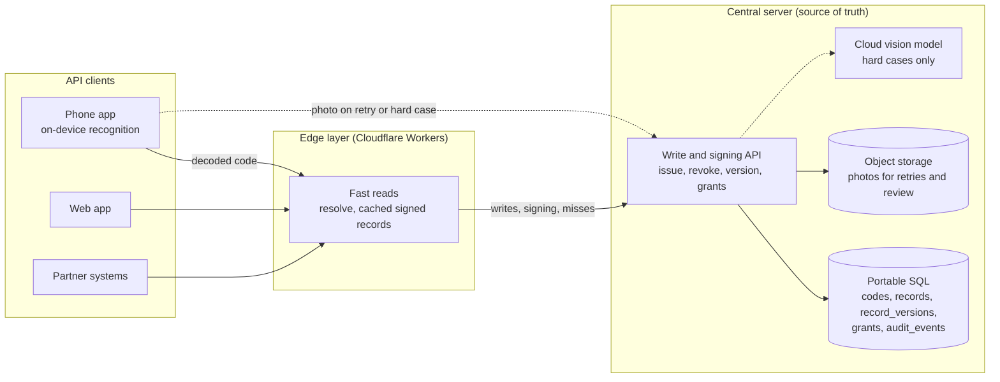

# zzThis Spec

> **Spec Kit map (2026-10-02).** This file stays as the source for copy, tags, and decisions. Spec Kit artifacts now hold the requirements. See [`specs/README.md`](../specs/README.md).
>
> | Section | Now lives in |
> |---|---|
> | 2 Product | [`specs/002-resolver-core`](../specs/002-resolver-core/spec.md), [`003-wordlist-checkword`](../specs/003-wordlist-checkword/spec.md), [`004-capture`](../specs/004-capture/spec.md) |
> | 3 to 5 Site, demo, visual system | [`specs/001-marketing-site/spec.md`](../specs/001-marketing-site/spec.md). Verbatim copy stays here. |
> | 6 Stack and repo | [`specs/001-marketing-site/plan.md`](../specs/001-marketing-site/plan.md) |
> | 7 Workflows | Superseded by the Workflows section in each `specs/*/spec.md`. The "OPEN Q13" and "draft PR" text below is stale. |
> | 8 Acceptance | [`specs/001-marketing-site/checklists/requirements.md`](../specs/001-marketing-site/checklists/requirements.md) |
> | 2.2a v1 text grammar | Accepted 2026-10-03 from Michael's Q48 and Q49 answers; updated the same day from his answers to Q50 to Q61 (draft, pending Danny's merge). Implemented by the spec 003 library (US3). |
> | 9 Questions | Question table. Q21 to Q39 were added on 2026-10-02; Q49 to Q61 on 2026-10-03, and Q50 to Q61 were answered the same day. Q62 (2026-10-03) sets the v1.0 hero headline with a spaced hyphen and no em dash. Q63 to Q65 were answered the same day (issues #51, #54, and #55). Section 3.1b records direction B v1.0 (accepted 2026-10-03). Section 9a is the running decisions log. |
> | 12 Roadmap | v1 scope, exit criteria, and v2 candidates. |
> | 10 Architecture | [`specs/002-resolver-core/plan.md`](../specs/002-resolver-core/plan.md), [`specs/004-capture/plan.md`](../specs/004-capture/plan.md) |
>
> Research targets, the funding-pitch founder bio, and the company-stage line were removed from this repo on 2026-10-02 (Q24 RESOLVED).

Status: v1 spec, deepened 2026-10-03 (Section 2.2a grammar, Section 12 roadmap). Owner of this document: Opus 5.5 (spec). Implementer: cloud coding agent or Grok Bot executor. Reviewer: operator (Danny), through a pull request to `main`.

## How to read this spec

- Square-bracket tags cite the source of each product claim or piece of copy: [BRIEF], [WIRE], [OVERVIEW], [PRODUCT], [OPERATOR]. [PRODUCT] cites Michael's private product write-up dated 2026-09-09, which is not in this repo. A dated tag such as [OPERATOR 2026-10-02] marks an operator decision made on that date. [ASSETS] cites the committed image asset manifest on branch `assets`.
- **INFERRED** marks a design or engineering choice made in this spec. The implementer may follow it without further approval.
- **OPEN** marks a decision that Michael must make. Each OPEN item has a default so the build is not blocked.
- When sources conflict, the [BRIEF] governs the site. For product behavior, [PRODUCT] governs.
- Copy shown in a `copy:` block ships verbatim. Copy marked INFERRED is connective text and may be edited during review.

## Contents

1. Summary and audience
2. Product spec (2.2a: v1 text grammar)
3. Marketing site
4. Click-through demo (`/demo`)
5. Visual system and components
6. Stack, repo layout, and engineering rules
7. Workflows
8. Acceptance criteria
9. Out of scope and OPEN questions
10. Architecture (proposal, not built)
11. Provenance
12. Roadmap: v1 scope and v2 candidates

## 1. Summary and audience

zzThis is a human-readable, human-writable code that works alongside barcodes and QR codes [BRIEF]. A person writes a code such as `zz-copper-lantern-sky-zz` on tape, a crate, a parcel, or a sign. The person links the code to a digital record and finds it later by camera, typing, or voice [BRIEF]. A second layer uses AI to turn a marked or photographed item into the next task and record [BRIEF].

This spec covers three deliverables and one proposal:

1. The product definition that the site describes (Section 2).
2. The first marketing site (Section 3).
3. A scripted click-through demo at `/demo` (Section 4).
4. A proposed architecture for the real product: central API, edge layer, and on-device capture (Section 10). It is a proposal, not built.

**Audience for the site:** xTechSearch visitors, possible investors, and collaborators [BRIEF].

**Audience for the brief:** Michael Chung (founder and project lead) and Daniel Meyer (full-stack development) [BRIEF].

**Honesty rules that apply everywhere:**

- zzThis has no validated codebook and no controlled comparisons yet [PRODUCT]. Recognition, resolver security, and human-factors performance are untested [PRODUCT].
- No performance figure appears on the site or in this repo until it is measured (Q7, Q24).
- The site makes no claim of pilots, customers, endorsement, or government adoption. The footer shows the words "Patent pending" at Michael's direction [MICHAEL 2026-10-02]; the site makes no other patent claim (Q9 RESOLVED).
- The xTech panel images are concept renderings [ASSETS]. The handwritten photos are real photos of Michael's handwritten codes [ASSETS].

## 2. Product spec

### 2.1 Status: concept versus tested

| Capability | Status | Source |
|---|---|---|
| Architecture, syntax, capacity calculations, postal and privacy workflows | Current work (design) | [PRODUCT] |
| Proof of concept built with Lovable, linked from zzthing.com | Exists; dictionary, generation, and checksum code not yet verified | [PRODUCT] |
| Word codebook | Not validated; no controlled comparisons | [PRODUCT] |
| Handwriting and print recognition of zz codes | Untested | [PRODUCT] |
| Secure resolver | Untested; prototype planned | [PRODUCT] |
| Central API, edge layer, and on-device capture (Section 10) | Proposal, not built | [OPERATOR 2026-10-02] |
| AI photo-to-action, inventory assistant, touch-first handling | Concept, shown as image concepts | [BRIEF] |
| Panels a–o and demo images | Concept renderings | [ASSETS] |
| Handwritten photos of codes on paper | Real photos | [ASSETS] |

### 2.2 Code grammar

**Framing markers.** The standard form opens with `zz-` and closes with `-zz` [BRIEF] [PRODUCT].

**Words.** The site shows lowercase code words: "MARK a lowercase zz code" [BRIEF]. Codes are built from a controlled word codebook designed for handwriting, reading, speech, recall, correction, optical recognition, and error detection [PRODUCT].

**Case rule.** Every zz code in site copy (text, headings, captions, titles) is lowercase and site copy never writes a standalone capital "ZZ". Photos and renders supplied by Michael may show a capital ZZ mark or uppercase letters inside a code; alt text describes them in words ("capital-letter zz mark") or quotes the code as shown [MICHAEL 2026-10-02] (Q42 RESOLVED). The three real photos with a capital-letter zz stay [MICHAEL 2026-10-03 #39] (Q53 RESOLVED); images we generate keep lowercase zz (Section 2.2a G7).

**Mark types.** A zz mark can be words, numbers, or simple hand-drawn symbols such as a smiley or tally marks, and a person can read it even when it is written inside a sentence [MICHAEL 2026-10-02]. A code can connect to authorized macros as well as a record and next action [MICHAEL 2026-10-02]. The site names this as a concept only and does not describe how macros run or are authorized (INFERRED).

**Examples from sources:**

| Code | Context | Source | Under the v1 grammar (Section 2.2a) |
|---|---|---|---|
| `zz-copper-lantern-sky-zz` | Hero example; crate tape | [BRIEF] [ASSETS] | Valid, plain |
| `zz-apple-sky-lantern` | Postage code written in the label area | [PRODUCT] | Fails `no-closing-marker` |
| `zz-blue-bike-astoria-zz` | Physical thing | [PRODUCT] | Valid, plain |
| `zz-vitalik.eth-zz` | Web3 resource | [PRODUCT] | Valid, name (G4 domain-style name; Q52, issue #38) |
| `zz@-AgentSmith-neo-zz` | Verified agent | [PRODUCT] | Valid, handle with qualifier `neo`; canonical `zz-@agentsmith-neo-zz` (Q51, issue #37) |
| `zz-@agentsmith-zz` | AI agent handle (Home, Top ways 04) | [MICHAEL 2026-10-02] | Valid, handle |
| `zz-b2-smith-1-zz`, `zz-b2-4-zz` | Duffel and crate tape (panel a) | [ASSETS] | Valid, plain (field code) |
| `(zz) camp bravo four two (zz)` | Circled marker variant on a pallet (panel c) | [BRIEF] [ASSETS] | Valid, plain; canonical `zz-camp-bravo-four-two-zz` |
| `zz-river-maple-sky-zz` | Parcel (panel g) | [ASSETS] | Valid, plain |
| `zz-kathy-lost-cat-zz` | Lost-cat flyer (panel h) | [ASSETS] | Valid, plain |

**Circled-zz variant.** Panel c shows a "circled zz marker variant" on a wrapped mixed-goods pallet [BRIEF], written as `(zz) camp bravo four two (zz)` [ASSETS].

**Three kinds of zz-code.** A zz-code has no design limit on its size [MICHAEL 2026-10-03 #36]. It can be (1) a text code: words, numbers, handles, or domain-style names between the markers (Section 2.2a); (2) a drawn code: a hand-drawn image between `zz-` and `-zz`; or (3) an object code: a ZZ mark (capitalized, and can be circled) attached to an object such as a picture or a sign, where the image of that object, ideally with its mark, is the code [MICHAEL 2026-10-03 #36]. v1 parses text codes only; drawn and object codes need image matching and are v2 candidates (Section 12.2). "zz-code", "zz-code-words", "code-words", and "zz-Code" all name the same thing [MICHAEL 2026-10-03 #36]; this spec uses "code" or "zz-code" (INFERRED).

**Namespace marker.** The `@` marker appears in the verified-agent example `zz@-AgentSmith-neo-zz` [PRODUCT]. Michael's Q49 answer sets the v1 rule: `@` comes first, right after the opening marker, and marks a handle (Section 2.2a G4) [MICHAEL 2026-10-02 #34]. His Q51 answer lets more words follow a handle, and says an `@` touching the zz is not intentional, so the reader treats it as separate [MICHAEL 2026-10-03 #37]. Verification is a resolver concern, not something the printed characters prove (INFERRED); verifying who runs a handle is a v2 candidate (Section 12).

**Word counts and capacity:**

- With a 5,000-word dictionary, two ordered words give 25 million raw combinations, and three give 125 billion. These counts come before reserving capacity for checks, exclusions, and policy [PRODUCT].
- [PRODUCT] also proposes a candidate 10,000-word dictionary. Two ordered words from it give 100 million raw combinations, and three give one trillion (arithmetic INFERRED).
- Two or three data words plus a checksum word produce three or four visible words. The checksum does not increase identifier capacity [PRODUCT].

**Checksum word.** A checksum word or other redundancy supports error detection [PRODUCT]. The demo does not implement or imply a real checksum algorithm (INFERRED).

**Formats to model:** two-word, three-word, checksum, prefix, enterprise, one-time, and reusable-account formats [PRODUCT].

**Status of the syntax.** The syntax shown on the site is illustrative. The interaction format is to be selected by measured performance and system cost [PRODUCT]. The text grammar that parsers accept is fixed for v1 in Section 2.2a; the issued formats (which word counts the server issues) stay OPEN (Q27).

### 2.2a v1 text grammar (accepted 2026-10-03)

This section is the accepted v1 grammar for codes written as text. It replaces the "product options, not yet accepted grammar" placeholder in spec 003 FR-006. Sources: Michael's replies on issue #33 (Q48) and issue #34 (Q49) [MICHAEL 2026-10-02 #33] [MICHAEL 2026-10-02 #34], and his answers to Q50 to Q61 (issues #36 to #42 and #44 to #48) in a document sent through Danny on 2026-10-03 [MICHAEL 2026-10-03], used as given. Where Michael's answers leave a gap, the rule is marked INFERRED. Michael expects firmer rules later, by context and language [MICHAEL 2026-10-03 #44] [MICHAEL 2026-10-03 #46]; this section is the v1 starting point. Update intent: [`intent/2026-10-03-michael-answers-q50-q61.md`](../intent/2026-10-03-michael-answers-q50-q61.md). Spec 003 owns the library that implements it; specs 002 and 004 and the demo (001 T029) call that one library. Intent: [`intent/2026-10-03-v1-text-grammar.md`](../intent/2026-10-03-v1-text-grammar.md) (accepted by Danny, 2026-10-03 2:52 AM PT).

v1 is ASCII only. Any-language codes are a v2 candidate (issue #35).

**G1. Code types**

| Type | Shape | Example | Source |
|---|---|---|---|
| Word code | Dictionary words from the closed wordlist (spec 003) | `zz-copper-lantern-sky-zz` | [MICHAEL 2026-10-02 #34] |
| Field code | Words or names mixed with numbers | `zz-b2-smith-1-zz` | [MICHAEL 2026-10-02 #34] |
| Handle | A name for a person, organization, or AI agent, starting with `@`. Qualifier parts may follow it; one tag part may come before it | `zz-@agentsmith-zz`, `zz-@agentsmith-neo-zz` | [MICHAEL 2026-10-02 #34] [MICHAEL 2026-10-03 #37] |
| Name | A domain-style name from a known naming system, written without `@` (v1: `.eth`, as Ethereum's ENS writes it) | `zz-vitalik.eth-zz` | [MICHAEL 2026-10-03 #38] |
| Bare mark | `zz` or a circled `(zz)` alone, in any case or mix | `zz` | [MICHAEL 2026-10-02 #33] [MICHAEL 2026-10-03 #48] |

- The parser reports one of four kinds: `plain` (word code or field code), `handle`, `name`, or `bare`. Telling a word code from a field code needs the wordlist: a plain code whose parts are all wordlist words is a word code. Every other plain code is a field code, including codes such as `zz-hello-zz` whose words are not on the list. Michael's definition ("words or names mixed with numbers") is extended to cover these (INFERRED).
- Near-word check before field classification (INFERRED, PR #43 review). A misread wordlist word (`coper` for `copper`) must not turn a word code into a field code. Before the classifier calls a code a field code, it checks every letters-only part that is not on the wordlist. A part within edit distance 2 of a wordlist word is a near-word. Edit distance is Levenshtein distance over the lowercase ASCII letters: insert, delete, or substitute one letter, each costing 1, so a swap of two letters costs 2 (INFERRED, D-2026-10-04-05). A code with a near-word is classified `confirm`, not field, and lists each near-word with its position and its wordlist candidates. Candidates are every wordlist word within the limit, sorted by distance (smallest first), then by wordlist index (list order, spec 003 FR-017). The vectors compare `near_words` in this order (INFERRED, D-2026-10-04-05). The client shows a confirm step for each near-word: the candidate words and the part as written. Snapping is off for a part only after the person picks "as written". Picking a candidate snaps it, and the code is classified again. Parts with a digit, handle parts, name parts, and parts farther than 2 from every word are never near-words. The number words `zero` to `nine` count as parts with a digit and are never near-words, to match G10 step 2 and spec 003 filter (3), which drops them from the list (INFERRED, D-2026-10-04-08). In a handle code, the tag and qualifier parts are not near-word checked either (INFERRED). Because every pair of wordlist words is at least 3 apart (spec 003 FR-003), a part at distance 1 has exactly one candidate at distance 1, and that word is listed first. It can also have candidates at distance 2, listed after it. The distance limit is a parameter until the real-photo test set (spec 004 Q37) measures it. Vectors are in G1a.
- Macro codes such as `zz-fn-pay-agentsmith-zz` and `zz-run-reorder-water-zz` are plain codes to the grammar. Running a macro is an app concern that needs an authorized, confirmed user, and it is not part of v1 [MICHAEL 2026-10-02 #34].
- Drawn symbols (a smiley, a star) are a separate image-recognition mode, not part of this text grammar [MICHAEL 2026-10-02 #34]. They are a v2 candidate, with object codes (Section 2.2, three kinds of zz-code).

**G1a. Classifier vectors.** Fixture wordlist (test data only): `copper`, `lantern`, `sky`, `maple`, `river`, `harbor` (every pair at least 3 apart, as FR-003 requires). The classifier (spec 003 T012) runs after the parser and must return these results.

| Canonical input | Class | Near-words (position: candidates) |
|---|---|---|
| `zz-copper-lantern-sky-zz` | word | none |
| `zz-coper-lantern-sky-zz` | confirm | 1: `copper` |
| `zz-lanterns-zz` | confirm | 1: `lantern` |
| `zz-coppr-lantrn-sky-zz` | confirm | 1: `copper`; 2: `lantern` |
| `zz-skyy-maple-zz` | confirm | 1: `sky` |
| `zz-rivr-zz` | confirm | 1: `river` |
| `zz-lntrn-zz` | confirm | 1: `lantern` (distance 2, the limit) |
| `zz-kopr-zz` | field | none (`copper` is 3 away, past the limit) |
| `zz-ocppr-zz` | field | none (`copper` is 3 away under Levenshtein, D-2026-10-04-05) |
| `zz-mapper-zz` | confirm | 1: `copper`, `maple` (both 2 away, so list order, D-2026-10-04-05) |
| `zz-hello-zz` | field | none (no word within 2) |
| `zz-b2-smith-1-zz` | field | none (digits, and `smith` is farther than 2) |
| `zz-copper-4-zz` | field | none (`4` has a digit; `copper` is on the list) |
| `zz-coper-4-zz` | confirm | 1: `copper` (`4` has a digit and is never checked; `coper` is 1 from `copper`, D-2026-10-04-08) |
| `zz-bravo-five-six-zz` | field | none (number words count as digits, D-2026-10-04-08; `five` is 2 from `river` and `six` is 2 from `sky`) |
| `zz-@coper-zz` | handle | none (handles are never near-word checked) |
| `zz` | bare | none |

These classes come from the fixture list. On proto-v0, most short letters-only parts that are not on the list (for example `hello`, `smith`, or `box`) are expected to be within 2 of a list word, so they classify `confirm`.

After the person confirms `coper` as written, `zz-coper-lantern-sky-zz` is a field code and `coper` is not snapped. After they pick `copper`, it is the word code `zz-copper-lantern-sky-zz`.

**G2. Normalization, in order**

1. Fail with `too-long` if the raw input is longer than 256 UTF-16 code units (JavaScript `length`, Swift `utf16.count`, Kotlin `length`), before any mapping (INFERRED guard for FR-010 malformed input in spec 002; the unit is D-2026-10-04-10). Then map the input the way the IETF PRECIS UsernameCaseMapped profile maps identifiers, for an ASCII result (D-2026-10-04-10): the fullwidth forms U+FF01 to U+FF5E become their ASCII characters, and the text is normalized to NFC, so a canonical equivalent such as the Kelvin sign U+212A becomes `K`. Then fail with `empty` if the input is empty or only whitespace. Whitespace is every character with the Unicode White_Space property: tab, LF, VT, FF, CR, U+0020, U+0085, U+00A0, U+1680, U+2000 to U+200A, U+2028, U+2029, U+202F, U+205F, and U+3000.
2. Trim leading and trailing whitespace. Treat every other whitespace character, including line breaks and tabs, as a space, so a code written across two lines is one code [MICHAEL 2026-10-02 #33].
3. Treat the dash characters U+2010 to U+2015 and U+2212 as a hyphen, because phone keyboards replace typed hyphens (INFERRED).
4. Lowercase with the Unicode lowercase mapping, without locale rules (JavaScript `toLowerCase()`, Swift `lowercased()`, Kotlin `lowercase(Locale.ROOT)`). A letter that is still not ASCII after steps 1 and 4 fails with `unsupported-script` (G4), so a lookalike from another script, such as a Cyrillic `о` inside a word, never matches an ASCII code (D-2026-10-04-10). Case never changes which code it is: `Zz-HELLO-zz`, `zz-Hello-zz`, and `zz-hello-zz` are the same code, and so is the same code written all in capitals [MICHAEL 2026-10-02 #33].
5. Rewrite an `@` that touches the opening marker (`zz@-name-zz` or `zz@name-zz`) as `zz-@name-zz`. Touching is not intentional, and the reader treats the `@` as separate even when it touches or overlaps the zz [MICHAEL 2026-10-03 #37]. Rewrite a tag part that ends in `@` (`zz-ai@-name-zz`, `zz-ai@ name-zz`, `zz-ai@name-zz`) as the tag plus the handle: `zz-ai-@name-zz` (INFERRED from the About photo in issue #37). The rewrite runs on the split parts, so the result does not depend on the separator or the marker form (D-2026-10-04-04, decided 2026-10-05): an `@` touching the opening marker is read as separate, a first part `tag@rest` becomes `tag` and `@rest`, and a part that is exactly `@` joins the part after it. It landed with the grammar code change and its G9 rows in spec 005 T035.
6. Find the markers (G3), then split the content on separators. Hyphens, spaces, or a mix count as separators, and a run of them counts as one separator [MICHAEL 2026-10-02 #33]. The separators are the whitespace characters of step 1, the hyphen U+002D, and the dashes in step 3. No other character is a separator: a format character such as U+FEFF stays in the part and fails with `invalid-character` (D-2026-10-04-10).
7. Check each part (G4) and the part count (G5).
8. Return the canonical form: `zz-` plus the parts joined by single hyphens plus `-zz`. The canonical form of a bare mark is `zz` [MICHAEL 2026-10-02 #33].

Steps 1, 2, 4, and 6 name exact character sets so the TypeScript, Swift, and Kotlin parsers agree (D-2026-10-04-10, decided 2026-10-05). `src/lib/grammar.ts` follows them since spec 005 T035, which moved the G9 rows that waited for it into the table below. Input that is only whitespace fails with `empty` even when it is longer than 256 code units, because `empty` comes first in the G6 order; any other input over the guard fails with `too-long` before mapping.

**G3. Markers**

- A code with content needs a marker at the start and at the end. A circled `(zz)` counts as a marker [MICHAEL 2026-10-02 #33]. A missing closing marker fails with `no-closing-marker`. This replaces the demo parser's rule that accepted a missing closing marker (Section 4.4).
- Markers are whole tokens. An opening `zz` must be followed by a separator, and a closing `zz` must follow one: `zzcopper-lantern-zz` and `zzz-x-zz` fail with `no-marker`, and the `zz` at the end of `buzz` is part of the word (INFERRED). A circled marker needs no separator. `(` and `)` appear only inside the exact token `(zz)`.
- The two ends may mix forms, for example `(zz) camp bravo zz`, because handwriting varies (INFERRED). Markers are found by their pattern in any case or mix: a zz, a separator, content, a separator, a closing zz [MICHAEL 2026-10-03 #39].
- The circled form is display metadata only. `(zz) camp bravo four two (zz)` and `zz-camp-bravo-four-two-zz` are the same code (INFERRED from "one canonical form" [MICHAEL 2026-10-02 #33]).
- A bare mark is `zz` or `(zz)` alone, and nothing else, in lowercase, capitals, or a mix [MICHAEL 2026-10-03 #48]. `zz-` fails with `no-closing-marker`, and two markers with nothing but separators between them (`zz-zz`, `(zz) (zz)`) fail with `no-content`, so a cut-off scan fails instead of reading as a bare mark (Q61, issue #48). The scanner follows this: `zz-zz` or `(zz) (zz)` on its own is one candidate that fails with `no-content`, not two bare marks (spec 004 Scanner rule 5, INFERRED, D-2026-10-04-11).
- A part may not be `zz`. `zz-zz-zz` fails with `marker-in-body` (INFERRED).

**G4. Parts**

| Part | Allowed characters after lowercasing | Rule | Source |
|---|---|---|---|
| Plain part | `a` to `z`, `0` to `9` | One or more characters | [MICHAEL 2026-10-02 #34] |
| Handle part | `@`, then `a` to `z`, `0` to `9`, `.`, `_` | `@` only as the first character of the first part, or of the second part when the first part is a tag. 1 to 32 characters after `@` (INFERRED cap). At least one letter or digit; no leading, trailing, or doubled `.` (INFERRED) | [MICHAEL 2026-10-02 #34] [MICHAEL 2026-10-03 #37] |
| Name part | Labels of `a` to `z` and `0` to `9` joined by single dots, ending in a known suffix (v1: `.eth`) | Only as the first part. At least one label before the suffix. No `_`, no leading, trailing, or doubled `.` (INFERRED) | [MICHAEL 2026-10-03 #38] |

- Plain parts may follow a handle as qualifiers, read as "handle, then details": `zz-@agentsmith-neo-zz` is the handle `@agentsmith` with the qualifier `neo` (a sub-account, a role, or a version) [MICHAEL 2026-10-03 #37]. The handle and its qualifiers form one code; the parser returns `handle`, `tag`, and `qualifiers` separately (INFERRED).
- One plain tag part may come before the handle, as in `zz-ai-@agentsmith-zz` (a category tag `ai`). Michael leaves open which of these forms are permitted by context [MICHAEL 2026-10-03 #37]; v1 accepts both (INFERRED).
- `@` anywhere else fails with `misplaced-at`, for example `zz-ai-agent-@smith-zz`, `zz-a@b@c-zz`, or a second handle.
- A name part (`zz-vitalik.eth-zz`) is valid as written, without `@` [MICHAEL 2026-10-03 #38]. Qualifier parts may follow it, as with handles (INFERRED). Other dots (`zz-1.2-zz`, `zz-example.com-zz`) and `_` outside a handle still fail with `invalid-character`; more suffixes can be added later without breaking codes (INFERRED).
- The reserved symbols `#`, `$`, `/`, and `:` fail with `reserved-symbol`, never as ordinary characters, so they can get meanings later without breaking codes [MICHAEL 2026-10-02 #34].
- Letters outside ASCII (for example Korean or Cyrillic) fail with `unsupported-script` in v1 (INFERRED; issue #35 tracks any-language codes). Other characters fail with `invalid-character`.

**G5. Part count**

A code with content has one or more parts. There is no design limit on the number of parts [MICHAEL 2026-10-03 #36] (Q50, issue #36). The only cap is the technical input guard in G2 step 1 (256 UTF-16 code units of raw input), a safety setting for reliable scanning and abuse protection, not a rule about what people may write (INFERRED; it is a parameter). Codes issued from the wordlist keep the counts in Section 2.2: two or three data words plus a check word [PRODUCT]. Whether a one-part code may open a private record is a resolver rule (spec 002 FR-020, Q59).

**G6. Failure reasons**

The parser returns exactly one reason. When several apply, it returns the first in this order (INFERRED, so tests are stable): `empty`, `too-long`, `no-marker`, `no-closing-marker`, `no-content`, `marker-in-body`, `unsupported-script`, `reserved-symbol`, `misplaced-at`, `invalid-handle`, `invalid-character`. `part-count` is removed (Q50); `no-content` is new (Q61).

**G7. Storage and display**

- Store and display the canonical form, lowercase and hyphen-separated, including handles and names [MICHAEL 2026-10-02 #33] [MICHAEL 2026-10-02 #34]. People may write any case or mix; the system stores one canonical form [MICHAEL 2026-10-02 #33] [MICHAEL 2026-10-03 #48]. Michael's "in our system we will use ZZ as upper case" [MICHAEL 2026-10-03 #48] is reconciled in Section 9a (decision D-2026-10-03-01): case never changes matching, the stored key is case-folded, and what we generate and display stays lowercase, which his Q53 answer calls the "best case" when our system uses them [MICHAEL 2026-10-03 #39].
- `zz-vitalik.eth-zz` and `zz-@vitalik.eth-zz` resolve to the same record, so a person who adds the `@` out of habit still reaches it (INFERRED from [MICHAEL 2026-10-03 #38]; spec 002 FR-022).
- Site copy, images, and documents show lowercase `zz` or the circled `(zz)`, never a capital-letter zz mark on its own or in a code. On its own, a capital Z mark painted on equipment resembles adversary vehicle markings, and these materials go to the Army [MICHAEL 2026-10-02 #33]. Uppercase letters inside code words (as in `zz-1234ABCD-zz` on a sign) are not covered by this rule. Alt text may quote text inside an image as it appears (Section 3.8); prose that names a code uses the canonical form (INFERRED). Test inputs that need capitals are described in words. Real photos keep what they show: the three real civilian photos with a capital-letter zz (`hw-mark-on-object`, `hw-dog-collar-tag`, `app-truck-after`) stay [MICHAEL 2026-10-03 #39] (Q53 RESOLVED). Images we generate, and any image in a military setting, use lowercase zz (INFERRED from [MICHAEL 2026-10-02 #33] and [MICHAEL 2026-10-03 #39]).

**G8. Codes inside running text** (Q55, issue #41)

- Typed lookup: the whole input must be one code or one bare mark. The parser does not search inside a sentence (Q55 proposal, kept for v1).
- Camera and text scanning (spec 004): find every marker pair. When the view holds several codes, a partial code (an opening `zz-` without its close, or a closing `-zz` without its open, INFERRED, D-2026-10-04-06), or a bare `zz`, the reader puts a box around each candidate and asks the person (a user or a Soldier) to pick the one to process [MICHAEL 2026-10-03 #41]. It never guesses. A partial code is labeled "Incomplete code. Rescan." (INFERRED wording). In "Box zz-copper-lantern-sky-zz goes to bay 4, zz." the final `zz` is offered as a choice and never processed on its own (INFERRED).

**G9. Test vectors.** The grammar library and the demo (after 001 T029) must return these results.

| Input | Result | Canonical form or reason |
|---|---|---|
| `zz-copper-lantern-sky-zz` | plain | `zz-copper-lantern-sky-zz` |
| `zz copper lantern sky zz`, all in capitals | plain | `zz-copper-lantern-sky-zz` |
| `zz-copper` + tab + `lantern-zz` | plain | `zz-copper-lantern-zz` |
| `zz−copper−lantern−zz` (U+2212 minus signs) | plain | `zz-copper-lantern-zz` |
| `(zz) camp bravo zz` (mixed markers, INFERRED) | plain | `zz-camp-bravo-zz` |
| `(zz)camp bravo(zz)` | plain | `zz-camp-bravo-zz` |
| `zz-buzz-zz` | plain | `zz-buzz-zz` |
| `Zz-Copper--lantern  sky-zZ` | plain | `zz-copper-lantern-sky-zz` |
| `zz-copper` + line break + `lantern-sky-zz` | plain | `zz-copper-lantern-sky-zz` |
| `zz–copper–lantern–zz` (en dashes) | plain | `zz-copper-lantern-zz` |
| `(zz) camp bravo four two (zz)` | plain | `zz-camp-bravo-four-two-zz` |
| `zz-hello-zz` | plain | `zz-hello-zz` |
| `zz-b2-smith-1-zz` | plain | `zz-b2-smith-1-zz` |
| `zz-1234ABCD-zz` | plain | `zz-1234abcd-zz` |
| `zz Guest WiFi connect zz` | plain | `zz-guest-wifi-connect-zz` |
| `zz-fn-pay-agentsmith-zz` | plain | `zz-fn-pay-agentsmith-zz` |
| `zz-@agentsmith-zz` | handle | `zz-@agentsmith-zz` |
| `zz-@AgentSmith.eth-zz` | handle | `zz-@agentsmith.eth-zz` |
| `zz-@acme_support-zz` | handle | `zz-@acme_support-zz` |
| `zz@-agentsmith-zz` | handle | `zz-@agentsmith-zz` |
| `zz@agentsmith-zz` | handle | `zz-@agentsmith-zz` |
| `zz-@` + 32 letters + `-zz` | handle | same, lowercase |
| `zz-@agentsmith-neo-zz` | handle | `zz-@agentsmith-neo-zz` (handle `@agentsmith`, qualifier `neo`) |
| `zz@-AgentSmith-neo-zz` | handle | `zz-@agentsmith-neo-zz` |
| `zz-ai@-agentsmith-zz` | handle | `zz-ai-@agentsmith-zz` (tag `ai`) |
| `zz-ai@ agentsmith-zz` | handle | `zz-ai-@agentsmith-zz` (tag `ai`) |
| `zz@ agentsmith zz` | handle | `zz-@agentsmith-zz` (D-2026-10-04-04) |
| `(zz)@ agentsmith (zz)` | handle | `zz-@agentsmith-zz` (D-2026-10-04-04) |
| `zz ai@ agentsmith zz` | handle | `zz-ai-@agentsmith-zz` (tag `ai`, D-2026-10-04-04) |
| `zz-vitalik.eth-zz` | name | `zz-vitalik.eth-zz` |
| `zz-Vitalik.ETH-zz` | name | `zz-vitalik.eth-zz` |
| `zz-one-two-three-four-five-six-zz` | plain | `zz-one-two-three-four-five-six-zz` |
| `zz-bravo-smith-one-two-three-four-zz` | plain | `zz-bravo-smith-one-two-three-four-zz` |
| `zz` | bare | `zz` |
| `(zz)` | bare | `zz` |
| `zz` in capitals | bare | `zz` |
| `(zz)` in capitals | bare | `zz` |
| `zz-zz` | fail | `no-content` |
| `(zz) (zz)` | fail | `no-content` |
| `zz-` | fail | `no-closing-marker` |
| (empty or spaces only) | fail | `empty` |
| 300 spaces | fail | `empty` |
| `copper` | fail | `no-marker` |
| `zzcopper-lantern-zz` | fail | `no-marker` |
| `zzz-x-zz` | fail | `no-marker` |
| `( zz ) camp ( zz )` | fail | `no-marker` |
| `zz-copper-lantern-sky` | fail | `no-closing-marker` |
| `zz-@agentsmith` | fail | `no-closing-marker` |
| `zz-zz-zz` | fail | `marker-in-body` |
| `zz-구리-등불-zz` | fail | `unsupported-script` |
| `zz-#tag-zz` | fail | `reserved-symbol` |
| `zz-pay-$5-zz` | fail | `reserved-symbol` |
| `zz-a/b-zz` | fail | `reserved-symbol` |
| `zz-x:y-zz` | fail | `reserved-symbol` |
| `zz-ai-agent-@smith-zz` | fail | `misplaced-at` |
| `zz-@agentsmith-@neo-zz` | fail | `misplaced-at` |
| `zz-@-zz` | fail | `invalid-handle` |
| `zz-@.agent-zz` | fail | `invalid-handle` |
| `zz-@agent.-zz` | fail | `invalid-handle` |
| `zz-@agent..smith-zz` | fail | `invalid-handle` |
| `zz-@` + 33 letters + `-zz` | fail | `invalid-handle` |
| `zz-acme_support-zz` | fail | `invalid-character` |
| `zz-example.com-zz` | fail | `invalid-character` |
| `zz-1.2-zz` | fail | `invalid-character` |
| `zz-.eth-zz` | fail | `invalid-character` |
| 257 characters | fail | `too-long` |
| `zz-` + 125 copies of U+10330 + `-zz` (256 UTF-16 code units, 131 code points) | fail | `unsupported-script` (the guard counts code units, so 256 passes it, D-2026-10-04-10) |
| `zz-` + 126 copies of U+10330 + `-zz` (258 UTF-16 code units, 132 code points) | fail | `too-long` (D-2026-10-04-10) |
| `zz-copper` + U+00A0 + `lantern-zz` | plain | `zz-copper-lantern-zz` (U+00A0 is White_Space, D-2026-10-04-10) |
| `zz-copper` + U+2003 (em space) + `lantern-zz` | plain | `zz-copper-lantern-zz` |
| `zz-` + U+212A (the Kelvin sign) + `ite-zz` | plain | `zz-kite-zz` (NFC makes U+212A `K`, D-2026-10-04-10) |
| `zz-c` + U+043E (Cyrillic о) + `pper-zz` | fail | `unsupported-script` (UTS #39 ASCII-Only, D-2026-10-04-10) |
| fullwidth `ｚｚ－ｃｏｐｐｅｒ－ｚｚ` (U+FF5A, U+FF0D, and so on) | plain | `zz-copper-zz` (fullwidth forms map to ASCII, D-2026-10-04-10) |
| `zz-cafe` + U+0301 (combining acute) + `-zz` | fail | `unsupported-script` (NFC makes it `é`, D-2026-10-04-10) |
| `zz-copper` + U+FEFF + `lantern-zz` | fail | `invalid-character` (U+FEFF is not White_Space, D-2026-10-04-10) |

**G10. Matching key for field codes** (Q57, issue #44)

Handwriting and cameras confuse 0/o, 1/l/i, 5/s, 2/z, and 8/b, and Michael agrees these lookalikes are confusing [MICHAEL 2026-10-03 #44]. He wants firm rules later; until then, v1 uses this key (INFERRED from the issue #44 proposal, which he answered "yes"):

1. Start from the canonical form (G2). The key is internal; the code is still stored and shown in canonical form. The key covers the parts only; the markers are not part of it (INFERRED, D-2026-10-04-09).
2. Number words `zero` to `nine` become digits, so `zz-bravo-one-two-three-four-zz` and `zz-bravo-1-2-3-4-zz` match. Michael writes field numbers both ways [MICHAEL 2026-10-03 #44].
3. Lookalikes fold to one character: `o` to `0`; `i` and `l` to `1`; `s` to `5`; `z` to `2`; `b` to `8` (like Crockford base32).
4. A run of consecutive all-digit parts joins into one part, so `1-2-3-4` and `1234` match. This runs after the fold, so a lookalike inside a number run still joins (INFERRED, D-2026-10-04-09).

Two field codes with the same key are the same code for matching. The server never issues two codes in one scope with the same key, and the reserved-handle check uses the key too (spec 002 FR-019). Word codes do not use this key; their check word catches misreads (spec 003 FR-018, spec 002 FR-021). Vectors: `zz-b2-smith-1-zz` and `zz-b2-smith-l-zz` have the same key; `zz-bravo-one-two-three-four-zz` and `zz-bravo-1234-zz` have the same key; `zz-bravo-smith-1234-zz` and `zz-bravo-john-1234-zz` do not; `zz-bravo-l-2-zz` and `zz-bravo-12-zz` have the same key (fold before join, D-2026-10-04-09); `zz-@b0b-zz` and `zz-@bob-zz` have the same key.

**G11. No-device field formats** [MICHAEL 2026-10-03 #44]

A Soldier with only a marker (ideally on blue tape, so as not to mark up things), no phone, and no connection can still write codes that are reasonably unique: a unit prefix and a sequence (`zz-bravo-1-2-3-4-zz`, or with number words `zz-bravo-one-two-three-four-zz`), or a unit prefix, a personal identifier, and a sequence (`zz-bravo-smith-one-two-three-four-zz`). Within that unit, such codes are unique. The prefix should be a locally assigned phonetic word such as `bravo`, not a real unit designation (INFERRED operational-security default). These codes link to a record later (Section 2.4, no-device marks; Q25).

### 2.3 Resolver

- **Public identifier versus authorization.** The visible words are a public identifier, not a password or private key. Payment and authorization stay in signed backend records [PRODUCT].
- **Controls.** The resolver maps the public code to mutable records and enforces single use, expiration, revocation, signed updates, permissions, rate limits, and auditability [PRODUCT].
- **Uncertain readings.** The system resolves only above a validated threshold; otherwise it requests confirmation, another view, or manual handling [PRODUCT].
- **Abuse cases.** Copied marks, replay, enumeration, unauthorized updates, and malformed input [PRODUCT].

### 2.4 Record linking

- A code links to existing identifiers: NSN, document number, hand receipt, and photo (panel e) [BRIEF].
- In field logistics, the code connects to existing identifiers [BRIEF].
- **No-device marks.** "For a field code made with no device, link and reconcile later" [BRIEF]. A person writes the code first, and a record is attached when a device is available.

### 2.5 Capture by camera, typing, or voice

- **Input paths.** Read by camera or manual entry. Report the words by voice where useful [BRIEF]. Voice and manual entry are alternate input paths [BRIEF].
- **Recognition approach.** Distinctive markers and placement cues are combined with existing printed-text and handwriting models, lexicon-constrained decoding, ranked candidates, and checksum validation [PRODUCT].
- **Decision bands.** Calibrated confidence decides whether the system resolves, asks for confirmation, requests another view, or abstains [PRODUCT]. These are accept, clarify, retry, or abstain decisions, calibrated separately for voice, image, and typed input [PRODUCT].
- **Read-back.** Panel f shows a radio cue and read-back of three code words [BRIEF]: "Tag: copper, lantern, sky. Break." [ASSETS]. Read-back confirmation errors must be evaluated, not assumed away [PRODUCT].

### 2.6 AI-assisted photo-to-record flow

Workflow: PHOTOGRAPH one or more items → CONFIRM the proposed identification → choose a handling or inventory action by touch or voice → REVIEW the prepared record or form. "This is the second layer of the story, not a separate product category." [BRIEF]

- **Photo to action.** A Soldier photographs loose or damaged items. zzThis AI helps identify each one, suggests how to handle, pack, ship, return, repair, or dispose of it, and prepares the relevant form for review [BRIEF].
- **Inventory assistant.** A Soldier photographs a supply shelf at different times. zzThis helps count what remains, identifies what is running low, and suggests a reorder [BRIEF].
- **AI and touch first.** A Soldier drags a recognized item to an action on the screen or speaks a request instead of typing through forms [BRIEF].
- **Human review.** A person confirms the proposed identification and reviews the prepared record or form [BRIEF].

### 2.7 Privacy

Codes are public identifiers, and authorization stays separate [PRODUCT]. Research targets are not part of this repo (Q24).

## 3. Marketing site

### 3.1 Information architecture

**Navigation, in order:** How it works | Applications | About | Contact [BRIEF]. The zzThis logo links to `/` (INFERRED). A theme toggle sits at the end of the nav bar (INFERRED). On viewports narrower than 900 px, the nav collapses into a disclosure button labeled "Menu" (INFERRED).

| Route | H1 | Purpose | Source |
|---|---|---|---|
| `/` | Hero line | Long scrolling page, mobile first | [BRIEF] |
| `/how-it-works` | How it works | Mark, read, link, report; then photograph, confirm, act, record | [BRIEF] |
| `/applications` | Applications | Field logistics, postal and parcel, community use, digital aliases | [BRIEF] |
| `/about` | About zzThis | Michael, advisors, prototypes, business context | [BRIEF] |
| `/contact` | Contact | 1@1000x10.com and a collaboration invitation | [BRIEF] |
| `/demo` | See zzThis in action. | Prototype links, planned zzThat app, scripted click-through with demo data | Operator request; H1 [MICHAEL 2026-10-02] |
| `/technology` | (not built) | Michael's draft wording is stored in `src/content/technology.ts`; the page is built and enters navigation only when it has that explanation plus a supporting example [MICHAEL 2026-10-02] | [BRIEF] [MICHAEL 2026-10-02] |

- `/how-it-works` is a real page that reuses the Home workflow components. Home also exposes `#how-it-works` (INFERRED; the [BRIEF] allows "Anchored Home sections; stable detail route later").
- The demo is not in the main nav. Links to it appear on `/how-it-works`, in the Home core workflow section, and in the footer [MICHAEL 2026-10-02] (Q5 RESOLVED). When the free zzThat app launches, add a prominent "Try zzThat" navigation action that links to zzthat.com [MICHAEL 2026-10-02].
- **Technology page:** `src/content/technology.ts` holds Michael's public draft wording, marked `unpublished`. No route is generated and no page links to it until the page has that explanation plus a supporting example. Do not publish an empty stub [MICHAEL 2026-10-02] (Q14 RESOLVED).
- Every page has exactly one H1, then H2 and H3 by content hierarchy, not by menu [BRIEF].
- Every page has a footer with "Contact: 1@1000x10.com" [BRIEF], the nav links, and a link to `/demo` (INFERRED).

### 3.1a Layout and proportions (wireframes)

[WIRE] is the companion layout source for this spec. It shows Home as three phone scroll segments and two desktop segments of one continuous page [WIRE]. Grey boxes in [WIRE] mark image positions, and type, color, and final imagery follow later [WIRE]. Where [WIRE] and the [BRIEF] differ on copy, the [BRIEF] governs. Where they differ on order or layout, [WIRE] governs, because it is the later and more specific source (INFERRED).

**Home order on phones (3 segments)** [WIRE]

| Segment | Sections, in order | Panels |
|---|---|---|
| 1. First screen and workflow | Header (logo, Menu); H1 hero and subline; hero image; actions; featured statement; comparison strip; How it works (Mark, Read, Link, Report, one card at a time) | b; c close-up, d, e, f |
| 2. Field work and AI | Field logistics (controlled swipe row); From photo to action (j, k, l sequence, then m and n cards) | a, b (alternate), c; j, k, l, m, n |
| 3. Applications and contact | More applications (Postal and parcel, Everyday and community, Digital aliases); About teaser; Contact action; footer | g and o; h; i |

**Home order on desktop (2 segments)** [WIRE]

| Segment | Sections, in order | Panels |
|---|---|---|
| 1. First screen and workflow | Logo and nav; hero text beside hero image; featured statement; comparison (4 cards) [MICHAEL 2026-10-02]; core workflow (4 steps); field logistics (3 across); photo to action (j, k, l, 3 across) | b; c close-up, d, e, f; a, b (alternate), c; j, k, l |
| 2. More applications | m and n (2 across); Applications grid 2×2 (Field logistics, Postal and parcel, Community, Digital aliases); About and Contact (2 across); footer | m, n; j thumbnail, g and o, h, i |

On phones, the Applications grid omits the Field logistics card, because the field band sits directly above it [WIRE].

**Grid per breakpoint (INFERRED)**

| Viewport | Container | Columns | Series of 3 | Core workflow | Applications |
|---|---|---|---|---|---|
| 320–599 px | Fluid, 16 px side margins | 1 | Stacked; field a, b, c use a controlled swipe row [BRIEF] [WIRE] | 1 per row [WIRE] | 1 per row |
| 600–899 px | Fluid, 26 px margins | 2 | 2 across, then wrap | 2×2 | 2×2 |
| 900–1199 px | Max 1120 px, 12-column grid | 12 | 3 across [BRIEF] | 2×2 | 2×2 |
| ≥ 1200 px (check at 1440) | Max 1280 px, 12-column grid | 12 | 3 across | 4 across [WIRE] | 2×2 |

The controlled swipe row uses CSS scroll snap and a visible peek of the next card. It has Previous and Next buttons and no auto-advance. The row is a focusable region labeled "Field logistics examples" (INFERRED).

**Golden ratio, 1:1.618** [WIRE]. Michael asked Daniel to use this ratio for the layout [WIRE]. The [BRIEF] allows it only "without constraining responsive layout" [BRIEF].

| Use | Rule (INFERRED) |
|---|---|
| Hero split at ≥ 900 px | `grid-template-columns: minmax(0,1fr) minmax(0,1.618fr)` (text : image) |
| About intro and contact row | Text 1.618 : contact card 1 |
| Founder row | Initials card 1 : bio 1.618 |
| Card image area | Aspect ratio 1.618 : 1, `object-fit: cover`, `object-position` from the focal point |
| Spacing scale | φ steps: 4, 6, 10, 16, 26, 42, 68, 110 px (Section 5) |
| Override | The ratio yields when content would overflow. Columns use `minmax(0, …)`, and long copy wraps [BRIEF] |

**j–l sequence.** Panels j, k, and l form one visible three-step sequence [WIRE]. Render them as an ordered list with step labels "01 Photograph", "02 Guide", and "03 Review", set uppercase by CSS [WIRE]. The mobile wireframe uses "Guidance" and "Prepared form". This spec uses the desktop labels at every width, because [WIRE] says sections and wording stay consistent with mobile (INFERRED). A thin construction line joins the three steps. It runs horizontally at ≥ 900 px and vertically on phones. Panels m and n follow as two more cards titled "Inventory assistant" and "Touch first" [WIRE]. All five cards have equal footprints within their row.

**Concept-gallery label rule.** One short concept-gallery label covers the j–n group, and captions explain each step [WIRE]. The [BRIEF] allows concept status once for the demonstration gallery and once on the prototype links [BRIEF].

- Concept labels [MICHAEL 2026-10-02] (Q17 RESOLVED): a standalone AI-render panel carries the tag "Concept illustration" (the Home hero image b, each Home application card, and single-panel sections on `/applications`). A grouped gallery carries one visible label above its panels: on Home, above the core workflow steps, the Field logistics row, and the From photo to action group. `/how-it-works` and `/applications` keep one page label under the H1, which covers their galleries. Captions name the actual workflow.
- Label copy: standalone tag "Concept illustration" [MICHAEL 2026-10-02]. Group label (INFERRED): "Concept illustrations. These panels show intended use, not a deployed system." Page label (INFERRED): "Concept renderings. The panel images on this page show intended use, not a deployed system." All three live in `src/content/labels.ts`; replace the INFERRED wording if Daniel supplies exact text.
- The second label appears on the About prototype links. Copy (INFERRED): "Both sites are concept-stage explorations."
- `/demo` uses its own "Demo · demo data" label instead (Section 4).

**About layout** [WIRE]

| Order | Phone | ≥ 900 px |
|---|---|---|
| 1 | H1 and intro | H1 and intro (1.618) beside the contact card (1) |
| 2 | Current explorations, stacked | zzthing.com and zzthat.com, 2 across |
| 3 | Founder card: headshot or initials | Headshot or initials (1) beside the bio (1.618) |
| 4 | Hacker Dojo: eyebrow, H2, subtitle, logo, two paragraphs | Same block; logo about 96 px square [MICHAEL 2026-10-02] |
| 5 | Advisors, one stacked card each [WIRE]. Headshot where one was supplied, otherwise initials | 3 across: Patrick Muggler, Arshi Chadha, Ridham Bhagat; then Daniel Meyer, Adam Fry [MICHAEL 2026-10-02] |
| 6 | Codes written by hand, four real photos, 2×2 | 2×2 [MICHAEL 2026-10-02] (Q42 RESOLVED) |
| 7 | Location, then Next action | Location and Next action, 2 across [WIRE] |

The 2026-10-02 brief and wireframes add Adam Fry and drop the Future space card. Michael's later 2026-10-02 answers remove Jim White from the advisors [MICHAEL 2026-10-02]. Headshots ship for Michael Chung, Patrick Muggler, Arshi Chadha, and Ridham Bhagat. Daniel Meyer and Adam Fry stay on initials. The implementer does not scrape LinkedIn [MICHAEL 2026-10-02] (Q6, Q46 RESOLVED).

**Overrides to H.1–H.3**

1. H.1: Add the subline directly under the H1: "Write a code on a thing; find its record by camera, typing, or voice." [WIRE]
2. H.1 phone order becomes: H1, subline, image b, actions, then the [BRIEF] paragraph [WIRE]. This replaces "image above text on phones". The image still comes before the descriptive paragraph.
3. H.1 desktop: The text column holds the H1, subline, actions, and paragraph. The image column holds b. The 1:1.618 ratio is unchanged.
4. H.1: The focal point of image b sits on the tape code, so the mark stays visible in every crop [WIRE]. Caption: "Word code on blue tape beside an obscured barcode." [BRIEF]
5. H.1: Keep both buttons. The desktop wireframe shows only the primary action, but the [BRIEF] specifies both [BRIEF].
6. H.1: The H1's spaced hyphen ("writable - and smart."), as typed in Michael's alternate hero copy [MICHAEL 2026-10-02] (Q47; Jev decision 2026-10-02), replaced the Q1 em dash. Q62 keeps the spaced hyphen in the v1.0 headline "readable-writable - and smart." [DANNY 2026-10-03, revised: "Fix the em dashes"]. No em dash is allowed in site copy, with no exceptions.
7. H.3: Render the comparison as four cards, in this order: Barcode, QR code, Alphanumeric code, and zzThis [MICHAEL 2026-10-02]. This replaces the three cards in [WIRE] and the [BRIEF] cells. Each card has four labeled rows (Create the mark, Read the mark, What it connects, Easy to say and remember) that use the H.3 cells verbatim. The note under the cards is both H.3 sentences verbatim (Q41 RESOLVED). Keep the section number "02" and the current card design: dark cards, small uppercase monospace row labels set by CSS, divider lines, and the corner detail. Only the zzThis card has the accent edge, and it stays last. Layout: four equal columns at ≥ 900 px, a 2×2 grid at 600–899 px, and stacked single cards below 600 px, with no horizontal scrolling. At ≥ 900 px each row aligns across all four cards, so a longer cell pushes the same row down on every card [MICHAEL 2026-10-02].
8. The Section 3.2 order conflict is resolved by [WIRE]: comparison → How it works → Field logistics → From photo to action. Q2 is closed. SUPERSEDED for Home, About, and Applications presentation by Section 3.1b (direction B v1.0, accepted 2026-10-03).

### 3.1b Direction B v1.0 layout (accepted 2026-10-03)

Danny accepted direction B, with `docs/redesign-2026-10-03/b-resolver-v1/` as the reference [DANNY 2026-10-03]. The Home section order, the About block order, and the Applications gallery follow that reference [JEV 2026-10-03]. The four-card comparison stays: Michael's v1.0 change list does not remove the Section 3.1a rule [MICHAEL 2026-10-02], and the prototype table is not an explicit removal [JEV 2026-10-03]. Copy in the `copy:` blocks below still ships verbatim. Lines the prototype added on its own (console labels, the non-ASCII note, anatomy labels other than "word or check word", decision-band names, and the architecture diagram labels) are marked [prototype 2026-10-03 b-resolver-v1].

**Visual system.** Dark field-instrument. IBM Plex Sans Condensed for display, IBM Plex Sans for body, IBM Plex Mono for codes. Korean, Japanese, and Hebrew-script examples also load IBM Plex Sans KR, JP, and Hebrew. Tokens and type sizes are Section 5. Shared header, footer, theme toggle, and tokens use this system on every page. How it works, the demo, contact, and the 404 keep their existing content.

**Home order** (direct sections, no numbered eyebrows):

| Order | Section | Source |
|---|---|---|
| 1 | Hero: two-line H1, subline, actions, paragraph, and the lookup console | H.1; console [prototype 2026-10-03 b-resolver-v1] |
| 2 | Featured statement, code anatomy, four code forms, why the markers matter, in any language | H.2, H.2b |
| 3 | Comparison: four cards (H.3 cells and note) | H.3 [MICHAEL 2026-10-02] |
| 4 | How it works frames, then the uncertain-reading note and the public-record note | H.4; notes from Section 3.3 |
| 5 | Top ways | H.2a |
| 6 | Field logistics | H.5 |
| 7 | From photo to action | H.6 |
| 8 | Proposed architecture, labelled "Proposal, not built." | Section 10, drawn as in the prototype |
| 9 | More applications | H.7 |
| 10 | About teaser and contact action | H.8, H.9 |

The Home console calls the v1 grammar in `src/lib/grammar.ts` (Section 2.2a, 001 T029) and `src/lib/resolver.ts` against the existing mock records. Exact match only (issue #12). Input that contains a letter outside A–Z (for example `zz-구리-등불-하늘-zz`) shows the non-error note in H.1c, ahead of the grammar's `unsupported-script` result [DANNY 2026-10-03]. It is not `aria-invalid` and it is not error-styled. Camera and voice on Home are simulated: no `getUserMedia`, no network, no storage. Reduced motion removes the scan and the view transition.

**About order:** H1 and intro beside the contact card; current explorations; founder card (same headshot size as the advisors); advisors; Hacker Dojo (below advisors, no logo, one paragraph); codes written by hand; location and next action.

**Applications.** Same four sections and the same galleries, except the delivery collage is removed, the delivery H3 and its intro and Step 3 title are the H.7b lines, and "Coupang" does not appear. Card titles in the galleries are caption titles, not extra heading levels. H3 is only the named sub-topic (the anonymous use cases, and Businesses).

### 3.2 Home (`/`)

Reading order follows Do / Re / Mi / Fa as rhythm only. No beat labels are printed [BRIEF]. Golden-ratio proportions may inform spacing and image scale [BRIEF].

**Source conflict (closed):** the [BRIEF] destinations row lists "core workflow; field example", while the reading-order table puts Re (field item) before Mi (workflow). [WIRE] settles the order (Section 3.1a override 8, Q2 closed).

#### H.1 Hero (Do)

Image: `public/images/panels/b-crate-word-code.webp`, eager loaded, `fetchpriority="high"`. At 900 px and wider, the image and text sit side by side at about 1.618:1 (image:text). On phones, the image appears above the text so that the image comes before the description [BRIEF; layout INFERRED].

```copy
H1: Barcodes made things scannable. zzThis makes things readable-writable - and smart.
Subline: Write a code on a thing; find its record by camera, typing, or voice.
P:  zzThis is a human-readable, human-writable code for the physical world. Write a zz-code on tape, a crate, a parcel, an envelope, or a sign, or embed it in text or program code. Link it to a digital record or its information hub, then find it by camera, typing, or voice.
Primary button:   See field logistics   → /#field-logistics
Secondary button: How it works          → /#how-it-works
```

[MICHAEL 2026-10-03 v1.0 change list] The H1 and the paragraph replace the Q47 hero lines. `zz-code` renders in IBM Plex Mono. The H1 uses a spaced hyphen ("readable-writable - and smart.") and no em dash (Q62) [DANNY 2026-10-03, revised: "Fix the em dashes"]. There is no em-dash exception. Image b carries the "Concept illustration" tag in its caption [MICHAEL 2026-10-02]. The secondary button scrolls to the Home workflow anchor. The main nav still links How it works to `/how-it-works` [BRIEF].

#### H.1b Code anatomy and languages (Do)

Shown under the featured statement. The third anatomy label is [MICHAEL 2026-10-03 v1.0 change list]. The other four labels are [prototype 2026-10-03 b-resolver-v1].

```copy
Specimen: zz - copper - lantern - sky - zz
Labels: opening marker; word; word; word or check word; closing marker
Word code: zz-copper-lantern-sky-zz
Field code: zz-b2-smith-1-zz
Handle: zz-@agentsmith-zz
Circled marker: (zz) camp bravo four two (zz)
H3: Why the zz markers matter
P:  The zz markers are to zzThis what the start and stop bars are to a barcode, or the three corner squares to a QR code: a fixed frame that tells people and machines exactly where a code begins and ends. Two lowercase letters, recognizable almost anywhere, in any handwriting.
H3: In any language
Korean: zz-구리-등불-하늘-zz
Japanese: zz-さくら-ねこ-そら-zz (cherry blossom, cat, sky)
German: zz-kupfer-laterne-himmel-zz
French: zz-cuivre-lanterne-ciel-zz
Aramaic: zz-נהורא-שמיא-zz (light, sky)
```

[MICHAEL 2026-10-03 v1.0 change list] The "Why the zz markers matter" paragraph and the five language lines ship as given. Aramaic is wrapped in `<bdi lang="arc" dir="rtl">` around `נהורא-שמיא`. Michael confirmed the Korean, Japanese, and Aramaic examples, including the glosses and the right-to-left Aramaic (Q63, issue #51) [MICHAEL 2026-10-03 #51].

#### H.1c Home console (prototype microcopy)

[prototype 2026-10-03 b-resolver-v1] These lines are the sample's own console text. They are not new marketing claims.

```copy
H2: Look up a code
Badge: Demo · demo data
Tabs: Camera; Typing; Voice
Button: Photograph (simulated)
Readout: Confidence: 0.94 (demo)
Readout: Check word: OK (demo; no algorithm runs)
Label: Type a zz code
Examples label: Example codes
Examples: zz-copper-lantern-sky-zz; zz-river-maple-sky-zz; zz-blue-bike-astoria-zz; zz-b2-4-zz; (zz) camp bravo four two (zz); copper lantern sky
Voice cue: “Tag: copper, lantern, sky. Break.”
Voice note: No microphone is used. The words below are a prewritten transcript.
Button: Simulate voice input
Heard: Simulated voice input: 'copper, lantern, sky'
Button: Look up
Empty: Type a zz code.
Miss: No match. The demo will not guess. Check the words and try again.
Miss note: Exact match only. A miss never suggests other codes.
Malformed: This is not a zz code. A code starts and ends with zz, like zz-copper-lantern-sky-zz.
Closing: Add the closing zz at the end of the code.
Handle: An @ handle comes right after the first zz, like zz-@agentsmith-zz.
Reserved: The symbols # $ / : are reserved and are not used in codes yet.
Script: This demo reads English letters and numbers only.
Bare: A bare zz mark is found by photo and place, not by typing. Try a code with words.
Coming later: Codes in other languages and scripts are coming later. This demo reads v1 codes, written with Latin letters and numbers, for now.
Record foot: Demo record. No network request was made.
```

The miss and malformed lines match Section 4.4. The coming-later line is the non-error note for letters outside A–Z. It stays, because v1 lookup reads Latin letters and numbers; it is not a caveat about the language examples (Q63). The confidence line, the check-word line, the record foot, and the badge say demo [MICHAEL 2026-10-03 #54]. The badge is "Demo · demo data", the same Section 4 badge.

#### H.2 Featured statement (Do)

No image.

```copy
H2: The shortest, smartest distance between a physical thing, its digital record, and the work that comes next.
P:  A zz code gives people a way to create the mark themselves, wherever the work happens. AI can help identify what a camera sees, count what remains, suggest how an item should be handled, and prepare the next task. The same visible code connects the item, its history, and the people responsible for it. It bridges physical things and their digital control: the easiest, smartest way to identify, manage, and act on them. zzThis is designed AI-first, on the principle that AI is the new UI, and the great connector and leveler across big tech stacks.
```

[MICHAEL 2026-10-02] (Q47 RESOLVED) for the H2 and the first three sentences. The last two sentences are [MICHAEL 2026-10-03 v1.0 change list]. The H2 is unchanged.

#### H.2a Top ways zzThis is used (Do)

On the B v1.0 Home page this block sits after How it works, as a manifest (Section 3.1b), not inside the featured statement. zzthat.com is plain text [MICHAEL 2026-10-02]. The copy is unchanged.

```copy
H3: Top ways zzThis is used
01 Logistics
   zz-copper-lantern-sky-zz
   zz-fastfreight-c4821-123-zz
   Easier handling: mark crates, bags, and parts, then read, link, and hand them off with a phone camera or a few spoken words. For shipping, including across borders, the zz-code can be the shipment's shared identity and hub, where customs, carriers, and payment services find the same information, and its ID on the shared ledger used by every service that handles the goods.
02 Postal
   zz-post-rock-river-sky-zz
   A handwritten zz-code can serve as proof of postage and a trackable reference: write it in the stamp corner of a letter or parcel, and it links to postage, routing, and tracking.
03 Everyday use: zzThat
   zz-kathy-lost-cat-zz
   zz-moving-box-kitchen-3-zz
   Free for everyone. Write a code on a lost-pet flyer, a moving box, a garage-sale item, or a note, and anyone can scan it, like a QR code you can write by hand. Endless imaginative uses. The zzThat app is coming to Android, iOS, and the web at zzthat.com.
04 AI agents
   zz-acme-support-agent-zz
   zz-@agentsmith-zz
   AI agents need identities people can easily know and recognize by name, and enterprises need to name and brand their agents, on the everyday web as well as on blockchains. A zz-code gives an agent a short name people can write, say, and verify, linked to who runs it and what it is allowed to do.
05 Blockchain addresses
   zz-btc-harbor-violet-nine-zz
   zz-harbor-violet-nine-zz
   Wallet, account, smart-contract, and agent addresses on networks such as Bitcoin and Ethereum are long strings of random characters. A zz-code is a readable alias for any of them: easier to write, say, and check on screen before you send.
06 Macros
   zz-fn-pay-agentsmith-zz
   zz-run-reorder-water-zz
   A zz-code can also call a function: a short, human-writable command that asks a system to do something, such as reorder supplies, pay an agent, or open a work order. A macro runs only for an authenticated, authorized user who confirms it; the code itself carries no authority.
```

[MICHAEL 2026-10-02]

#### H.3 Comparison strip (Do)

H2: "How zzThis compares" (INFERRED). Cells are verbatim [MICHAEL 2026-10-02] and replace the [BRIEF] cells:

| | Barcode | QR code | Alphanumeric code | zzThis |
|---|---|---|---|---|
| Create the mark | Print | Print or display | Print or handwrite | Write, draw, print, or display: words, numbers, or symbols |
| Read the mark | Scanner | Camera | Person, scanner, or typing | Person, camera, voice, typing, or within text |
| What it connects | Item to data | Surface to digital content | Shipment or item to its tracking status | Thing to its record, next action, and authorized macros |
| Easy to say and remember | No | No | Hard (8 to 22 random characters) | Yes (2 to 4 words, or short words and numbers) |

Note under the cards (small, muted, full width), both sentences verbatim [MICHAEL 2026-10-02] (Q41 RESOLVED): "Alphanumeric example: an 8-character handwritten postage code (Deutsche Post) or a 14–22-character parcel tracking number. zz-codes can be words, numbers, or simple hand-drawn symbols such as a smiley or tally marks, and can be read even when written inside a sentence."

On Home, render these cells as the four cards in Section 3.1a override 7 [MICHAEL 2026-10-02]. Michael's v1.0 change list does not remove that rule [JEV 2026-10-03]. The cells and the note stay verbatim. Four equal columns at 900 px and up, a 2×2 grid from 600 to 899 px, and stacked cards below 600 px, with no horizontal scrolling.

#### H.4 How it works (Mi), `id="how-it-works"`

```copy
H2: How it works
P:  Core identity: MARK a lowercase zz code → READ it by camera or manual entry → LINK it to a record → REPORT the words by voice where useful.
Step 1 H3 Mark:   Write the code on tape, a crate, or a pallet.        [image alt-c]
Step 2 H3 Read:   Camera or manual entry.                              [image d]
Step 3 H3 Link:   Connect to an existing record and photo.             [image e]
Step 4 H3 Report: Say the code words if a voice handoff is useful.     [image f]
P:  Example code: zz-copper-lantern-sky-zz   (lowercase, as text)
P:  For a field code made with no device, link and reconcile later.
Link: Try the scripted demo → /demo
```

Sources: the first paragraph and the closing line are [BRIEF]. The example-code line shows the visible lowercase zz code as text, not as the zz-code logo image [MICHAEL 2026-10-02] (Q11 RESOLVED); the "Example code" label is INFERRED. The step text is [WIRE]. The link text is INFERRED. In each card, the image sits above the step text.

#### H.5 Field logistics (Re), `id="field-logistics"`

```copy
H2: Field logistics
P:  Hand-mark mixed items at the point of work; link the mark to a record.
Cards: a, b (alternate), c, with captions from the Section 3.8 image plan.
```

[WIRE]. This band and H.6 together form the visually largest part of Home, with eight full-size image cards [BRIEF]. Section H.7 uses smaller thumbnails.

#### H.6 From photo to action (Fa), `id="photo-to-action"`

```copy
H2: From photo to action
P:  A second layer after the handwritten code: see an item, identify it, choose its next task.
[Concept group label, Section 3.1a]
Sequence: j (01 Photograph), k (02 Guide), l (03 Review); then cards m (Inventory assistant) and n (Touch first)
P:  AI-assisted work: PHOTOGRAPH one or more items → CONFIRM the proposed identification → choose a handling or inventory action by touch or voice → REVIEW the prepared record or form.
```

The first paragraph and the card labels are [WIRE]. The workflow paragraph is [BRIEF]. Keep this section distinct and after the marking example, never under the digital-alias card [BRIEF].

On Home, the uncertain-reading note and the public-record note from Section 3.3 sit under How it works. The decision bands are Manual, Rescan, Confirm, Resolve [MICHAEL 2026-10-03 #54]. The line under them is "Design intent. No threshold has been measured yet."

#### H.6b Proposed architecture

Home shows Section 10 as a diagram labelled "Proposal, not built." The paragraph is the Section 10.1 rules in one sentence. The node names are the Section 10 diagram labels.

```copy
H2: Proposed architecture
P:  One central server owns codes, records, grants, and the audit log; every app is an API client. Revocation, single use, expiry, and rate limits are enforced on the server.
Label: Proposal, not built.
API clients: Phone app (on-device recognition); Web app; Partner systems
Edge layer: Fast reads (resolve, cached signed records)
Central server: Write and signing API (issue, revoke, version, grants); Portable SQL (codes, records, record_versions, grants, audit_events); Object storage (photos for retries and review); Cloud vision model (hard cases only)
```

[OPERATOR 2026-10-02] for the rules. The one-paragraph form and the on-page diagram are the B v1.0 rendering of that section. Nothing in the diagram is built.

#### H.7 More applications, `id="applications"`

```copy
H2: More applications
P:  The same writable code works in other settings.
H3 Field logistics (≥ 600 px only): Hand-mark bags, crates, pallets, and mixed goods; read or relay a code; connect it to existing identifiers. Then photograph loose items, prepare a turn-in, compare inventory, and use touch-first actions.   [thumbnail j]
H3 Postal and parcel: Write a reference directly on a parcel; photograph loose items and receive packing guidance before choosing a parcel code.   [g, o]
H3 Everyday and community: A handwritten code on a lost-cat flyer or other public surface can lead to a useful page.   [h]
H3 Digital aliases: A short human-readable code can stand in for a long machine address used by software agents.   [i]
Link: All applications → /applications
```

The story text for each category is [BRIEF]. The intro paragraph and link text are INFERRED. On phones, each card shows one image. The parcel card shows g and o side by side at 50% width each [WIRE].

#### H.8 About teaser

```copy
H2: About and people
P:  Meet Michael and the advisors; see prototype explorations.
Link: About zzThis → /about
```

[WIRE]

#### H.9 Contact action, `id="contact"`

```copy
H2: Contact
P:  Discuss field feedback, a pilot, or collaboration.
Link: 1@1000x10.com → mailto:1@1000x10.com
```

[WIRE] [BRIEF]

#### Footer (all pages)

Footer: How it works | Applications | Demo | About | Contact, then "1@1000x10.com" [BRIEF] and the words "Patent pending" [MICHAEL 2026-10-02] (Q9 RESOLVED).

### 3.3 How it works (`/how-it-works`)

| Order | Section | Content | Source |
|---|---|---|---|
| 1 | H1 "How it works" | Intro: "Two connected workflows: one code for identity, and AI for the work that follows." (INFERRED) | - |
| 2 | H2 "Core identity" | Same as H.4, using the shared component | [BRIEF] [WIRE] |
| 3 | H2 "Three ways to read a code" | H3 Camera; H3 Typing; H3 Voice, each one line: "Read by camera or manual entry. Report the words by voice where useful. Voice and manual entry are alternate input paths." Panels d and f | [BRIEF] |
| 4 | H2 "When a reading is uncertain" | "The design resolves only above a confidence threshold. Otherwise it asks for confirmation, another view, or manual handling." | [PRODUCT] |
| 5 | H2 "AI-assisted work" | Same as H.6, using the shared component | [BRIEF] [WIRE] |
| 6 | H2 "The code is public; the record is protected" | "The visible words are a public identifier, not a password or private key. Payment and authorization remain in signed backend records." | [PRODUCT] |
| 7 | Demo link | "Try the scripted demo" → /demo | INFERRED |

### 3.4 Applications (`/applications`)

H1 "Applications". The intro, verbatim: "AI belongs across field logistics and parcel workflows. Digital aliases are a separate application." [BRIEF]

| H2 | Story copy (verbatim) | Panels | Source |
|---|---|---|---|
| Field logistics | BRIEF category story (see H.7) | a, b alternate, c, d, e, f, j, k, l, m, n | [BRIEF] |
| Postal and parcel | BRIEF category story | g, o | [BRIEF] |
| Everyday and community | BRIEF category story | h | [BRIEF] |
| Digital aliases | BRIEF category story, plus "Deeper blockchain/AI architecture can grow into a later page." | i | [BRIEF] |

Each H2 section carries an `id` (`#field`, `#parcel`, `#community`, `#aliases`) so a later page can link to it (INFERRED). The field section is the largest on this page [BRIEF]. Story copy, `pageExtra`, and the existing series stay as they are. New galleries render after that series [MICHAEL 2026-10-02].

A gallery may include an H3, intro paragraphs, then the cards, then closing paragraphs. When the gallery has an H3, card titles are H4. Otherwise card titles are H3. A group whose images are concept renders shows one group concept label. A group whose images are all real photos shows the caption-style line "Real photos." A standalone concept card carries the "Concept illustration" tag. Frames use the image ratio with `object-fit: contain` (not cropped). A small image is not shown wider than about 1.5 times its natural width.

**Postal and parcel.** Standalone image `app-super-identifier` (frame 268 / 200). Caption, from MICHAEL note: "Carrier labels that can carry one zz-Code ID." Closing paragraph, verbatim:

> By appending a single 'super identifier' to legacy systems, we create a unified data node system to give current analog logistics the new digital-smart AI solutions and network. In the above, in theory, a FedEx overnight shipper can only put the zz-Code ID on the package and its deliverer in the fulfillment chain in anonymous, until the final touch with the receiver.

H3 "End-to-end anonymous concept use cases" [MICHAEL 2026-10-03 v1.0 change list]. Intro, verbatim: "The merchant never receives the customer's personal data or payment details, only a zz-code and a security code. Nothing personal appears on the outside of the package. The customer picks it up at a drop-off store by giving a secret code or signing with a private key." The group concept line stays: "Concept illustrations. These panels show intended use, not a deployed system." The 2x2 composite lead card is removed. "Coupang" does not appear. Then an ordered group of four (frame 4 / 5). Titles and captions, captions from MICHAEL note:

| Step | Title | Caption |
|---|---|---|
| Step 1 | Anonymous customer orders online | Purchase: Customer selects reduced-exposure delivery. |
| Step 2 | Merchant ships only with the zz-Code | Fulfillment: The parcel displays only a shipment reference. |
| Step 3 | Delivery man only knows drop-off address | Last mile: The assigned courier receives task-limited address access. |
| Step 4 | Anonymous customer gives matching secret code or signature | Pickup: A private credential authorizes release at a secure pickup point. |

Closing paragraphs, verbatim:

> This is an example of end-to-end anonymous delivery to a drop store and anonymous pickup. The receiver would pick up by identification using private-key to the package’s public key.
>
> This reduces potential for customer data breach by keeping customer information including payment account from the merchants’ applications.

**Everyday and community.** Signs group (frame 6 / 5): For sale, Help wanted, Event cancelled. Captions, from MICHAEL note: "A zz-code attached to a lamp (object) for sale." "A help wanted sign with the zz-code." "An “Event Cancelled” sign with the zz-code."

Connect, Shop / Pay, and Donate (frame 9 / 10). Captions, from MICHAEL note: "A sign code opens guest Wi-Fi details." "A booth code opens the vendor page." "A sign code opens a donation page."

Standalone trail marker (frame 812 / 431). Caption, from MICHAEL note: "A trail marker tags in the park that visitors can scan and update with their posts, etc."

Share, Community, and Handwritten works infographics (frame 4 / 5). Captions, from MICHAEL note: "Wedding photos and other everyday sharing with a zz-code." "Lost dog and block party signs with a zz-code." "Lemonade stand and lost cat signs with a zz-code."

H3 "Businesses" (INFERRED). Intro, from MICHAEL note: "Businesses can convert their product names with the scannable zz-Codes." Real photos, tape before and after (frame 4 / 3). Captions, from MICHAEL note: "Before: product tape with a phone number." "After: the same tape with a scannable zz-Code."

Truck signage, no extra H3. Intro, from MICHAEL note: "A commercial moving truck signage has a zz mark added to it, and people can scan it for the information." Real photos, before and after (frame 342 / 281). Captions, from MICHAEL note: "Before: printed company signage on a cargo truck." "After: a zz mark added so people can scan it for the information."

**Digital aliases.** Standalone ENS wallet image `app-wallet-ens` (frame 733 / 436). Caption, from MICHAEL note: "An Ethereum ENS address being scanned by a wallet with a zzThis function."

### 3.5 About (`/about`)

The layout follows Section 3.1a.

| Block | Copy | Source |
|---|---|---|
| H1 | About zzThis | [WIRE] |
| Intro | "A code a person can write anywhere, linked to a digital record and the next work." | [MICHAEL 2026-10-02] wireframes |
| Contact card | "1@1000x10.com. Invite collaboration and test partners." | [WIRE] |
| H2 Current explorations | zzthing.com: "Broader showcase and label mockups." zzthat.com: "Scanner/creator prototype; planned free web, Android, and iOS app." [MICHAEL 2026-10-02] Concept label 2 (Section 3.1a) | [WIRE] [BRIEF] |
| H2 Founder | Michael Chung, "Founder, business-model architect, and project lead" [MICHAEL 2026-10-03 v1.0 change list]. Bio, word for word (supersedes the Q43 bio): "I “invent” business models. If you've ever paid at the DMV with a card or used Gmail's inbox tabs, thank me. ;) In 1992–93, I pitched New York City and initiated a pilot for possibly the world's first electronic card payments by the municipal agencies for motor-vehicle fines and fees. In 1995, the NYC DMV began accepting cards, and in 1996, the first E-ZPass tolling began in New York State. In 2002, my patent application was published for sorting tagged emails into their dedicated tabs (Priority, Ads, Bills, etc.) and was cited by 158 patent applications, majority by leading tech and Fortune companies. Gmail did their tabs in 2013. My business experience includes 25 years in real estate, including federal GSA RFPs (I was awarded two office space lease-contracts, one an over $9 million 10-year fixed), and other small businesses: eateries, supermarkets, merchant credit cards, finance, and direct marketing. For the past 13 years I've been in Silicon Valley's tech startup space, with 10+ years in and around blockchain and the last 3+ years in AI. A driver of my business models is the discovery and the purposeful enabling unity of the deterministic blockchain with the probabilistic AI to target today's great problematic gaps and solve to the emerging next-phase civilizational opportunities." Headshot: `images/people/michael-chung.webp`. LinkedIn: https://www.linkedin.com/in/unitynow | [MICHAEL 2026-10-02] (Q43 RESOLVED); placement [OPERATOR 2026-10-02] (Q24) |
| H2 Hacker Dojo | Subtitle: "Innovation community and advisory network." Logo removed from the page [MICHAEL 2026-10-03 v1.0 change list]. One paragraph, verbatim: "Many of us are at Hacker Dojo, a top coworking, maker, and networking space and community in the heart of Silicon Valley, minutes from the headquarters of Google, NVIDIA, Apple, and more. Every day brings direct participation in, and access to, the latest ideas in problem solving, innovation, and creativity, along with cutting-edge work and trends, a deep and broad knowledge base, news, and resources. Its several hundred members cover the full range of skills, from software, hardware, and robotics to physical AI, IoT, security, and design." | [MICHAEL 2026-10-03 v1.0 change list] (Q44 subtitle kept; Q45 logo no longer shown on the page) |
| H2 Advisors | Cards: Patrick Muggler, "Connected logistics and IoT"; Arshi Chadha, "AI security"; Ridham Bhagat, "Cybersecurity, cryptography and research methods"; Daniel Meyer, "Full-stack development"; Adam Fry, "AI agents, infrastructure and deployment". Bios for Patrick, Arshi, and Daniel are verbatim from the brief; Ridham and Adam bios are verbatim from Michael's later 2026-10-02 answers (`src/content/people.ts`). Headshots for Patrick, Arshi, and Ridham (Q46 RESOLVED). Daniel Meyer and Adam Fry keep initials. | [MICHAEL 2026-10-02] |
| H2 Codes written by hand | Four real photos in a 2×2 (Section 3.8): hw-agent-notes, hw-usps-tally, hw-mark-on-object, and hw-dog-collar-tag, including the two capital-ZZ photos (Q42 RESOLVED). zz-hackerdojo-zz, zz-helloworld-zz, and zz-roto-zz are removed. Label: "Real photos of handwritten codes." | [MICHAEL 2026-10-02]; label INFERRED |
| Location | "Mountain View / Santa Clara area; Hacker Dojo work base." Unchanged. | [WIRE] [BRIEF] |
| Next action | "Discuss a pilot, test cohort or collaboration." → mailto | [WIRE] |

**Advisor card (INFERRED).** Each card shows a square photo (`object-fit: cover`, alt is the person's name) when a headshot was supplied, and otherwise initials in IBM Plex Mono at 42 px inside a 1:1 tile. Then the name as H3, the role line, the bio where supplied, and a LinkedIn link where a URL was supplied [MICHAEL 2026-10-02] (Q46 RESOLVED): Michael Chung, Patrick Muggler, Arshi Chadha, and Ridham Bhagat have headshots. Daniel Meyer and Adam Fry have no URL and no headshot yet (Q10, Q12).

### 3.6 Contact (`/contact`)

| Block | Copy | Source |
|---|---|---|
| H1 | Contact | [BRIEF] |
| P | "Discuss a pilot, field feedback, or collaboration." | [BRIEF] |
| Email | 1@1000x10.com as a `mailto:` link | [BRIEF] |
| Location | "Michael works from the Hacker Dojo area in Mountain View/Santa Clara." | [BRIEF] |

The page has no form, because the site has no backend (INFERRED).

### 3.7 Content model (INFERRED)

All copy lives in `src/content/*.ts` as typed objects [BRIEF]:

```ts
type PanelStatus = "concept" | "real-photo" | "demo-mock" | "logo";
interface ImageMeta {
  id: string;            // "a" … "o", "demo-01", "hw-agent-notes", "app-*"
  src: string;           // "/images/panels/b-crate-word-code.webp"
  width: number; height: number;
  title: string; shortCopy: string; alt: string; caption: string;
  focal: { x: number; y: number };   // 0–1, maps to object-position
  destination: Array<"home" | "how" | "applications" | "about" | "demo">;
  status: PanelStatus;
  sourceTag: "BRIEF" | "WIRE" | "ASSETS" | "MICHAEL";
}
```

`uses.ts` holds the Home "Top ways" block. `applications.ts` adds optional `pageGalleries` (heading, intro, label, columns, frame, items, closing) on an application. `people.ts` adds optional `photo` (`src`, `width`, `height`) on a person and on the founder. Application images added on 2026-10-02 live in `appImages.ts` and are merged into `images`.

The other content files are `hero.ts`, `comparison.ts`, `workflows.ts`, `applications.ts`, `people.ts`, `contact.ts` (including `hackerDojo`), `technology.ts` (unpublished draft), `labels.ts`, `uses.ts`, and `demo.ts`.

### 3.8 Image plan

All panel images have status `concept` [ASSETS]. Captions follow the [BRIEF] scene direction or the [WIRE] step text.

| Panel | Path (`public/images/…`) | Alt text (INFERRED) | Caption | Placement |
|---|---|---|---|---|
| a | panels/a-duffels-crate.webp | Olive duffels and a crate with blue tape marked zz-b2-smith-1-zz and zz-b2-4-zz. | No-device marking on duffels and a crate. [BRIEF] | Field band, /applications |
| b | panels/b-crate-word-code.webp | Olive crate with blue tape reading zz-copper-lantern-sky-zz beside an obscured barcode. | Word code on blue tape beside an obscured barcode. [BRIEF] | Hero; demo B |
| b alt | panels/alt-b-weathered-crate.webp | Weathered crate label with a handwritten blue-tape code over a barcode. | Obscured label. [WIRE] | Field band (avoids repeating the hero image) |
| c | panels/c-pallet-circled.webp | Wrapped pallet hand-printed with (zz) camp bravo four two (zz). | Wrapped mixed-goods pallet with circled zz marker. [BRIEF] | Field band |
| c alt | panels/alt-c-circled-tape.webp | Close-up of blue tape reading (zz) camp bravo four two (zz). | Write on tape or an item. [WIRE] | Step 1 Mark |
| d | panels/d-camera-read.webp | Phone camera framing a handwritten crate code with offline and checksum indicators. | Camera or manual entry. [WIRE] | Step 2 Read |
| e | panels/e-linked-record.webp | Tablet record card linking a code to NSN, document number, hand receipt, and photo. | Code linked to NSN, document number, hand receipt, and photo. [BRIEF] | Step 3 Link |
| f | panels/f-radio-readback.webp | Two radios with the handoff "Tag: copper, lantern, sky. Break." and a read-back. | Radio cue and read-back: three code words. [BRIEF] | Step 4 Report |
| g | panels/g-parcel.webp | Parcel with zz-river-maple-sky-zz handwritten beside the address. | Handwritten code on a parcel beside the address. [BRIEF] | Parcel card |
| h | panels/h-lost-cat.webp | Lost-cat flyer with zz-kathy-lost-cat-zz being scanned by a phone. | Lost-cat flyer with handwritten code. [BRIEF] | Community card |
| i | panels/i-agent-alias.webp | Laptop showing a short zz alias mapped to a long agent address. | Short agent alias standing in for a long machine address. [BRIEF] | Aliases card |
| j | panels/j-photo-to-action.webp | Soldier photographing loose and broken items on a vehicle tailgate. | Loose or broken items; spoken note. [WIRE] | 01 Photograph |
| k | panels/k-ai-guidance.webp | Rugged phone boxing each item with a proposed next step. | Confirmed item and handling choices. [WIRE] | 02 Guide |
| l | panels/l-turn-in-form.webp | Tablet turn-in request form with item fields and attached photos. | Prepared form and photos. [WIRE] | 03 Review |
| m | panels/m-shelf-inventory.webp | Day 1 and Day 4 shelf photos; water at about two days left with a reorder prompt. | Same shelf across days; lower stock and proposed reorder. [WIRE] | Inventory card |
| n | panels/n-touch-first.webp | Phone screen with a recognized item being dragged onto large action buttons. | Drag an identified item to an action; offer voice input. [WIRE] | Touch-first card |
| o | panels/o-pack-and-ship.webp | Phone packing guidance for a guitar and an appliance with a zz parcel code. | Guitar and appliance packing guidance; handwritten zz parcel code. [BRIEF] | Parcel card |
| l alt, m alt | removed from `public/` | Not used: Michael confirmed the primary l and m files (Field Tablet Turn-In Request Review, Split-screen water stock drops by Day 4) [MICHAEL 2026-10-02]. The alternates remain on branch `assets`. | - | Q4 RESOLVED |
| demo 01–05 | demo/*.webp | Per step, Section 4.3 | Per step | /demo |
| app-super-identifier | applications/super-identifier-labels.webp | Stacked UPS, DHL, and FedEx Express shipping labels. The FedEx Large Pak label shows From: PAC-987-654-3210-XYZ and To: PAC-123-456-7890-QTR. | Carrier labels that can carry one zz-Code ID. from MICHAEL note. concept. [MICHAEL 2026-10-02] | /applications, parcel, standalone. Source: zz - More Applications part.docx image2 |
| app-delivery-overview | applications/delivery-overview.webp | Four panels: a woman orders on her phone, a warehouse worker handles a box labeled zz-apple-sky-5678-zz, a courier carries the box from a van, and a customer collects it at a pickup counter. | Purchase, fulfillment, last mile, and pickup. INFERRED | Parcel, Coupang lead card |
| app-delivery-1 | applications/delivery-1-purchase.webp | A woman on a sofa orders on her phone. A panel beside her shows a cart, a shoe, and a delivery option switched on. | Purchase: Customer selects reduced-exposure delivery. from MICHAEL note. concept. [MICHAEL 2026-10-02] | /applications, parcel step 1. Source: zz - More Applications part.docx image4 |
| app-delivery-2 | applications/delivery-2-fulfillment.webp | A warehouse worker in gloves handles a box on a conveyor. The box label reads zz-apple-sky-5678-zz. | Fulfillment: The parcel displays only a shipment reference. from MICHAEL note. concept. [MICHAEL 2026-10-02] | /applications, parcel step 2. Source: zz - More Applications part.docx image5 |
| app-delivery-3 | applications/delivery-3-last-mile.webp | A courier beside a delivery van checks his phone while holding a box labeled zz-apple-sky-5678-zz. | Last mile: The assigned courier receives task-limited address access. from MICHAEL note. concept. [MICHAEL 2026-10-02] | /applications, parcel step 3. Source: zz - More Applications part.docx image6 |
| app-delivery-4 | applications/delivery-4-pickup.webp | A customer holds up her phone at a pickup counter while a staff member hands over a box labeled zz-apple-sky-5678-zz. | Pickup: A private credential authorizes release at a secure pickup point. from MICHAEL note. concept. [MICHAEL 2026-10-02] | /applications, parcel step 4. Source: zz - More Applications part.docx image7 |
| app-wallet-ens | applications/wallet-ens-alias.webp | An acrylic desk sign reading zz-vitalik.eth-zz, Wallet / Contact Code, with a QR code. A phone shows the zzthis app with zz-vitalik.eth-zz marked Verified and options to connect a wallet, add the address, save the contact, verify on-chain, and pay or tip. | An Ethereum ENS address being scanned by a wallet with a zzThis function. from MICHAEL note. concept. [MICHAEL 2026-10-02] | /applications, aliases, standalone. Source: zz - More Applications part.docx image8 |
| app-for-sale | applications/for-sale-lamp.webp | A table lamp with a handwritten paper tag reading zz-1234ABCD-zz, under a For Sale banner. | A zz-code attached to a lamp (object) for sale. from MICHAEL note. concept. [MICHAEL 2026-10-02] | /applications, community signs. Source: zz - More Applications part.docx image9 |
| app-help-wanted | applications/help-wanted-sign.webp | A handwritten HELP WANTED sign on a glass door with zz-1234ABCD-zz written below. | A help wanted sign with the zz-code. from MICHAEL note. concept. [MICHAEL 2026-10-02] | /applications, community signs. Source: zz - More Applications part.docx image10 |
| app-event-cancelled | applications/event-cancelled-sign.webp | A handwritten EVENT CANCELLED sign reading zz-123XYZ-zz on a door. A phone beside it shows the zzthis app: Code recognized, Event Update, Event Cancelled. | An “Event Cancelled” sign with the zz-code. from MICHAEL note. concept. [MICHAEL 2026-10-02] | /applications, community signs. Source: zz - More Applications part.docx image12 |
| app-connect | applications/connect-guest-wifi.webp | A table sign reading zz Guest WiFi connect zz with a Wi-Fi icon. A phone shows the zzthis app opening the guest Wi-Fi details. | A sign code opens guest Wi-Fi details. from MICHAEL note. concept. [MICHAEL 2026-10-02] | /applications, community connect. Source: zz - More Applications part.docx image13 |
| app-shop-pay | applications/shop-pay-booth.webp | A table sign reading zz Maria flea market booth 12 zz. A phone shows the zzthis app opening the vendor page with items, a pay link, and contact. | A booth code opens the vendor page. from MICHAEL note. concept. [MICHAEL 2026-10-02] | /applications, community shop. Source: zz - More Applications part.docx image14 |
| app-donate | applications/donate-booth.webp | A table sign reading zz Hacker Dojo donate 11 zz. A phone shows the zzthis app opening a donation page. | A sign code opens a donation page. from MICHAEL note. concept. [MICHAEL 2026-10-02] | /applications, community donate. Source: zz - More Applications part.docx image15 |
| app-trail-marker | applications/trail-marker.webp | A wooden trail sign reading zz-TrailInfo-zz, Trail Info Code, with a hiker nearby. A phone shows the zzthis app with trail updates, a check-in, a safety alert, and a map. | A trail marker tags in the park that visitors can scan and update with their posts, etc. from MICHAEL note. concept. [MICHAEL 2026-10-02] | /applications, community trail. Source: zz - More Applications part.docx image16 |
| app-share | applications/share-infographic.webp | Infographic titled Share: readable short codes for everyday sharing. Example codes: zz Alex photos wedding zz, zz Maya resume zz, zz Sam playlist zz. | Wedding photos and other everyday sharing with a zz-code. from MICHAEL note. concept. [MICHAEL 2026-10-02] | /applications, community infographic. Source: zz - More Applications part.docx image17 |
| app-community | applications/community-infographic.webp | Infographic titled Community: make flyers actionable without forcing a QR code. A lost dog flyer and a block party sign, with codes zz Lost dog maple street zz, zz Block party RSVP zz, and zz Free couch pickup zz. | Lost dog and block party signs with a zz-code. from MICHAEL note. concept. [MICHAEL 2026-10-02] | /applications, community infographic. Source: zz - More Applications part.docx image18 |
| app-handwritten-works | applications/handwritten-works-infographic.webp | Infographic titled Handwritten works: no printer, no QR generator, just write the code. Signs for a lemonade stand, a garage sale, and a lost cat, with codes zz Lemonade stand pay zz, zz Garage sale map zz, and zz Lost cat help zz. | Lemonade stand and lost cat signs with a zz-code. from MICHAEL note. concept. [MICHAEL 2026-10-02] | /applications, community infographic. Source: zz - More Applications part.docx image19 |
| app-tape-before | applications/business-tape-before.webp | Before: yellow company tape on a red post reading 510-786-2004, Western States Tool & Supply, 1950 Alpine Way, Hayward, CA 94545. | Before: product tape with a phone number. from MICHAEL note. real-photo. [MICHAEL 2026-10-02] | /applications, community businesses, before. Source: zz - More Applications part.docx image20 |
| app-tape-after | applications/business-tape-after.webp | After, with the banner After with UZZ / zzthis: the same yellow tape now reads zz@-WESTERN-STATES-zz, Tool & Supply, 1950 Alpine Way, Hayward, CA 94545. | After: the same tape with a scannable zz-Code. from MICHAEL note. real-photo. [MICHAEL 2026-10-02] | /applications, community businesses, after. Source: zz - More Applications part.docx image21 |
| app-truck-before | applications/truck-sign-before.webp | Before: a box truck with Filco Logistics LLC signage, Professional Moving & Staging Transport, and a partly blurred phone number. | Before: printed company signage on a cargo truck. from MICHAEL note. real-photo. [MICHAEL 2026-10-02] | /applications, community truck, before. Source: zz - More Applications part.docx image22 |
| app-truck-after | applications/truck-sign-after.webp | After: the same truck signage with a capital-letter zz mark added before the phone number 650-460. | After: a zz mark added so people can scan it for the information. from MICHAEL note. real-photo. [MICHAEL 2026-10-02] | /applications, community truck, after. Source: zz - More Applications part.docx image23 |
| real photo | handwritten/hw-agent-notes.webp | Handwritten paper notes reading zz-patient name-zz, zz-ai@ agentsmith-zz, and zz dojo mojo glade-zz. Title: zz-ai@ agentsmith-zz | Real photo. [MICHAEL 2026-10-02] (Q42 RESOLVED) | /about. Source: Michael's OneDrive share, 2026-10-02 (`zz mix of hand drawn zzcodes/` and `zz logos, other assets/`) |
| real photo | handwritten/hw-usps-tally.webp | Handwritten page with an address sketch marked with a zz-usps-apple code, the line zz- be bold be brave be beautiful-zz, and a circled (zz) bravo code with four tally marks. Title: zz- be bold be brave be beautiful-zz | Real photo. [MICHAEL 2026-10-02] (Q42 RESOLVED) | /about. Source: Michael's OneDrive share, 2026-10-02 (`zz mix of hand drawn zzcodes/` and `zz logos, other assets/`) |
| real photo | handwritten/hw-mark-on-object.webp | A framed Flower Power print with a circled capital-letter zz sticker in the lower left and a handwritten zz note with a smiley in the lower right. Title: zz mark on an object | Real photo. [MICHAEL 2026-10-02] (Q42 RESOLVED) | /about. Source: Michael's OneDrive share, 2026-10-02 (`zz mix of hand drawn zzcodes/` and `zz logos, other assets/`) |
| real photo | handwritten/hw-dog-collar-tag.webp | A plush corgi wearing a round red collar tag marked with a capital-letter zz, to identify the dog. Title: zz tag on a dog collar | Real photo. [MICHAEL 2026-10-02] (Q42 RESOLVED) | /about. Source: Michael's OneDrive share, 2026-10-02 (`zz mix of hand drawn zzcodes/` and `zz logos, other assets/`) |
| removed | handwritten/zz-hackerdojo-zz.webp, zz-helloworld-zz.webp, zz-roto-zz.webp | Not used [MICHAEL 2026-10-02] | Removed from public/images/handwritten/ | none |
| headshot | people/michael-chung.webp | Michael Chung | 440 by 440. [MICHAEL 2026-10-02] (Q46 RESOLVED) | /about, founder and advisor headshot. Source: Michael's OneDrive share, 2026-10-02 (`zz mix of hand drawn zzcodes/` and `zz logos, other assets/`) |
| headshot | people/patrick-muggler.webp | Patrick Muggler | 300 by 300. [MICHAEL 2026-10-02] (Q46 RESOLVED) | /about, advisor headshot. Source: Michael's OneDrive share, 2026-10-02 (`zz mix of hand drawn zzcodes/` and `zz logos, other assets/`) |
| headshot | people/arshi-chadha.webp | Arshi Chadha | 440 by 440. [MICHAEL 2026-10-02] (Q46 RESOLVED) | /about, advisor headshot. Source: Michael's OneDrive share, 2026-10-02 (`zz mix of hand drawn zzcodes/` and `zz logos, other assets/`) |
| headshot | people/ridham-bhagat.webp | Ridham Bhagat | 440 by 440. [MICHAEL 2026-10-02] (Q46 RESOLVED) | /about, advisor headshot. Source: Michael's OneDrive share, 2026-10-02 (`zz mix of hand drawn zzcodes/` and `zz logos, other assets/`) |
| logo | logos/hacker-dojo.webp | Hacker Dojo logo | About 96 px square on the page. [MICHAEL 2026-10-02] (Q45 RESOLVED) | /about Hacker Dojo. Source: Michael's OneDrive share, 2026-10-02 (`zz mix of hand drawn zzcodes/` and `zz logos, other assets/`) |
| logos | logos/zzthis-logo-on-light.webp, …-on-dark.webp | "zzThis" | - | Header, swapped by theme |

Handwritten-code scenes [MICHAEL 2026-10-02] (Q11 RESOLVED): b in the hero, a and c (with b alternate) in Field logistics, g for parcel, h for community, and the lowercase zz code as text in the explainer. `zz-dojo-mojo-org-nacho-zz.webp`, `zz-sticky-note.webp`, and `zz-code-tm.webp` stay unrendered.

## 4. Click-through demo (`/demo`)

### 4.1 Rules

- The demo is scripted and has no backend, camera, microphone, network calls, or storage. All data is scripted demo data (INFERRED, per operator).
- Every step shows a persistent badge, "Demo · demo data", at the top of the step panel. The badge is not dismissible and is included in each step's accessible name.
- The intro reads, verbatim: "This is a scripted demonstration. No recognition runs; every result is prewritten demo data." (INFERRED)
- User-facing labels in this section say demo instead of mock. That wording overrides the earlier mock labels [MICHAEL 2026-10-03 #54] [DANNY 2026-10-04].
- The UI never uses the words "detected live", "scanning", or a spinner that implies processing. Results appear on button press with the label "Show scripted result".
- The demo uses the H1 "See zzThis in action." [MICHAEL 2026-10-02], a lead line, a "Current prototypes" block (zzthing.com, zzthat.com, and the planned free zzThat app), then two H2 tabs: "Flow A: Field item" and "Flow B: Look up a code".

### 4.2 Demo records (`src/content/demo.ts`)

Code strings come from the sources. Every record field is labeled demo [MICHAEL 2026-10-03 #54].

| Code | Source | Demo record |
|---|---|---|
| zz-copper-lantern-sky-zz | [BRIEF] | Crate, field supply (demo). NSN: "DEMO-0000-00-000-0001". Document number: "DEMO-DOC-0001". Hand receipt: "DEMO-HR-01". Photo: "Attached (demo image)" |
| zz-river-maple-sky-zz | [ASSETS] | Parcel (demo). Reference: "DEMO-PARCEL-01". Status: "Ready for drop-off (demo)" |
| zz-blue-bike-astoria-zz | [PRODUCT] | Physical thing: bicycle (demo). Owner contact: "Withheld: public code, protected record (demo)" |
| zz-b2-4-zz | [ASSETS] | Duffel group B2, item 4 (demo). Hand receipt: "DEMO-HR-02" |

Flow A handling options: Pack, Return, Repair, Dispose [BRIEF]. The suggested option is Return, with the reason "Damaged handle (demo)". The confidence is "Confidence: 0.94 (demo)", and the checksum state is "Checksum: OK (demo state, no algorithm runs)". The handling label is "Handling options (demo)". The suggestion label is "AI suggestion (demo)". The form label is "Prepared turn-in form (demo, read-only)".

### 4.3 Flow A state machine

| State | Screen | Image | Primary action | Back |
|---|---|---|---|---|
| A0 intro | "A field crate, marked by hand." | demo/01 | Start | - |
| A1 mark | "Write the code on tape." Code shown in mono | demo/02 | Photograph (simulated) | A0 |
| A2 photo | "Photo taken (demo image)." | demo/05 | Show scripted result | A1 |
| A3 read | Code, confidence 0.94 (demo), checksum OK (demo). Buttons: Confirm or Retry | demo/02 | Confirm → A4; Retry → A2 | A2 |
| A4 linked | Record card from 4.2 | demo/03 | Next | A3 |
| A5 handle | "AI suggestion (demo): Return." Four large targets; voice chip "Say 'return' (simulated)" | panels/k | Choose an option → A6 | A4 |
| A6 review | Prepared turn-in form, read-only, chosen action filled in | panels/l | Review complete | A5 |
| A7 end | "Nothing was submitted. This was a demo with demo data." Restart and Contact links | demo/04 | Restart → A0 | A6 |

The voice chip is a button. Activating it selects the option and shows the text "Simulated voice input: 'return'". The demo does not use the microphone.

### 4.4 Flow B state machine

Input: a text field labeled "Type a zz code", a Look up button, and example chips for the codes in 4.2.

| State | Trigger | Output |
|---|---|---|
| B0 idle | - | Field and chips |
| B1 resolved | Normalized input matches a demo record | Record card (demo) |
| B2 (removed) | Removed on 2026-10-02 (issue #12). A miss never lists or suggests other codes. | None |
| B3 abstain-unknown | Valid grammar, no exact match | "No match. The demo will not guess. Check the words and try again." The public demo stays exact match only (Q20, Q40); wording is a placeholder |
| B4 abstain-malformed | Parser rejects the input | One line per reason, in the table below |
| B5 bare mark | Input is a bare `zz` or `(zz)` | "A bare zz mark is found by photo and place, not by typing. Try a code with words." |

**Parser (`src/lib/grammar.ts`).** After 001 T029 the demo and the Home console use Section 2.2a, including every G9 vector. The parser observed at d721783 diverged in four ways: it accepted a missing closing marker, it needed 2 to 5 words, it rejected `@` handles and the bare mark, and it reported reserved symbols as ordinary invalid words. Those four divergences are closed.

**Flow B after 001 T029 (INFERRED wording, placeholders until Michael edits them).** Valid input that is not a mock code stays B3. A bare mark gets its own state, B5: "A bare zz mark is found by photo and place, not by typing. Try a code with words." Each parser failure (Section 2.2a G6) maps to one B4 line:

| Reason | B4 line |
|---|---|
| `empty`, `no-marker`, `no-content`, `marker-in-body`, `invalid-character`, `too-long` | "This is not a zz code. A code starts and ends with zz, like zz-copper-lantern-sky-zz." |
| `no-closing-marker` | "Add the closing zz at the end of the code." |
| `misplaced-at`, `invalid-handle` | "An @ handle comes right after the first zz, like zz-@agentsmith-zz." |
| `reserved-symbol` | "The symbols # $ / : are reserved and are not used in codes yet." |
| `unsupported-script` | "This demo reads English letters and numbers only." |

No B4 or B5 line names or suggests a mock code other than the fixed example (Section 10.4).

The resolver mock (`src/lib/resolver.ts`) is pure. It returns `resolved | abstain-unknown | abstain-bare | abstain-malformed`. It matches the canonical form exactly and never ranks or suggests other codes (Section 10.4, issue #12). A bare mark is `abstain-bare` (B5), not a miss and not a malformed code. Test inputs: `zz-coper-lantern-sky-zz` → abstain-unknown, with no other code shown. `ZZ COPPER LANTERN SKY ZZ` → resolved. `zz-apple-sky-zz` → abstain-unknown. `zz-@agentsmith-zz` and `zz-hello-zz` → abstain-unknown. `copper` → abstain-malformed. `zz` → abstain-bare.

### 4.5 Accessibility and motion (INFERRED)

- Each step change moves focus to the new step heading, which has `tabindex="-1"`. An `aria-live="polite"` region announces "Step 3 of 8: Read result".
- All controls are native buttons, reachable by Tab and activated by Enter or Space. Handling targets form a `radiogroup` with arrow-key navigation. Drag is never required.
- Flow B results render in an `aria-live` region.
- With `prefers-reduced-motion: reduce`, transitions are instant. Otherwise, steps cross-fade in 160 ms or less.
- Without JavaScript, the demo shows a static ordered list of all steps as a fallback.

## 5. Visual system and components

### 5.1 Color tokens (direction B, accepted 2026-10-03)

Dark field-instrument. Values are OKLCH. The brand accent is the logo orange, `oklch(65.9% 0.215 38)`, which is `#F85000`. `light-dark()` pairs are light, then dark. The page defaults to dark when the visitor has no preference override.

| Token | Light | Dark | Use |
|---|---|---|---|
| `--color-paper` | oklch(95.3% 0.016 86) | oklch(17.5% 0.006 75) | Page |
| `--color-panel` | oklch(97.6% 0.009 86) | oklch(21.5% 0.007 75) | Raised panel |
| `--color-panel-2` | oklch(91.7% 0.021 86) | oklch(25.5% 0.008 75) | Secondary panel |
| `--color-ink` | oklch(22.2% 0.004 85) | oklch(94% 0.014 86) | Body |
| `--color-ink-2` | oklch(39.6% 0.013 82) | oklch(78% 0.018 85) | Secondary text |
| `--color-ink-3` | oklch(46% 0.012 82) | oklch(70% 0.014 85) | Tertiary text |
| `--color-rule` | oklch(82.9% 0.027 85) | oklch(32% 0.009 80) | Hairline |
| `--color-rule-strong` | oklch(60% 0.02 85) | oklch(48% 0.012 80) | Strong rule |
| `--color-accent` | oklch(65.9% 0.215 38) | same | Accent fill |
| `--color-on-accent` | oklch(22.2% 0.004 85) | same | Text on accent |
| `--color-accent-ink` | oklch(45% 0.165 38) | oklch(73% 0.17 42) | Accent used as text |
| `--color-focus` | oklch(52% 0.19 38) | oklch(76% 0.16 44) | Focus ring |

Orange is not used as body text on cream. Accent text uses `--color-accent-ink`, which stays at least 4.5:1 on `--color-paper`. The earlier charcoal/cream hex table is superseded. Legacy names (`--surface`, `--text`, `--accent`, and the spacing scale) alias these tokens so How it works, the demo, contact, and the 404 keep their components.

The theme follows `prefers-color-scheme` and stores nothing, so a manual toggle lasts only until reload.

### 5.1a Previous hex tokens (superseded)

Kept for the record. Do not implement from this table.

| Token | Dark | Light | Use |
|---|---|---|---|
| `--surface` | #1C1B19 | #F4EFE4 | Page |
| `--mount` | #262421 | #EAE3D4 | Card mount |
| `--text` | #F4EFE4 | #1C1B19 | Body (about 15:1) |
| `--text-muted` | #C9C2B4 | #4A463F | Captions (≥ 7:1) |
| `--edge` | #3A3732 | #CFC6B4 | Fine card edge and construction lines |
| `--accent` | #F85000 | #F85000 | Single accent: primary button fill, zzThis card edge, focus ring, step numerals |
| `--on-accent` | #1C1B19 | #1C1B19 | Text on accent (about 5.0:1) |

### 5.2 Type and spacing

| Role | Font | Size | Notes |
|---|---|---|---|
| Hero claim and page H1 | IBM Plex Sans Condensed 700 | `--text-display-s`: clamp(2rem, 2.4vw + 1.1rem, 3.4rem) | Hero headline is not reduced |
| Section H2 | IBM Plex Sans Condensed 600 | `--text-section`: 0.75 × the display size | v1.0: about 25% smaller |
| Sub-topic H2 | IBM Plex Sans Condensed 600 | `--text-h2`: 0.75 × `--text-xl` | |
| H3 | IBM Plex Sans Condensed 600 | `--text-sub`: max(body, 0.75 × 1.25rem) | Never smaller than body |
| Body | IBM Plex Sans 400 | 1.0625rem | Line height 1.6 |
| Codes | IBM Plex Mono 500 | 0.92em inside text | |
| Language examples | IBM Plex Sans KR, JP, and Hebrew 500 | with the code | Self-hosted subsets only |

Fonts are self-hosted through `@fontsource`. No Google Fonts and no runtime request to another origin. Spacing steps stay 4, 6, 10, 16, 26, 42, 68, and 110 px. The measure is 62ch.

### 5.2a Previous type scale (superseded)

| Role | Font | Size (mobile → ≥ 900 px) | Line height |
|---|---|---|---|
| H1 | IBM Plex Sans 600 | 32 → 52 px | 1.15 |
| H2 | Plex Sans 600 | 26 → 34 px | 1.2 |
| H3 | Plex Sans 600 | 20 → 21 px | 1.3 |
| Body | Plex Sans 400 | 17 px | 1.6 |
| Caption | Plex Sans 400 | 14 px | 1.45 |
| Codes, labels, badges | IBM Plex Mono 500 | 15–16 px | 1.4 |

### 5.3 Card specification

The cut-corner card still applies on How it works, the demo, and contact, which this change does not redesign. Home, About, and Applications use the B v1.0 frames instead (hairline rules, no cut corner).

- The card sits on `--mount` with a 1 px `--edge` border.
- The lower-right corner has a single 16 px cut, made with `clip-path`. The border follows the cut through an SVG overlay or a pseudo-element.
- A separate floating shadow sits beneath the card: a blurred offset element at 8 px down and 0 px across, about 0.35 opacity in dark mode and 0.12 in light mode.
- Cards in a series have equal footprints, enforced with `grid-auto-rows: 1fr`.
- The image comes first, at 1.618:1, then the title, then a one-line caption.

### 5.4 Focus and states

- Focus: `:focus-visible` shows a 2 px `--accent` outline with a 3 px offset on every interactive element. Outlines are never removed.
- Hover: the edge changes to `--text-muted`. Hover never changes layout.
- Disabled: 50% opacity and `aria-disabled`.
- Minimum target size: 44 × 44 px.

## 6. Stack, repo layout, and engineering rules

**Stack:** Astro (static output), INFERRED. Astro builds static HTML with no client JavaScript by default. The demo and the Home console each ship one TypeScript island. Neither island calls the network, the camera, the microphone, or storage. The build makes no runtime external requests and includes no analytics. The site has no service worker. IBM Plex Sans, Plex Sans Condensed, Plex Mono, and the KR, JP, and Hebrew faces used by the language examples are self-hosted through `@fontsource` packages [OPERATOR 2026-10-01] [JEV 2026-10-03].

**Hosting:** GitHub Pages, deployed from the public repo `Zero-State-LLC/zzthis` (organization plan Team). The repo and the Pages site are both public [OPERATOR 2026-10-02], so nothing private (source documents, costs, credentials) may be committed. The project-site URL is `https://zero-state-llc.github.io/zzthis/`. The site has no custom domain, no DNS, and no Vercel [OPERATOR 2026-10-01].

**Base path:** `astro.config.mjs` sets `output: 'static'`, `site: 'https://zero-state-llc.github.io'`, and `base: '/zzthis/'`. Every internal link and image URL is built from `import.meta.env.BASE_URL`. The source contains no absolute root paths such as `/images/...` or `/demo` [OPERATOR 2026-10-01]. A small helper in `src/lib/url.ts` that joins `BASE_URL` with a relative path keeps this consistent (INFERRED).

```
.github/workflows/
  ci.yml                   (required `build` check; do not edit or duplicate)
  pages.yml                (deploy)
  site-ci.yml              (typecheck and test)
  free-security-scan.yml   (security scan)
  project-collaboration.yml (project board automation)
.specify/memory/           constitution.md
specs/                     001 to 004 feature specs, README.md, analysis
src/
  pages/        index.astro how-it-works.astro applications.astro about.astro contact.astro demo.astro 404.astro
  components/   AdvisorCard AppCards Card ComparisonCards ConceptLabel Eyebrow Footer Header
                PhotoToAction Series Steps SwipeRow ThemeToggle TopWays (.astro)
  layouts/      BaseLayout.astro
  demo/         Demo.ts (island) demoMachine.ts dom.ts renderA.ts renderB.ts
  lib/          grammar.ts image.ts resolver.ts url.ts
  content/      *.ts (Section 3.7)
  styles/       tokens.css base.css
scripts/        check-dist.mjs check-agents-md.sh security-scan.sh
tests/          content demo-guard demoMachine grammar image resolver url (.test.ts)
public/images/  optimized WebP images
LICENSE         proprietary, all rights reserved
package-lock.json
```

`src/pages/404.astro` builds to `dist/404.html`, which GitHub Pages serves for unknown paths [OPERATOR 2026-10-01]. Its links also use `BASE_URL`.

| Rule | Requirement |
|---|---|
| TypeScript | `strict: true`, `noUncheckedIndexedAccess`, no `any` (enforced by ESLint `no-explicit-any: error`) |
| Lint and format | ESLint (typescript-eslint, eslint-plugin-astro) and Prettier |
| Tests | Vitest; 100% line and branch coverage on `src/lib/*` and `src/demo/demoMachine.ts`, with thresholds enforced in the config |
| File size | Every source file under 500 lines |
| Images | WebP from `public/images`, referenced through `BASE_URL`; `width` and `height` set; `loading="lazy"` and `decoding="async"` below the fold; hero eager |
| Fonts | IBM Plex from `@fontsource` packages, bundled into the build; no font CDN [OPERATOR 2026-10-01] |
| Scripts | `package.json` defines `lint`, `typecheck` (`astro check && tsc --noEmit`), `test` (`vitest run --coverage`), and `build` |
| Lockfile | Commit `package-lock.json` [OPERATOR 2026-10-01] |
| Required CI | PR #1 is merged to `main`. `main`'s `.github/workflows/ci.yml` (job id `build`, the required check) runs `bash scripts/check-agents-md.sh AGENTS.md`, detects `package.json` and the lockfile, uses Node 24, runs `npm ci` when `package-lock.json` exists, and then runs `npm run lint` and `npm run build` if those scripts exist. Do not edit or duplicate this file. `lint` and `build` must pass under Node 24 [OPERATOR 2026-10-01]. |
| Optional CI | `.github/workflows/site-ci.yml` may run typecheck and test on `pull_request` (Node 24, INFERRED to match `ci.yml`). It must not repeat lint or build [OPERATOR 2026-10-01]. |
| Deploy | `.github/workflows/pages.yml` triggers on `push` to `main` and on `workflow_dispatch`. Permissions: `pages: write`, `id-token: write`, `contents: read`. Concurrency group `pages`. Steps: `npm ci`, `npm run build`, `actions/configure-pages`, `actions/upload-pages-artifact` (path `dist`), and `actions/deploy-pages`. Pull requests do not deploy [OPERATOR 2026-10-01]. |
| Docs | Repo `AGENTS.md` says start at `README.md`, then the spec, which lives at `docs/SPEC.md` [OPERATOR 2026-10-01] |
| Secrets | No passwords, tokens, or private source documents in the repo |

## 7. Workflows

| Item | Value |
|---|---|
| Governing workflows | anti-slop-code, production-systems, google-developer-style; stop-slop for copy. frontend-inspiration-lock applied to the first visual build only (spec 001 Workflows). |
| Spec owner | Opus 5.5 (this document) |
| Implementer | Cloud coding agent or Grok Bot executor; opens a pull request to `main` |
| Reviewer | Operator (Danny), through the pull request. Agents do not merge. |
| CI | `ci.yml` (job `build`, required; do not edit), `site-ci.yml` (typecheck and test), `free-security-scan.yml`, `pages.yml` (deploy on push to `main`). Q13 is closed. |

## 8. Acceptance criteria

1. `/zzthis/`, `/zzthis/how-it-works`, `/zzthis/applications`, `/zzthis/about`, `/zzthis/contact`, and `/zzthis/demo` build as static HTML and return content. `/technology` does not exist, and no page links to it.
2. Each page has exactly one `<h1>`, and no heading level is skipped.
3. The nav shows, in order: How it works, Applications, About, Contact. The footer shows How it works, Applications, Demo, About, Contact, then "Patent pending" [MICHAEL 2026-10-02].
4. The hero H1, subline, paragraph, featured statement, comparison cells, workflow lines, and category stories match Sections 3.2–3.4 character for character. This check uses a snapshot test of the content objects.
5. No rendered copy contains an em dash (U+2014) [MICHAEL 2026-10-02], with no exceptions. The hero headline uses a spaced hyphen: "readable-writable - and smart." (Q62) [DANNY 2026-10-03, revised: "Fix the em dashes"].
6. The Home section order matches Section 3.1b (direction B v1.0). Field logistics and From photo to action remain the largest image bands on Home.
7. Panel placement matches Section 3.8. j, k, and l render as an ordered list labeled 01 to 03.
8. Concept labels follow Section 3.1a [MICHAEL 2026-10-02]: standalone panels carry "Concept illustration", each grouped gallery has one label above it, and the About prototype block has one. `/zzthis/demo` shows the "Demo · demo data" badge on every step, A0–A7 and B0–B4 [MICHAEL 2026-10-03 #54].
9. The advisor list is Patrick Muggler, Arshi Chadha, Ridham Bhagat, Daniel Meyer, and Adam Fry [MICHAEL 2026-10-02]. Every page footer shows "Patent pending".
10. Founder and advisor cards show a supplied headshot where one exists (Michael, Patrick, Arshi, Ridham) and initials otherwise [MICHAEL 2026-10-02] (Q46).
11. Flow A reaches A7 with the keyboard alone. A7 states that nothing was submitted.
12. Flow B produces each outcome for the test inputs in Section 4.4.
13. The demo makes no `getUserMedia`, `fetch`, or storage calls. A grep check runs in CI.
14. No unmeasured performance figure (for example, 95%, 99.9%, or 0.1%) appears in rendered copy. No page contains the words "pilot customer", "endorsed", or "adopted by".
15. Light and dark themes both render correctly at 320, 390, 900, and 1440 px, with no horizontal scroll and no clipped text.
16. Text contrast is at least 4.5:1 in both themes, checked with axe-core in Playwright or an equivalent tool.
17. With reduced motion, the demo makes no animated transitions.
18. Lighthouse mobile scores (INFERRED goals): Performance ≥ 90, Accessibility 100, Best Practices ≥ 95, SEO ≥ 95.
19. The browser makes no network requests to other origins at runtime. Fonts load from the site's own origin [OPERATOR 2026-10-01].
20. The required `build` check from `ci.yml` is green on the PR, with `npm ci`, lint, and build passing under Node 24. If `site-ci.yml` exists, its typecheck and test (100% coverage on the required logic) are green. `ci.yml` is unchanged [OPERATOR 2026-10-01].
21. Repo size budget: images 15 MB or less, and the total build output 20 MB or less (INFERRED). No file exceeds 2 MB.
22. A secret scan (gitleaks or an equivalent tool) is clean, and no private source document is in the repo.
23. Every internal `href` and `src` in `dist/` starts with `/zzthis/` or is relative. A grep check finds no `href="/` or `src="/` that lacks the `/zzthis/` prefix [OPERATOR 2026-10-01].
24. `dist/404.html` exists, and its links resolve under `/zzthis/`.
25. The build output contains no service worker registration.
26. `package-lock.json` is committed, and `npm ci` succeeds from a clean checkout.
27. `pages.yml` matches Section 6: it triggers only on `push` to `main` and `workflow_dispatch`, uses the listed permissions and concurrency group, and uploads `dist`. The PR does not trigger a deploy.
28. After merge, `https://zero-state-llc.github.io/zzthis/` serves Home, and every nav link and image loads without a 404.
29. Site copy (text, headings, captions, titles) writes every zz code in lowercase and never writes a standalone capital "ZZ". Photos and renders may show uppercase letters inside a code word. Real photos may show a capital-letter zz mark (Q53 RESOLVED: keep [MICHAEL 2026-10-03 #39]); images we generate may not; alt text describes them in words or quotes the code as shown [MICHAEL 2026-10-02] (Q42). A check in `check-dist.mjs` fails on a standalone capital ZZ in rendered text or in an `alt` or `title` attribute, and does not flag uppercase letters inside a code.
30. After 001 T029: Flow B returns, for every input in Section 2.2a G9, the outcome that the grammar gives (plain or handle input that is not a mock code goes to B3, bare goes to B5, each failure goes to its B4 line). A unit test runs the whole G9 table against the demo parser [MICHAEL 2026-10-02 #33] [MICHAEL 2026-10-02 #34].
31. After 001 T030: no image we generated shows a capital-letter zz mark, on its own or in a code [MICHAEL 2026-10-02 #33]. The three real photos (`hw-mark-on-object`, `hw-dog-collar-tag`, `app-truck-after`) stay as supplied [MICHAEL 2026-10-03 #39] (Q53, issue #39).

## 9. Out of scope and OPEN questions

**Out of scope for the site:** real recognition, camera access, a real resolver, accounts, forms or email backends, analytics, service workers, a custom domain or DNS, Vercel, the technology page, the founder history page (patent, civic payments, HalfHashed Labs, Unity Consensus) [BRIEF], the zzthing.com and zzthat.com apps, and CMS integration. GitHub Pages replaces the earlier Vercel target [OPERATOR 2026-10-01].

Michael's answers arrived on 2026-10-02 through Danny (issue #10), in an updated content brief and updated wireframes. [MICHAEL 2026-10-02] tags each answer.

| # | Question for Michael and Danny | Default or decision |
|---|---|---|
| Q1 | The hero em dash: use a comma or another form? | RESOLVED: keep the em dash between "writable" and "and smart." [MICHAEL 2026-10-02]. SUPERSEDED by Q47: the alternate hero copy uses "writable - and smart." [MICHAEL 2026-10-02] |
| Q2 | Home order | Closed by [WIRE] |
| Q3 | H1 wording for `/demo` | RESOLVED: "See zzThis in action." [MICHAEL 2026-10-02] |
| Q4 | Which l and m renders are the final corrected versions? | RESOLVED: Field Tablet Turn-In Request Review (l) and Split-screen water stock drops by Day 4 (m), already the primary files; the alternates are not used [MICHAEL 2026-10-02] |
| Q5 | Should the demo appear in the main nav? | RESOLVED: no; link from How it works and the footer. Add "Try zzThat" to the nav when the free app launches [MICHAEL 2026-10-02] |
| Q6 | Founder and advisor portraits: should the team supply approved photos? No LinkedIn scraping. | RESOLVED: initials cards until Michael supplies approved original headshots; supplied LinkedIn URLs are profile links [MICHAEL 2026-10-02] |
| Q7 | Should research targets be published, and where? | RESOLVED: do not publish them on the site [MICHAEL 2026-10-02]; removed from the repo (Q24) |
| Q8 | Michael's origin story for the About page | RESOLVED: short founder origin on About (Section 3.5); room for a longer history later [MICHAEL 2026-10-02] |
| Q9 | Should a patent notice appear in the footer? | RESOLVED: footer shows the words "Patent pending" [MICHAEL 2026-10-02] |
| Q10 | Profile URLs and bios for Patrick Muggler, Arshi Chadha, and Daniel Meyer | PARTLY RESOLVED: bios for Patrick, Arshi, and Daniel; LinkedIn URLs for Patrick and Arshi [MICHAEL 2026-10-02]. RESOLVED [DELEGATED 2026-10-04, #74]: Daniel's card has no profile link and no accomplishments line until he supplies them |
| Q11 | Should the remaining handwritten photos and the zz-code mark be used? | RESOLVED: b hero; a and c field logistics; g parcel; h community; lowercase zz code as text in the explainer [MICHAEL 2026-10-02] |
| Q12 | Should Adam Fry (named in [PRODUCT]) be listed? | RESOLVED: yes, initials card; specialty "AI agents, infrastructure and deployment" and bio supplied [MICHAEL 2026-10-02]. RESOLVED [DELEGATED 2026-10-04, #74]: no profile link and no photo until supplied (the Q6 rule) |
| Q13 | CI | Closed: PR #1 `ci.yml` (job `build`) is the required check; do not edit or duplicate it; optional `site-ci.yml` runs typecheck and test only [OPERATOR 2026-10-01] |
| Q14 | Public wording for the technology page | RESOLVED: draft wording supplied (stored in `technology.ts`); no empty page; the page enters navigation only with that content plus an example [MICHAEL 2026-10-02] |
| Q15 | Domain | Closed for launch: GitHub Pages project URL https://zero-state-llc.github.io/zzthis/, no custom domain or DNS [OPERATOR 2026-10-01] |
| Q16 | Ridham Bhagat's role: "robotics and resilient operations" [BRIEF] or "robotics and operations" [WIRE]? | RESOLVED: "Cybersecurity, cryptography and research methods", with the updated bio from Michael's later answers (replaces "Robotics and smart-contract security") [MICHAEL 2026-10-02] |
| Q17 | Concept label wording | RESOLVED: "Concept illustration" on standalone AI-render panels; one label above a grouped gallery (Section 3.1a) [MICHAEL 2026-10-02] |
| Q18 | Should we fine-tune our own small model for on-device capture (Option B, Section 10.8)? | RESOLVED [DELEGATED 2026-10-04, #74]: ship Option A on the device: Apple Vision on iOS, ML Kit on Android. No cloud reader in v1 (`photo_reads` false, spec 005 US5). The Option B benchmark waits for the real-photo test set (Q34) and is a v2 track |
| Q19 | How do partner apps authenticate to the API (Section 10.6)? | RESOLVED [DELEGATED 2026-10-04, #74]: no partner route in contract 1. In v2, partners use OAuth 2.0 client credentials: one client per partner, scopes per deployment, secrets rotated at least yearly |
| Q20 | Does the demo's code lookup show "no match" (not "did you mean") for unrelated codes such as `zz-apple-sky-zz` vs `zz-b2-4-zz`? | RESOLVED: it depends on context [MICHAEL 2026-10-02]; recorded as a per-deployment suggestion policy (Section 10.4, Q40), and the public demo stays exact match [OPERATOR 2026-10-02]. RESOLVED [DELEGATED 2026-10-04, #74]: the miss wording is "No match. Check the words and try again." (design/copy.json `resolve.not_found`); the demo adds "The demo will not guess." |
| Q40 | Suggestion policy details: which deployment types may enable suggestions, what a suggestion may reveal, and how high-security deployments grade misreads | RESOLVED [DELEGATED 2026-10-04, #74]: off for every deployment in v1, including free public (zzThat ZQ13). A high-security deployment can never turn it on. A later suggestion may show wordlist words only, never a live code |
| Q21 | Touch-first verbs differ across the brief, wireframe, and demo. Which set is canonical? | RESOLVED [DELEGATED 2026-10-04, #74]: keep the demo as built (spec 001) |
| Q22 | Field logistics panels: a and c [BRIEF], or a, b, and c [WIRE]? | RESOLVED [DELEGATED 2026-10-04, #74]: keep as built (spec 001) |
| Q23 | Should a real handwritten photo replace the hero render? | RESOLVED [DELEGATED 2026-10-04, #74]: keep panel b with its label (spec 001), matching Michael's Q65 answer that Home stays as it is |
| Q24 | Remove the pitch-sourced founder bio, the company-stage line, the research targets, and the related figures from the repo? | RESOLVED: removed; the About page keeps Michael's founder origin [OPERATOR 2026-10-02] |
| Q25 | How does a person pick a valid code with no device? | RESOLVED [DELEGATED 2026-10-04, #74]: not in v1. In v2, a signed-in issuer claims a no-device field code: the server checks that its G10 key is unused in that scope, links it, and audits the claim |
| Q26 | Purge window for revoked codes and rate-limit values | RESOLVED for the edge cache [DANNY 2026-10-04]: cache only an active, reusable, public, unauthenticated resolve, with `Cache-Control: public, max-age=60, stale-while-revalidate=300` and the Workers Cache API. Purge that code's cache key on record update, revoke, or expiry. 60 seconds is the worst case if a purge fails. Single-use, short-expiry, private, authenticated, 404, and 429 responses send `Cache-Control: no-store`. Rate-limit numbers are the spec 005 table. |
| Q27 | Which code formats come first? | RESOLVED [DELEGATED 2026-10-04, #74]: two data words and a check word (spec 003, Prototype defaults) |
| Q28 | Where record-signing keys live and how they rotate | RESOLVED [DELEGATED 2026-10-04, #74]: v1 signs with one Ed25519 key whose id is stored on every version, and the private key lives only in Worker secrets. To rotate, add a new key id, sign new versions with it, and keep the old public keys. Contract 2 publishes public keys at `GET /v1/keys` so clients can verify. Rotate at least yearly, and at once if the secret may have leaked |
| Q29 | Where the resolver code lives | RESOLVED [DANNY 2026-10-04]: this repo holds the server and the web client (spec 005) |
| Q30 | Error classes the check word must detect | RESOLVED [DELEGATED 2026-10-04, #74]: (d1 + 2 * d2) mod a prime N, which catches one wrong word and a swap of any two words (spec 003) |
| Q31 | Target wordlist size: 5,000 or 10,000 [PRODUCT] versus about 4,000 (Section 10.8) | RESOLVED [DELEGATED 2026-10-04, #74]: whatever the proto-v0 filters yield, at least 1,000 words (spec 003) |
| Q32 | Language and licensing of the word source | RESOLVED [DELEGATED 2026-10-04, #74]: the EFF long wordlist, English, CC BY 3.0 US, credited in `NOTICE`. This is the license yes that the spec 003 gate waited for |
| Q33 | zzThat app scope (web, Android, iOS) | RESOLVED [DELEGATED 2026-10-04, #74]: iOS and Android together, with create, scan, type, resolve, share, my codes, and offline reading (zzThat ZQ1 and spec 001). The web client is built here (spec 005) |
| Q34 | Source and consent for the real-photo test set | RESOLVED [DELEGATED 2026-10-04, #74]: team-made photos of objects the team owns, with written consent from anyone whose handwriting appears. No faces, no personal data, no location metadata. Kept in a private bucket, never in this public repo. Used to measure, not to train, until a training consent exists |
| Q35 | How to measure distinct letter shapes and distinct sounds | RESOLVED [DELEGATED 2026-10-04, #74]: both filters are skipped in proto-v0 and reported. The first real list adds a confusable-letter table and a phonetic key (Double Metaphone), tuned on the Q34 test set |
| Q36 | Can retired codes be reissued? | RESOLVED [DELEGATED 2026-10-04, #74]: never reissue retired words |
| Q37 | Capture confidence thresholds and read-back error method | RESOLVED [DELEGATED 2026-10-04, #74]: accept at 0.80, retry below 0.50 (spec 004), as parameters. Revisit with the Q34 test set |
| Q38 | Where voice input is processed | RESOLVED [DELEGATED 2026-10-04, #74]: no voice in v1. When voice comes, recognition runs on the device only and audio never leaves the phone |
| Q39 | What counts as the zzThat launch for the "Try zzThat" nav action? | RESOLVED [DELEGATED 2026-10-04, #74]: launch is the first public release on both stores (zzThat ZQ2). The "Try zzThat" item appears then and links to a zzThat section of the marketing page with both store badges and the web client link |
| Q41 | Source for the comparison note's alphanumeric example (an 8-character handwritten Deutsche Post postage code; 14 to 22 character parcel tracking numbers) and for the "8 to 22 random characters" cell | RESOLVED: use as given [MICHAEL 2026-10-02]. Both note sentences ship. |
| Q42 | Two supplied photos (a sticker on a framed print and a dog-collar tag) show a standalone capital "ZZ", which the lowercase rule bars. Show them? | RESOLVED: use as given [MICHAEL 2026-10-02]. Both photos are on About. Alt text says "capital-letter zz" and does not write a standalone capital ZZ. SUPERSEDED in part by Michael's Q48 reply, which asks to regenerate any image with a capital-letter zz mark; see Q53. |
| Q43 | Replace the founder origin with the first-person bio supplied 2026-10-02? It contains unverified firsts, comparisons with other companies' products, and contract figures (FR-007, Q24) | RESOLVED: use as given [MICHAEL 2026-10-02]. The longer first-person bio is the founder text. |
| Q44 | Add the Hacker Dojo block ("advisory network", mentoring, named nearby companies, an advisor-led series, Army framing)? Needs Hacker Dojo's and Arshi Chadha's confirmation and wording without endorsement or superlatives | RESOLVED: use as given [MICHAEL 2026-10-02]. New About section after the founder. The Location line stays. |
| Q45 | Permission to use the Hacker Dojo logo | RESOLVED: use as given [MICHAEL 2026-10-02]. The logo is on the About page. Michael will ask Hacker Dojo for permission once the beta is live. |
| Q46 | Are the supplied headshots (Michael, Patrick, Arshi, Ridham) approved originals with each person's consent, not LinkedIn copies (Q6)? | RESOLVED: use as given [MICHAEL 2026-10-02]. Those four cards show the supplied headshots. Michael will ask the people pictured for permission once the beta is live. |
| Q47 | Adopt the alternate hero paragraph, featured text, or "deeper section" copy that Michael shared as a reference on 2026-10-02? | RESOLVED: use as given [MICHAEL 2026-10-02]. The new hero paragraph and featured text ship, and the H1 uses the spaced hyphen as typed (Jev decision 2026-10-02). Q62 keeps the spaced hyphen in the v1.0 H1 "readable-writable - and smart." [DANNY 2026-10-03, revised: "Fix the em dashes"] |
| Q48 | Codes shown in supplied images use uppercase letters or spaces (zz-1234ABCD-zz, zz Guest WiFi connect zz). Are codes case- and space-insensitive? | RESOLVED (issue #33) [MICHAEL 2026-10-02 #33]: yes. Case-insensitive; hyphens, spaces, or a mix are separators and a run counts as one; a code across two lines is one code; one canonical lowercase hyphen form is stored and displayed; a code with content needs a marker at both ends, and `(zz)` counts; a bare `zz` or `(zz)` is its own type, found by photo and place; never show a capital-letter zz mark. Rules in Section 2.2a. |
| Q49 | Should codes allow `@` handles like `zz-@agentsmith-zz`? | RESOLVED (issue #34) [MICHAEL 2026-10-02 #34]: widen the rules. `@` only as the first character after the opening marker; it marks a handle; letters, numbers, `.` and `_` allowed inside a handle; the closing marker is required; store and display in lowercase; reserve `#`, `$`, `/`, `:` and reject them for now; macros are ordinary words; drawn symbols are a separate camera mode. Rules in Section 2.2a. |
| Q50 | How many parts can a code have? (issue #36) | RESOLVED [MICHAEL 2026-10-03 #36]: no design limit; three kinds of zz-code (text, drawn, object). One or more parts; the input guard of 256 UTF-16 code units (G2 step 1, unit per D-2026-10-04-10) is the only cap; issued word codes keep Section 2.2 counts. Section 2.2a G5 |
| Q51 | Is `zz@-name-zz` the same as `zz-@name-zz`, and can a handle have more words after it? (issue #37) | RESOLVED [MICHAEL 2026-10-03 #37]: more words may follow a handle; a touching `@` is accidental and read as separate. v1 also accepts one tag before the handle (INFERRED). Section 2.2a G2, G4 |
| Q52 | Can `.` appear outside a handle, as in `zz-vitalik.eth-zz` on the ENS image? (issue #38) | RESOLVED [MICHAEL 2026-10-03 #38]: yes as written (for now), as ENS does it. New `name` kind for `.eth`; same record as the `@` form. Section 2.2a G4, G7 |
| Q53 | Three real photos show a capital-letter zz (`hw-mark-on-object`, `hw-dog-collar-tag`, `app-truck-after`). Replace or remove? (issue #39) | RESOLVED [MICHAEL 2026-10-03 #39]: keep them. Lowercase is the best case when our system uses them; handwriting mixes case. Images we generate stay lowercase. Section 2.2a G7 |
| Q54 | Keep the blockchain and ledger mentions on the site (Top ways 01 and 05, ENS image), given the #34 note about Army-facing pages? (issue #40) | RESOLVED [MICHAEL 2026-10-03 #40]: no change; all three stay |
| Q55 | How is a `zz` inside running text treated? (issue #41) | RESOLVED [MICHAEL 2026-10-03 #41]: the reader boxes every candidate (codes, partial codes, a bare `zz`) and the person picks; it never guesses. Typed lookup takes one whole code. Section 2.2a G8 |
| Q56 | Who can create a handle, and how is it protected? (issue #42) | RESOLVED for v1 [MICHAEL 2026-10-03 #42]: firm rules later, by context. Uniqueness is per scope (logistics, postal, free public, enterprise); free public use may repeat a code, resolved by local priority (GPS or region); enterprise handles are server-issued to a signed-in owner; postal account codes are reusable by their owner with a spending cap; verification is later. Spec 002 FR-016, FR-019 |
| Q57 | Treat lookalike characters (0/o, 1/l/i, 5/s, 2/z, 8/b) as the same in field codes? (issue #44) | RESOLVED [MICHAEL 2026-10-03 #44]: yes; firm rules later. Matching key and no-device formats in Section 2.2a G10, G11 |
| Q58 | Verify the check word before matching a word code? (issue #45) | RESOLVED [MICHAEL 2026-10-03 #45]: yes. Plus a creation photo after writing, and per-scope dictionaries. Spec 002 FR-021, 003 FR-022, 004 FR-016, FR-017 |
| Q59 | Should single-part codes open private records? (issue #46) | RESOLVED [MICHAEL 2026-10-03 #46]: early examples; rules grow by context and language. v1: one-part codes for public use; a private record needs two or more parts or a signed-in user (INFERRED). Spec 002 FR-020 |
| Q60 | Reserved handles list (issue #47) | RESOLVED [MICHAEL 2026-10-03 #47]: yes, reserves; free users cannot use corporate names or names like admin; premium tier for short names, as ENS (3 or more characters, shorter names cost more). Spec 002 FR-019 |
| Q61 | Should `zz-` and `zz-zz` count as a bare mark? (issue #48) | RESOLVED [MICHAEL 2026-10-03 #48]: only `zz` and `(zz)` alone, in any case or mix. `zz-` and `zz-zz` fail. Section 2.2a G3; case note in Section 9a |
| Q62 | Use an em dash in the v1.0 hero headline in place of the Q47 spaced hyphen, as in Michael's v1.0 change list? | RESOLVED: no. The headline reads "zzThis makes things readable-writable - and smart." with a spaced hyphen [DANNY 2026-10-03, revised: "Fix the em dashes"]. Danny first kept the em dash the same day, then reversed it. There is no exception to the no-em-dash rule. |
| Q63 | Native-reader check for the Korean, Japanese, and Aramaic examples? | RESOLVED [MICHAEL 2026-10-03 #51]: confirmed. The Korean, Japanese, and Aramaic examples stay as written, including the glosses and the right-to-left Aramaic display (Section 3.1b). |
| Q64 | Approve the B v1.0 prototype microcopy (console labels, anatomy, decision bands, architecture diagram)? (issue #54) | RESOLVED [MICHAEL 2026-10-03 #54]: approved as written, with three changes. Decision bands are Manual, Rescan, Confirm, Resolve. The console check line is "Check word: OK (demo; no algorithm runs)". Every user-facing label says demo instead of mock, including the shared badge and the scripted demo records [DANNY 2026-10-04]. Object storage reads "photos for retries and review". |
| Q65 | Should Home show the real handwritten photos from sample A? (issue #55) | RESOLVED: no [MICHAEL 2026-10-03 #55]. Home stays as it is. Those photos stay on Applications and are not added to Home. |
| Q66 | Sign-in: replace the authorization-code exchange with PKCE and a redirect URI (zzThat ZQ18) by an ID token and a server nonce, so one contract fits iOS, Android, and the web? (issue #68) | RESOLVED [DANNY 2026-10-04]: yes. Native Apple and Google sign-in send the provider ID token with a server nonce (spec 005 FR-020, FR-021). Answered 2026-10-03 23:33 PT. |
| Q67 | Offer Sign in with Apple on Android? Android has no Apple sign-in library. (issue #69) | RESOLVED [DELEGATED 2026-10-04, #74]: not in v1. Android offers Google; iOS offers Apple and Google; the web offers both (spec 005) |
| Q68 | May a record body hold a phone number the owner typed? (issue #70) | RESOLVED [DELEGATED 2026-10-04, #74]: yes. The server does not scan the body for phone numbers, and Create shows that anyone who scans the code can read the page (`create.public_hint`). A code string never holds personal data |
| Q69 | Hosting: one Worker serves the API and the web client on one origin. Which domain? (issue #71) | RESOLVED [DELEGATED 2026-10-04, #74]: one Worker serves `/v1` and the web client at `zz.zer0state.com`. The zer0state.com zone is already on Cloudflare, so there is no purchase and no DNS move; Danny adds the custom domain at deploy. Staging uses the workers.dev name. The marketing site stays on GitHub Pages (Q15) |
| Q70 | Can contract 1 hold private records? `MintRequest` had no visibility field (PR #59 review) | RESOLVED [DELEGATED 2026-10-04, #74]: yes, for the `enterprise` and `logistics` scopes. Mint takes `visibility` (`public` or `private`), and `free_public` is always public. A private record resolves only for its owner or an account with a `viewer` grant on that scope, with a bearer token. Everyone else gets the one not-found body, and private responses are never cached (spec 005 FR-008, FR-035) |
| Q71 | Handle uniqueness per scope (Q56) or across all scopes? Resolve takes no scope (PR #59 review) | RESOLVED [DELEGATED 2026-10-04, #74]: across all scopes in contract 1. A handwritten code carries no scope, so two scopes with the same handle would make resolve ambiguous. Global uniqueness still meets Q56's rule that a handle is unique within its scope. Per-scope duplicates need a scope-aware resolve and come with the Q56 v2 items (spec 005 FR-032) |

## 9a. Decisions log

One running list of decisions, so every agent and advisor works from the same rules. Michael passed this suggestion on with his 2026-10-03 answers [MICHAEL 2026-10-03]. Newest first. Each row names the issue, the decision, and its source. Michael's answers are used as given; INFERRED rows are build choices made where his answer leaves a gap, and any of them changes if he says so.

| ID | Date | Issue | Decision | Source |
|---|---|---|---|---|
| D-2026-10-05-07 | 2026-10-05 | #78 | The operator SQL and one copy key, decided under Danny's delegation of the remaining calls on #78 (https://github.com/Zero-State-LLC/zzthis/pull/78#issuecomment-6004261086). (1) The four files plan.md names, in `workers/api/ops/` (spec 005 T038). `reports.sql` lists the open reports and closes one by setting `closed_at`, which the FR-026 report deletion needs. Listing writes no audit row. `suspend.sql` and `revoke-code.sql` revoke with `revoked_reason` `operator`, and a code revoked from SQL keeps the FR-018 worst case of 60 seconds in the edge cache. `grant.sql` adds an issuer, viewer, or auditor grant, as FR-034 and FR-035 need. (2) Two new files. `unsuspend.sql` clears `suspended_at` and writes `account.unsuspend`, and codes revoked during the suspension stay revoked. `remove-grant.sql` ends one grant by setting `expires_at` to now and writes `grant.remove`. It keeps the row, so the grant's scope still resolves. (3) `grant.add` and `grant.remove` target the grant, so the event takes the grant's scope and that scope's auditors list it (FR-016). The audit row has no column for the role, and the schema is unchanged. Every operator event has no actor. (4) `common.back`, "Back", in `design/copy.json`, labels the back arrow. Its text waits for Michael's review. Decided 2026-10-05 by established practice [DELEGATED 2026-10-05, zzThis #78]. Danny asked for each call to go through Jev (https://github.com/Zero-State-LLC/zzthis/pull/78#issuecomment-6004271824). Each call was then run through Jev (TypeSafe System One, jev-latest, 2026-10-05, through Luna's API) and Jev chose the same option: grant audit rows point at the grant (confidence 0.92); add the undo scripts (0.63); remove a grant by expiring it (0.98); label the back arrow with a `common.back` copy key (1.00). | [DELEGATED 2026-10-05, zzThis #78] |
| D-2026-10-05-06 | 2026-10-05 | zzthat#43 | Four of Danny's answers on the zzThat build PR that change zzThis. (A1) The photo picker gets its own key, `scan.choose_photo`, in `design/copy.json`, instead of reusing `scan.take_photo`; its text "Choose a photo of the code" is INFERRED and waits for Michael's review. (A3) A new `vectors.json` scanner row, `see zz@bob.`, pins what zz-core's `scanner.ts` returns, which the iOS and Android ports match: a `zz@` token with text after its `@` is partial even when it ends a sentence, so the result is the partial `zz@bob`, not a bare mark. Spec 004 Scanner rule 7 now says so literally. (B3) The daily retention run deletes a report one year (365 days) after it is closed. An open report is never deleted, and the report's audit rows stay (spec 005 FR-026). (C5) `info.license` in `specs/005-v1-api/openapi.yaml` gains `identifier: LicenseRef-Proprietary`. That is metadata only, with no wire change, so OpenAPI Generator can validate the contract again. The comment is https://github.com/Zero-State-LLC/zzthat/pull/43#issuecomment-6002525004. | [DANNY 2026-10-05 zzthat#43] |
| D-2026-10-05-05 | 2026-10-05 | #78 | Danny's second batch of server and web build decisions. Decisions 1 to 10 of D-2026-10-05-04, the NOTICE text, and the LICENSE sentence stand. Worker: (1) the route's rate limit runs before the suspension check, and the first refusal per account per limiter window is audited, so a flood stays visible without one audit row per call (FR-025); (2) events with no scope stay operator-SQL-only (FR-016); (3) the human-gated setup turns Workers Logs and Logpush off, or filters them for `/v1/resolve` (plan.md Human-gated setup); (4) the security scan fix is PR #80; (5) the root build bundles the Worker with `wrangler deploy --dry-run`, with no upload, no login, and no network (plan.md Tests); (6) dependency updates come in a separate pull request after the build, and its merge is blocked if any advisory package reaches the Worker production bundle; (7) a JSON body needs `Content-Type: application/json` and at most 256 KiB, and a mint's `expires_at` must be later than now (spec 005 Mint and Errors). Web, all accepted (spec 005 Web client choices): developer sign-in as `dev:web`, local only; Report after any resolve that reaches the lookup; Share only with the Web Share API in v1; My codes loads every page at once in v1; after sign-in only an internal `?next=` path or `/codes/`; a decorative logo with empty alt text until an app-name string exists; no Write check on the web in v1 (Q18); and web unit tests that build the pages first under the root Vitest 5. | [DANNY 2026-10-05 #78] |
| D-2026-10-05-04 | 2026-10-05 | #78 | Eleven server build choices that spec 005 left open, decided on review of the build PR. (1) Consuming a nonce and a failed consume each write an audit event whose target is an HMAC of the nonce, never the nonce (FR-020). (2) A handle request is the bare handle only; a tag or a qualifier is 400 `malformed` (FR-032). (3) The auditor role is least-privilege: an auditor reads only the events of the scopes it holds an `auditor` grant for, and no grant reads the whole log (FR-016, FR-034). (4) Erasing a record at account deletion also clears each version's signature (FR-023). (5) Only the stored spelling of a code is put in the edge cache, so a purge always reaches it (FR-019). (6) The audit `since` filter is inclusive (FR-016). (7) A refusal because the account is suspended writes a `denied` audit event (FR-025). (8) A pending Apple revocation is retried after 1 day, and the wait doubles after each failure (FR-026). (9) Reports count against the IP limit only (FR-011). (10) The fail-closed settings check covers asset requests too (FR-029). (11) `ZZ_DATA_KEY` is never used directly: HKDF-SHA-256 (RFC 5869) with an empty salt derives one AES-GCM key, info `zzthis ZZ_DATA_KEY aes-gcm v1`, and one HMAC key, info `zzthis ZZ_DATA_KEY hmac-sha256 v1` (spec 005 Environment). | [DANNY 2026-10-05 #78] |
| D-2026-10-05-03 | 2026-10-05 | #75 | Toolchain pins in spec 005, decided by the rule: current stable, unless a named compatibility constraint forces another version [DELEGATED 2026-10-05, zzThis #75]. Node 24, the Active LTS line, because production runs on an LTS line (https://nodejs.org/en/about/previous-releases). `workers/api` alone uses `vitest` 4.1.11 with `@vitest/coverage-istanbul` 4.1.11, because `@cloudflare/vitest-pool-workers` 0.22 needs vitest 4.1 and cannot collect V8 coverage (its npm peer dependencies and the Cloudflare Workers testing docs). The root keeps its own vitest and V8 coverage. The `@ibm/plex` packages are pinned exactly (1.1.0, 2.0.0, 2.5.0) so the fonts rebuild byte for byte. The versions were checked against the vendors' sources by the 2026-10-04 audit. | Decided by best practice, as Danny asked on zzThis #75 |
| D-2026-10-05-02 | 2026-10-05 | #75 | The web client keeps its access token in memory only, not in `sessionStorage`. When a page loads, it gets a new one from the HttpOnly refresh cookie, inside `navigator.locks`, so tabs do not race. RFC 10017 (BCP 212) section 6.3.4.2.1 ranks isolated storage above storage any page script can read, section 8.4 covers in-memory storage, and the refresh token never reaches JavaScript (section 8.1). Spec 005, Web session, changes to match (https://www.rfc-editor.org/rfc/rfc10017) [DELEGATED 2026-10-05, zzThis #75]. | Decided by best practice, as Danny asked on zzThis #75 |
| D-2026-10-05-01 | 2026-10-05 | #75 | API contract practices in spec 005 [DELEGATED 2026-10-05, zzThis #75]. Refresh tokens rotate on every use, and reusing a rotated token revokes its family (RFC 9700 section 4.14.2; RFC 10017 section 6.3.2.3). Clients refresh one at a time, so two parallel 401s never look like reuse. Access-token checks allow only HS256 and reject `none` (RFC 8725 sections 3.1 and 3.2). ID tokens are checked for issuer, audience, and expiry (OpenID Connect Core 1.0 section 3.1.3.7) and carry the server nonce (section 15.5.2). The web refresh token is an HttpOnly, Secure, SameSite=Strict `__Host-` cookie (RFC 6265bis sections 4.1.3.2 and 4.1.2.7). API responses send `Cache-Control: no-store`, except the public resolve (RFC 9111 section 5.2.2.5). The Worker sends the CSP Level 3 policies, with `unsafe-inline` styles only on `/signin/` for the provider buttons (W3C CSP Level 3; OWASP Content Security Policy Cheat Sheet), and `/signin/` sends `Cross-Origin-Opener-Policy: same-origin-allow-popups` so the provider popups work (HTML Standard, COOP). `X-ZZ-Contract` must equal `1` exactly (RFC 9110 section 5.5). Timestamps are RFC 3339 section 5.6 UTC with three fractional digits. Guarded D1 batches decide from `meta.changes`, because a batch rolls back only when a statement errors (Cloudflare D1 batch docs; SQLite `changes()`). Account deletion revokes Apple tokens through Apple's revoke endpoint (Apple, Revoke tokens). Developer sign-in is refused in production (OWASP ASVS 5.0, configuration). Every operation declares 503 and every write declares 500 (RFC 9110 sections 15.6.4 and 15.6.1). | Decided by best practice, as Danny asked on zzThis #75 |
| D-2026-10-04-11 | 2026-10-04 | #48, #41 | The scanner agrees with G3 on empty pairs (spec 004 Scanner rules 5 and 8). Two markers with nothing between them form a pair unless one of them is joined by a hyphen to a word outside the pair. So `zz-zz` or `(zz) (zz)` on its own is one candidate that fails with `no-content`, not two bare marks, and a stray `zz` after a code, as in `zz-copper-lantern-sky-zz zz`, stays bare. Only codes are merged in the candidate list. Bare marks, partials, and invalid candidates are each listed where they appear. Updated and new scanner rows in `vectors.json`. Decided 2026-10-05 by established practice [DELEGATED 2026-10-05, zzThis #75]. Sources: consistency with G3 and Q61 [MICHAEL 2026-10-03 #48]. No external standard covers this. | INFERRED from [MICHAEL 2026-10-03 #48] (Q61) and the pre-build audit |
| D-2026-10-04-10 | 2026-10-04 | #33, #35 | Unicode edges in G2, decided 2026-10-05 by established practice [DELEGATED 2026-10-05, zzThis #75]. The 256 guard counts the raw input in UTF-16 code units, before any mapping. Then the input is mapped the way the IETF PRECIS UsernameCaseMapped profile maps identifiers, for an ASCII result: the fullwidth forms U+FF01 to U+FF5E become ASCII, and the text is normalized to NFC. Whitespace is every character with the Unicode White_Space property, and each counts as a space. Lowercasing is the Unicode lowercase mapping without locale rules. A letter that is still not ASCII fails with `unsupported-script`. So U+00A0 separates parts, the Kelvin sign U+212A reads as `k`, fullwidth `ｚｚ` reads as `zz`, and a Cyrillic `о` inside a word never matches an ASCII code. Sources: RFC 8265 section 3.3.1, width mapping, case mapping, and NFC (https://www.rfc-editor.org/rfc/rfc8265); RFC 8266 section 2.1, non-ASCII spaces to U+0020 (https://www.rfc-editor.org/rfc/rfc8266); The Unicode Standard, chapter 3, conformance clause C6, canonical equivalents are not distinct; UAX #15, NFC (https://www.unicode.org/reports/tr15/); UAX #44, White_Space (https://www.unicode.org/reports/tr44/); UTS #39 section 5.2, the ASCII-Only restriction level (https://www.unicode.org/reports/tr39/); OWASP Input Validation Cheat Sheet, check length first. The parser change lands in spec 005 T035. Until then, the rows today's parser fails wait in `vectors.json` `grammar_pending`. | Decided by best practice, as Danny asked on zzThis #75 |
| D-2026-10-04-09 | 2026-10-04 | #44 | G10 order: number words become digits, then lookalikes fold, then runs of all-digit parts join. The key covers the parts only, not the markers. New `vectors.json` matching-key rows: `zz-bravo-l-2-zz` matches `zz-bravo-12-zz`, and `zz-@b0b-zz` matches `zz-@bob-zz`. Decided 2026-10-05 by established practice [DELEGATED 2026-10-05, zzThis #75]. Sources: Crockford Base32, the decoding rules that map O to 0 and I and L to 1 before a value is read (https://www.crockford.com/base32.html); UTS #39 section 4, map confusables to one skeleton and then compare (https://www.unicode.org/reports/tr39/); [MICHAEL 2026-10-03 #44] for the extra pairs s to 5, z to 2, and b to 8. | INFERRED from [MICHAEL 2026-10-03 #44] and the pre-build audit |
| D-2026-10-04-08 | 2026-10-04 | #14, #44 | In the G1 near-word check, the number words `zero` to `nine` count as parts with a digit and are never near-words, to match G10 step 2 and spec 003 filter (3). New G1a and `vectors.json` classifier rows: `zz-coper-4-zz` is `confirm`, so a digit part does not make a code field, and `zz-bravo-five-six-zz` is `field`. Decided 2026-10-05 by established practice [DELEGATED 2026-10-05, zzThis #75]. Sources: consistency with G10 step 2 [MICHAEL 2026-10-03 #44]. No external standard covers this. | INFERRED from the pre-build audit (DA-5) |
| D-2026-10-04-07 | 2026-10-04 | #45 | A word code whose check-word verify returns `wrong-length` goes to Abstain with `scan.wrong_length` and typed entry. It is not sent, and no word is added or dropped (spec 004 FR-016 and both band tables). Bands use the local verify only when step 4 of the read pipeline ran. Otherwise the server's 400 `wrong-length` maps to `scan.wrong_length`. Decided 2026-10-05 by established practice [DELEGATED 2026-10-05, zzThis #75]. Sources: spec 003 FR-005 (the check word detects errors and does not correct them) and spec 004 FR-016. No external standard covers the band. | INFERRED from [MICHAEL 2026-10-03 #45] (Q58) and the pre-build audit (DA-4) |
| D-2026-10-04-06 | 2026-10-04 | #41 | Scanner punctuation and partials (spec 004 Scanner rules 1, 3, 6, and 7). Every Unicode White_Space character counts as a space. Leading `(`, `[`, and straight or curly opening quotes are set aside. Trailing `)`, `]`, `.`, `,`, `;`, `!`, `?`, and straight or curly closing quotes are set aside and end a clause. A trailing `:` is set aside only from a bare `zz`; elsewhere it stays for `reserved-symbol`. The grammar input drops the set-aside characters and keeps the separators. A closing marker joined by a hyphen to a word before it, with no opening marker, is partial, so it bands as Retry. Its text runs back, never forward, even when words follow it. New scanner rows in `vectors.json`. Decided 2026-10-05 by established practice [DELEGATED 2026-10-05, zzThis #75]. Spaces are the Unicode White_Space characters, matching D-2026-10-04-10. Sources: UAX #44 White_Space and the general categories Ps, Pe, Pi, and Pf for brackets and quotes (https://www.unicode.org/reports/tr44/); UAX #29 Sentence_Terminal for `.`, `!`, and `?` (https://www.unicode.org/reports/tr29/). | INFERRED from the pre-build audit (DA-7) |
| D-2026-10-04-05 | 2026-10-04 | #14 | Edit distance is Levenshtein, where a swap of two letters costs 2. FR-003, the proto-v0 distance filter, and the G1 near-word check use the same function. Near-word candidates sort by distance, then by wordlist index. A part at distance 1 has exactly one candidate at distance 1, listed first, and may have more at distance 2. New G1a and `vectors.json` classifier rows. Decided 2026-10-05 by established practice [DELEGATED 2026-10-05, zzThis #75]. Sources: the Levenshtein distance (V. I. Levenshtein, 1966: insert, delete, and substitute each cost 1). Damerau transpositions are not used, so the FR-003 distance-3 guarantee keeps its usual meaning. Ties sort by wordlist index so every platform gives the same order (spec 003 FR-019). | INFERRED from the pre-build audit (DA-3) |
| D-2026-10-04-04 | 2026-10-04 | #37 | The G2 step 5 `@` rewrite runs on the split parts. An `@` touching the opening marker is read as separate (`zz@` becomes `zz @`; a circled `(zz)@` needs nothing). After the split, a first part `tag@rest`, where the tag is a plain part, becomes `tag` and `@rest`, and a part that is exactly `@` joins the part after it (alone it stays `@` and fails with `invalid-handle`). Then G4 applies as written. So `zz@ agentsmith zz` and `(zz)@ agentsmith (zz)` give `zz-@agentsmith-zz`, and `zz ai@ agentsmith zz` gives `zz-ai-@agentsmith-zz` (US3 acceptance 2). This changes parser output, so `src/lib/grammar.ts`, its G9 rows, and the `vectors.json` rows change together in spec 005 T035. Decided 2026-10-05 by established practice [DELEGATED 2026-10-05, zzThis #75]. Sources: [MICHAEL 2026-10-03 #37]. Rewriting tokens after the split follows the usual lexer order, tokenize and then normalize each token. No external standard covers the `@` rule itself. | INFERRED from [MICHAEL 2026-10-03 #37] ("treats the @ as separate") and the pre-build audit (DA-2) |
| D-2026-10-04-03 | 2026-10-04 | #37, #41 | A scanned token that starts with `zz@`, in any case, is an opening marker that holds content: the text after its `@` counts as lying between markers, and as a word for a partial. It opens a pair but never closes one (spec 004 Scanner rules 4, 5, and 7). So `zz@agentsmith-zz` gives the handle `zz-@agentsmith-zz`, and a cut-off `zz@bob` is partial. A `zz@` token reads forward only, even when joined by a hyphen to a word before it, so `ai-zz@bob` gives the partial `zz@bob`. New scanner rows in `vectors.json`. Decided 2026-10-05 by established practice [DELEGATED 2026-10-05, zzThis #75]. Sources: [MICHAEL 2026-10-03 #37] ("treats the @ as separate") and spec 004 FR-013 and FR-014 (never guess). No external standard covers this. | INFERRED from the pre-build audit (DA-1) |
| D-2026-10-04-02 | 2026-10-04 | #68 | Native Apple and Google sign-in. The client sends the provider ID token with a server nonce (spec 005 FR-020, FR-021). This replaces the authorization-code exchange with PKCE and a redirect URI (zzThat ZQ18). | [DANNY 2026-10-04] |
| D-2026-10-04-01 | 2026-10-04 | Q26 | Edge-cache only an active, reusable, public, unauthenticated resolve. `Cache-Control: public, max-age=60, stale-while-revalidate=300` via the Workers Cache API. Purge that code's cache key on record update, revoke, or expiry. 60 seconds is the worst case if a purge fails. Single-use, short-expiry, private, authenticated, 404, and 429 responses are `Cache-Control: no-store` | [DANNY 2026-10-04] |
| D-2026-10-03-20 | 2026-10-03 | #55 | Home does not gain the sample A handwritten photos. They stay on Applications | [MICHAEL 2026-10-03 #55] |
| D-2026-10-03-19 | 2026-10-03 | #54 | Prototype microcopy is approved as written, except the bands are Manual, Rescan, Confirm, Resolve; every user-facing label says demo instead of mock, and the check line is "Check word: OK (demo; no algorithm runs)"; object storage is "photos for retries and review" | [MICHAEL 2026-10-03 #54] [DANNY 2026-10-04] |
| D-2026-10-03-18 | 2026-10-03 | #51 | The Korean, Japanese, and Aramaic examples are confirmed, including the glosses and the right-to-left Aramaic | [MICHAEL 2026-10-03 #51] |
| D-2026-10-03-01 | 2026-10-03 | #48, #33, #39 | Letter case: people may write zz, ZZ, Zz, or zZ; all mean the same marker. The system stores one case-folded canonical form, so case never changes which code it is. What we generate and display (site, documents, generated images, anything Army-facing) uses lowercase zz. Michael's "in our system we will use ZZ as upper case" (#48) is read together with "The lower case is – the “best case” and when our system uses them" (#39, same document, quoted as written): uppercase is how people often write the standalone or object mark, and it stays welcome in real photos. An uppercase brand style in civilian material would be a separate, explicit decision | INFERRED reconciliation of [MICHAEL 2026-10-03 #48] [MICHAEL 2026-10-03 #39] [MICHAEL 2026-10-02 #33] |
| D-2026-10-03-02 | 2026-10-03 | #48 | Bare mark: only `zz` or `(zz)` alone. `zz-` fails `no-closing-marker`; `zz-zz` fails `no-content` | [MICHAEL 2026-10-03 #48] |
| D-2026-10-03-03 | 2026-10-03 | #36 | No design limit on parts. The 256-character input guard is a safety setting. `part-count` is removed | [MICHAEL 2026-10-03 #36] |
| D-2026-10-03-04 | 2026-10-03 | #36 | Three kinds of zz-code: text (v1), drawn and object (v2) | [MICHAEL 2026-10-03 #36] |
| D-2026-10-03-05 | 2026-10-03 | #37 | Qualifier parts may follow a handle; a touching `@` is read as separate; one tag part may come before the handle (`zz-ai-@agentsmith-zz`) | [MICHAEL 2026-10-03 #37]; tag rule INFERRED |
| D-2026-10-03-06 | 2026-10-03 | #38 | `zz-vitalik.eth-zz` is valid as written (`name` kind, `.eth` only in v1) and reaches the same record as `zz-@vitalik.eth-zz` | [MICHAEL 2026-10-03 #38]; alias INFERRED |
| D-2026-10-03-07 | 2026-10-03 | #39 | The three real photos with a capital-letter zz stay. Generated images stay lowercase | [MICHAEL 2026-10-03 #39] |
| D-2026-10-03-08 | 2026-10-03 | #40 | Blockchain and ledger mentions stay as given | [MICHAEL 2026-10-03 #40] |
| D-2026-10-03-09 | 2026-10-03 | #41 | Several candidates in view: box each, the person picks, never guess. Typed lookup takes one whole code | [MICHAEL 2026-10-03 #41] |
| D-2026-10-03-10 | 2026-10-03 | #42 | Handles are unique per scope, not globally. Enterprise handles: server-issued to a signed-in owner. Free public duplicates and local priority, and reusable postal account codes, are v2 | [MICHAEL 2026-10-03 #42]; v1 and v2 split INFERRED |
| D-2026-10-03-11 | 2026-10-03 | #42 | Spec examples of reusable account codes use words (`zz-post-maple-river-zz`) linked privately to the account's contact details, never a phone number or other personal data in the code. Michael's intent (owner reuse, spending cap, owner credited, scan trail) is kept | INFERRED privacy default for [MICHAEL 2026-10-03 #42] |
| D-2026-10-04-12 | 2026-10-04 | #74 | Danny asked for every open decision to be made by best practice and said yes to the full list on issue #74. Each of those decisions is tagged [DELEGATED 2026-10-04, #74]. Danny or Michael can reopen any of them. Accepting the one-shot build intent was not on that list and stays Danny's | [DANNY 2026-10-04 #74] |
| D-2026-10-03-12 | 2026-10-03 | #44 | Field-code matching key: number words to digits, digit runs joined, lookalikes folded. No two issued codes share a key in a scope | [MICHAEL 2026-10-03 #44]; key details INFERRED |
| D-2026-10-03-13 | 2026-10-03 | #45 | Verify the check word before any match; a mismatch goes to a confirm step. Each scope names the wordlist and version its check word uses | [MICHAEL 2026-10-03 #45]; scope rule INFERRED |
| D-2026-10-03-14 | 2026-10-03 | #45 | Creation check: after writing a code, the creator can photograph it so the app confirms it can read the handwriting (on device, or online when uniqueness must be checked) | [MICHAEL 2026-10-03 #45] |
| D-2026-10-03-15 | 2026-10-03 | #46 | One-part codes are for public use. A private record needs two or more parts, or a signed-in user with permission | INFERRED from [MICHAEL 2026-10-03 #46] and the issue proposal |
| D-2026-10-03-16 | 2026-10-03 | #47 | Reserved handles (system, brand, government and agency, offensive), checked on the matching key; issued handles have 3 or more characters; premium short handles are v2 | [MICHAEL 2026-10-03 #47]; seed list INFERRED |
| D-2026-10-03-17 | 2026-10-03 | #33, #34 | Repeated in the 2026-10-03 document with no change. Rules stay as in Q48 and Q49 | [MICHAEL 2026-10-03] |
| D-2026-10-03-00 | 2026-10-03 | #33, #34 | v1 text grammar accepted (Section 2.2a), PR #43 | Q48, Q49; Danny accepted 2026-10-03 2:52 AM PT |

## 10. Architecture (proposal, not built)

**Status: proposal.** Nothing in this section is built. It records the architecture direction that Danny set on 2026-10-02, plus the recommendations he accepted [OPERATOR 2026-10-02]. The marketing site and the `/demo` click-through (Sections 3 and 4) stay static and mock-only; they do not call this API. Product behavior in Section 2 still governs where the two differ. Items marked **INFERRED** are sketch details added in this spec, not operator decisions.

### 10.1 Topology

- One central server, hosted on the web, owns codes, records, grants, and the append-only audit log [OPERATOR 2026-10-02].
- Every app is an API client: the phone app, the web app, and partner systems. No client holds the source of truth [OPERATOR 2026-10-02].
- Revocation, single use, expiry, and rate limits are enforced centrally, on the server, never in a client [OPERATOR 2026-10-02].



### 10.2 Edge layer and hosting

- The API sits behind an edge layer. Cloudflare Workers is the recommended host for the prototype and the pilot, with D1 for the database and R2 for stored photos [OPERATOR 2026-10-02].
- Reads are fast at the edge. Writes and signing are centralized: one place issues codes, signs record versions, and writes the audit log [OPERATOR 2026-10-02].
- The schema is portable SQL, so it can move off D1 without a redesign. If a sponsor needs IL4 or IL5, the later path is AWS GovCloud [OPERATOR 2026-10-02].
- Edge caches hold only an active, reusable, public, unauthenticated resolve, using `Cache-Control: public, max-age=60, stale-while-revalidate=300` and the Workers Cache API [DANNY 2026-10-04]. A record update, revoke, or expiry purges that code's cache key. If a purge fails, 60 seconds is the worst case. Single-use codes, short-expiry codes, private records, authenticated responses, 404 misses, and 429s send `Cache-Control: no-store` and are not stored. A single-use code is still marked used in the same central write.

### 10.3 Capture

AI reads, grammar verifies [OPERATOR 2026-10-02].

1. Recognition runs on the device with an AI vision model, preferably a small on-device model [OPERATOR 2026-10-02].
2. Only the decoded code goes to the API. The photo stays on the device by default [OPERATOR 2026-10-02].
3. Photos go to the server only on a retry or a hard case. There, a larger cloud vision model can read them [OPERATOR 2026-10-02].
4. Every model read, on device or in the cloud, is snapped to the closed wordlist, and the checksum word is verified [OPERATOR 2026-10-02].
5. Low-confidence reads go to clarify or retry, with a human confirm step, using the decision bands in Section 2.5 [OPERATOR 2026-10-02] [PRODUCT].

Which model does the on-device reading is OPEN. Section 10.8 compares the options.

### 10.4 Security model

The code on paper is public, so security lives in the resolver [OPERATOR 2026-10-02] [PRODUCT].

- **Signed record versions.** Each change to a record is a new version signed by the server.
- **Single use and short expiry** where the code format calls for them (Section 2.2 formats).
- **Rate limits** per client, per role, and per code, to slow enumeration.
- **Tiered views.** The resolver returns a view scoped to the caller's role. SD-JWT (selective disclosure) is an option for these views, not a commitment.
- **Exact match by default.** The resolver matches the exact code and does not suggest live codes. Fuzzy correction happens on the client against the closed wordlist and checksum, never by asking the server for nearby codes.
- **Suggestion policy (OPEN, [MICHAEL 2026-10-02]).** Whether a miss may return suggestions depends on the deployment. It can be acceptable for free public, fully internal, or consumer personal-inventory use; high-security deployments are strict pass or fail, possibly graded by the type of misread. The resolver carries a per-tenant suggestion policy that is off by default and can never be turned on for a high-security tenant. Details are TBD (Q40). The public site demo stays exact match only, because it exposes real codes.
- **Handwriting first.** Handwritten codes must work. Printed marks or steganography are optional add-ons only, never required to resolve.

All bullets above are [OPERATOR 2026-10-02].

### 10.5 Offline

- Apps may briefly cache signed records so a person can read them without a connection [OPERATOR 2026-10-02].
- Issuing and revocation always go through the server. An offline app cannot issue, revoke, or mark a code used [OPERATOR 2026-10-02].
- A code written with no device (Section 2.4) is linked later, when the app is back online [BRIEF]. How a person picks a valid code with no device is OPEN: for example, a pre-issued code card, or claiming a handwritten code that the server then checks for checksum and collisions (INFERRED).

### 10.6 API sketch (INFERRED)

A minimal shape for discussion, not a contract. Every call is authenticated and writes an audit event.

| Method and path | Purpose | Notes |
|---|---|---|
| `POST /codes` | Issue a code | Server picks the words and checksum. Body sets format, expiry, single use, and the linked record. |
| `GET /resolve/{code}` | Resolve a code | Exact match only. Response is scoped to the caller's role. Unknown, expired, used, and revoked codes all return the same not-found shape, so callers cannot probe for live codes. Single-use codes always resolve on the central server, which marks them used. |
| `POST /codes/{id}/revoke` | Revoke a code | Takes effect centrally at once. Purge that code's cache key. 60 seconds is the worst case if the purge fails (Section 10.2) [DANNY 2026-10-04]. |
| `POST /records/{id}/versions` | Add a record version | Server validates, signs, and stores a new version. Older versions are kept. |
| `GET /audit` | Read audit events | Filtered by code, record, or time. Restricted to roles with audit access. |

### 10.7 Data model sketch (INFERRED)

Portable SQL. Column lists are illustrative.

| Table | Purpose | Key fields |
|---|---|---|
| `codes` | Issued codes | `id`, `words`, `checksum_word`, `format`, `status` (active, used, revoked, expired), `single_use`, `expires_at`, `record_id`, `issued_by`, `created_at` |
| `records` | The thing a code points to | `id`, `owner_id`, `current_version_id`, `created_at` |
| `record_versions` | Signed, immutable history | `id`, `record_id`, `version`, `body`, `signature`, `signing_key_id`, `created_by`, `created_at` |
| `grants` | Who sees which view | `id`, `subject_id`, `scope` (code, record, or tenant), `role`, `view_tier`, `expires_at` |
| `audit_events` | Append-only log | `id`, `actor_id`, `action`, `target_type`, `target_id`, `result`, `created_at`. Never updated or deleted. |

### 10.8 Recognition approaches (decision OPEN)

Two ways to build the reader in Section 10.3. Both feed the same grammar: snap to the closed wordlist, verify the checksum word, and confirm with a person when confidence is low [OPERATOR 2026-10-02].

- **Option A: off-the-shelf AI vision.** An existing model does the reading: a cloud vision model, optionally with a small general on-device model. The output is snapped to the wordlist and the checksum is verified [OPERATOR 2026-10-02]. To keep to Section 10.3, the on-device model reads first where it is good enough, and photos go to the cloud model only on a retry or a hard case (INFERRED).
- **Option B: fine-tune our own small model.** For example TrOCR-small, or a small vision-language model with LoRA, trained on the closed wordlist. This is easier than general handwriting recognition because the model only has to pick from about 4,000 known words, not read any text [OPERATOR 2026-10-02].

**Data for Option B.** Data is the hard part. Start with synthetic data: the wordlist rendered in handwriting fonts, with blur, warping, and cardboard and tape textures. Then add real photos [OPERATOR 2026-10-02]. Training takes hours on a single GPU, and the result is small enough to run on a phone [OPERATOR 2026-10-02].

| Factor | Option A: off-the-shelf vision | Option B: fine-tuned small model |
|---|---|---|
| Accuracy in the field | Good on clean text; general models can misread unusual handwriting, but the wordlist snap and checksum catch many errors | Unknown until benchmarked; a model trained only on the wordlist may beat general models on rough handwriting, tape, and cardboard |
| Cost per read | Cloud reads are billed per call by the vision provider; on-device reads cost nothing per read | Near zero per read on device; the main cost is training runs and data collection |
| Offline support | Only with the on-device model; cloud reads need a connection | Full offline reading on the phone |
| Privacy | On-device reads keep the photo on the device; cloud reads send it off the device | Photo stays on the device; only the decoded code is sent |
| Time to first result | Available now | About 2 weeks for a first prototype |
| Data needs | None to start; real photos are still needed to measure accuracy | Synthetic data plus real photos |
| Maintenance | Provider owns the model; versions can change under us, so reads must be re-tested on each change | We own retraining when the wordlist or capture conditions change |

The table rows are a comparison drawn up in this spec from the operator's factors (INFERRED) and are not measured results.

**Recommendation** [OPERATOR 2026-10-02]:

1. Ship with Option A now.
2. Run a 2-week Option B prototype (synthetic data plus a few hundred real photos), benchmarked against Option A on the same test set.
3. If Option B wins, switch the on-device reader to Option B.
4. Keep cloud vision for retries and hard cases either way.

**Decision: decided (Q18) [DELEGATED 2026-10-04, #74].** v1 ships Option A on the device. Fine-tuning is not in v1: the Option B benchmark waits for the real-photo test set (Q34) and is a v2 track.

### 10.9 Open items

- **Fine-tune a small handwriting model?** Not in v1 (Q18, decided [DELEGATED 2026-10-04, #74]). The 2-week benchmark (Section 10.8) is a v2 track.
- **API auth for partner apps.** Not decided [OPERATOR 2026-10-02]. See Q19.

## 11. Provenance

| Claim | Tag | Source file |
|---|---|---|
| Hero, featured statement, comparison, nav, destinations, reading order, workflows, categories, panels, advisors, prototypes, contact | [BRIEF] | zzThis - Website Content and Design Brief 2026-10-01.md |
| Segments, hero subline, j–l sequence, concept label rule, About layout, Jim White removal, golden ratio | [WIRE] | zzThis - Website Wireframes 2026-10-01.md |
| Capacity, checksum, formats, resolver controls, POC status, code examples | [PRODUCT] | Michael's private product write-up, 2026-09-09 (not in this repo) |
| Document index and summary | [OVERVIEW] | zzThis - Overview.md |
| Image paths, codes in panels, concept versus real status, brand orange #F85000 | [ASSETS] | Asset manifest, branch `assets` |
| Architecture: central API topology, edge layer, on-device capture, recognition approaches A and B, resolver security model, offline rules, open items (Section 10) | [OPERATOR 2026-10-02] | Operator decision by Daniel Meyer, 2026-10-02 01:21 to 01:22 PT |
| Comparison four cards and note, lowercase rule, founder role line, About photo swap | [MICHAEL 2026-10-02] | Michael's shared-folder documents, 2026-10-02 16:36 to 17:40 PT (not in this repo) |
| Home Top ways, Applications additions | [MICHAEL 2026-10-02] | zz- modification to web home page.docx and zz - More Applications part.docx (OneDrive, 2026-10-02 about 20:07 to 21:15 PT; not in this repo) |
| Answers to Q41-Q47 | [MICHAEL 2026-10-02] | Michael's answers document via Danny, 2026-10-02 22:09 PT (not in this repo) |
| Q48 case, spacing, bare mark, display rule | [MICHAEL 2026-10-02 #33] | Michael's reply on issue #33, 2026-10-02 22:59 PT |
| Q49 handles, reserved symbols, macros, drawn symbols | [MICHAEL 2026-10-02 #34] | Michael's reply on issue #34, 2026-10-02 22:59 PT |
| Answers to Q50 to Q61 (issues #36 to #42, #44 to #48); a tag such as [MICHAEL 2026-10-03 #37] names the issue | [MICHAEL 2026-10-03] | Michael's answers document with Claude notes (`Daniel_10.03.2026_with_Claude_notes.docx`), received through Danny 2026-10-03 PT (not in this repo). Claude's notes are not a source; only Michael's text is |

## 12. Roadmap: v1 scope and v2 candidates

Added 2026-10-03. This section draws the v1 line from sources already in the repo. It adds no feature. INFERRED marks where the line itself is a choice.

### 12.1 What v1 is (INFERRED)

v1 is the public site and demo plus an English-only prototype of the three product parts. The boundary follows Section 10.8 (ship Option A, decide Option B after a benchmark) and issue #35, which files our own trained models and any-language codes as v2.

| Part | Spec | State at d721783 | v1 exit criterion |
|---|---|---|---|
| Site and demo | 001 | Built and live (PRs #9 to #32) | Section 8 items 1 to 31 pass; items 15 to 19 automated or recorded as manual with a date (001 T014) |
| v1 text grammar | 003 US3, Section 2.2a | Rules accepted 2026-10-03; demo parser diverges (Section 4.4) | One library passes every G9 vector; the demo uses it (001 T029) |
| Wordlist and check word | 003 US1, US2 (issue #14) | Not started | List v1 with a yield report; check word detects every single wrong word (Q30 minimum) |
| Resolver prototype | 002 (issue #13) | Not started | US1 to US4 and one test per FR-010 abuse case pass in CI |
| Capture prototype, Option A | 004 | Not started | Typed, spoken, and photographed codes go through one grammar, snap, and verify path with accept, clarify, retry, and abstain |
| Option B benchmark | 004 T008 (Q18) | Not started | Result recorded; it opens or defers v2 track A |

Every OPEN question that blocks a v1 task has a GitHub issue and a default. Q50 to Q61 (issues #36 to #42, #44 to #48) were filed and answered on 2026-10-03; the answers are in Sections 2.2a and 9a.

### 12.1a Structured semantic evolution (CANON-SHADOW; issue #81)

This is a specification track, not an implemented v1 feature and not authorization to change contract 1.

The product can evolve without changing the physical grammar by separating recognition from interpretation:

1. **V1:** readable/writable identifier with deterministic parsing and resolver behavior.
2. **V1.x:** opt-in structured semantic identifier. A versioned semantic profile may define X1 as a compact schema/class selector, X2 as a schema-defined locus/target, and X3 as a schema-defined state/action/qualifier. These roles do not apply to arbitrary three-part codes.
3. **V2:** visual/contextual recognition plus a separately specified scope-aware resolver contract and richer namespace semantics.
4. **V2+:** cryptographically verifiable private semantics and selective disclosure where a concrete requirement justifies commitments, attestations, or zero-knowledge proofs.

The governing boundary is: capture recognizes observations; spec 003 recognizes syntax and canonical form; spec 002 establishes authority and disclosure; an explicitly bound semantic profile establishes meaning. A visible code is public and copyable and is not authorization.

Keep `wordlist_version`, `semantic_profile_id`, `dictionary_version`, and `namespace_id` separate. Security does not depend on hiding the semantic dictionary. Steganography is at most a future redundant provenance/tamper signal, never the confidentiality boundary. Namespace secrets are cryptographic material and are not hashes of profile PII.

No new feature spec 006 is created for this track because ownership remains clear across specs 002 to 005.

### 12.2 v2 candidates (not committed)

| Candidate | Where the repo defers it |
|---|---|
| Any-language codes and a trained reader | Issue #35 (label `v2-roadmap`) |
| Own fine-tuned reader beyond the benchmark | Section 10.8, Q18 |
| Drawn-symbol camera mode, and object codes (a ZZ mark on an object; the object's image is the code) | Q49 reply (issue #34); Q50 answer (issue #36) |
| Firm per-context and per-language code rules (lookalikes, part counts, non-Latin scripts) | Q57, Q59 answers (issues #44, #46) |
| Handle scopes beyond enterprise: free public duplicates with local priority (GPS or region); reusable postal account codes with a spending cap and owner credit | Q56 answer (issue #42); Section 9a D-2026-10-03-10 |
| Premium short handles (pricing tiers, as ENS) | Q60 answer (issue #47) |
| Per-scope dictionaries: a 10,000-word postal list, BIP39 for Bitcoin, the EFF long list, and lists per language | Q58 answer (issue #45); spec 003 FR-022 |
| More name suffixes beyond `.eth` | Q52 answer (issue #38) |
| Bare mark matched by photo, place, and time | Q48 reply (issue #33); v1 only parses it |
| AI photo to action, inventory assistant, touch first | Section 2.1 ("Concept"), Section 2.6 |
| Macro execution | Section 2.2 mark types, Q49 reply |
| Handle verification; deeper aliases page | Section 2.2 namespace marker, Section 3.4 ("later page") |
| Shared ledgers and smart contracts | `src/content/technology.ts` (unpublished); not in Section 10 |
| Meanings for `#`, `$`, `/`, `:` | Q49 reply |
| AWS GovCloud (IL4 or IL5) | Section 10.2 |
| No-device issuance and linking | Section 10.5, Q25, 002 T014 |
| Partner authentication | Q19, 002 T015 |
| Per-tenant suggestion policy | Q40, 002 T016 |
| SD-JWT role views | Section 10.4 ("option, not a commitment") |
| Printed watermark add-on | Section 10.4 ("optional add-ons only") |
| zzThat and zzThing apps as products | Q33, `specs/README.md` |
| Long founder history page | Section 9 out of scope, Q8 |
